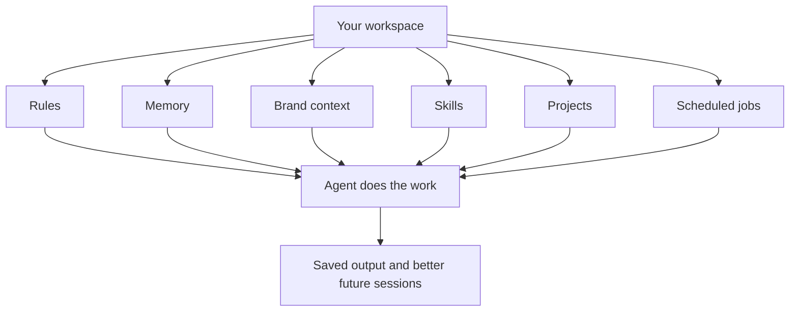
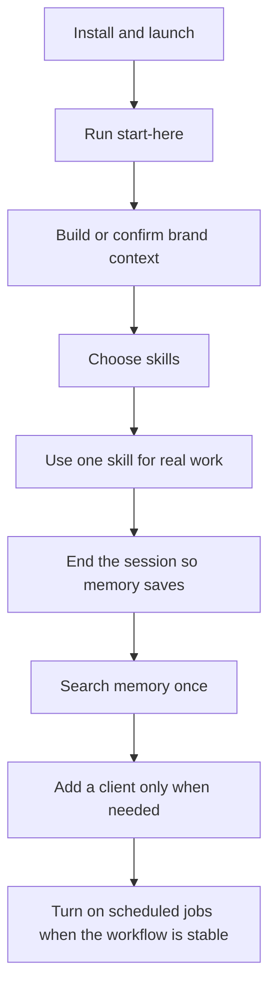
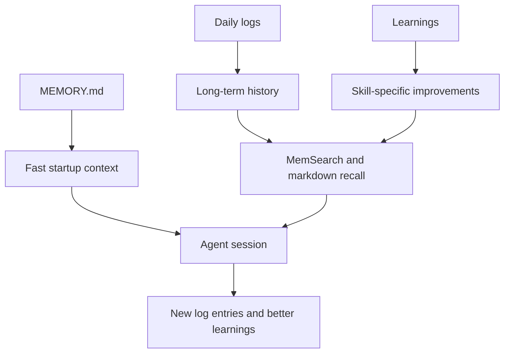
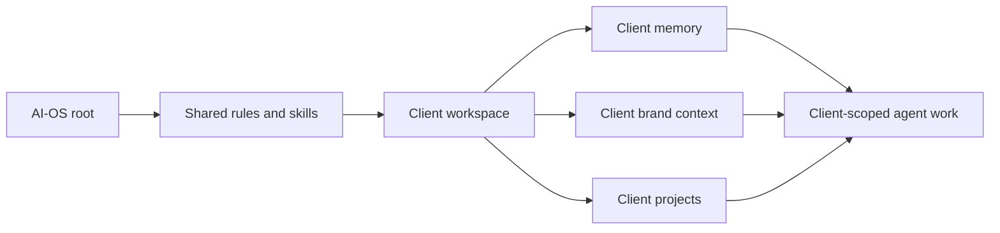
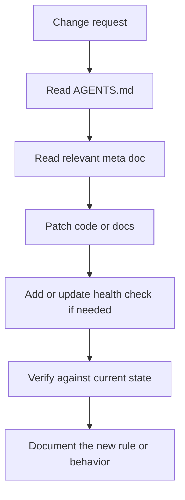

# AI-OS Docs

This is the practical guide to AI-OS. Start simple, then go deeper only when
you need more detail.

AI-OS is a local agent workspace. It gives Claude Code, Cursor, and
other compatible coding agents the same operating system: rules, memory, brand
context, skills, projects, scheduled jobs, and client workspaces.

The most important idea:

Nothing here is meant to be mysterious. Most of AI-OS is plain files and small
scripts arranged so agents can work with continuity.

## If You Only Read One Path

Use this path if you are setting up AI-OS from the template and want the
shortest route to being useful.

| Moment | What to read | What to do |
|---|---|---|
| First install | Root `README.md` | Clone, run `centre`, finish the guided bootstrap. |
| First command | [Start Here And First Run](start-here-first-run.md) | Run the `start-here` skill from the AI-OS root. In Claude Code, type `/start-here`. |
| First concept | [What AI-OS Is](what-ai-os-is.md) | Understand the mental model before changing settings. |
| First session | [Getting Started](getting-started.md) | Let `start-here` build context, then ask for one real deliverable. Keep it small. |
| First saved memory | [Memory And Cron](memory-and-cron.md) | End the session normally and check that a daily log was written. |
| First repeatable workflow | [Skills Catalog](skills-catalog.md) | Use the matching skill instead of ad-hoc prompting. |
| First larger project | [Projects Guide](projects-guide.md) | Decide whether it is Level 1, Level 2, Level 3, or Live. |
| First client | [Multi-Client Guide](multi-client-guide.md) | Create a client workspace and keep client memory separate. |
| First automation | [Turn On Nightly Jobs](turn-on-nightly-jobs.md) | Turn on cron only after you understand what the job does. |

## Read In This Order

### 1. Understand the basics

Read these first if you are new or explaining AI-OS to someone else.

| Doc | What it gives you |
|---|---|
| [What AI-OS Is](what-ai-os-is.md) | The simple mental model: rules, memory, skills, workspace structure, and what AI-OS is not. |
| [Install And Setup](install-and-setup.md) | Fresh install, launcher behavior, first session, optional setup, and setup checklist. |
| [Start Here And First Run](start-here-first-run.md) | The `start-here` onboarding skill: backup check, brand setup, skill selection, clients, sessions, and cron. |
| [Getting Started](getting-started.md) | The first 90 minutes: run `start-here`, choose skills, run one real task, save memory, and know where output went. |
| [How AI-OS Works](how-it-works.md) | The plain-English system map. Rules, memory, skills, brand context, and session flow. |
| [Cheat Sheet](cheat-sheet.md) | The commands and paths you will actually use. |
| [Commands And Folder Map](commands-and-folder-map.md) | Practical command guide and folder source-of-truth map. |
| [Cost And Privacy](cost-and-privacy.md) | What stays local, what can leave the machine, and where cost can appear. |
| [Projects Guide](projects-guide.md) | How AI-OS sorts work into small tasks, planned projects, and larger builds. |
| [Backups, Updates, And Undo](backups-updates-and-undo.md) | How memory backups, document versions, updates, and rollback paths differ. |

### 2. Make memory make sense

Read these when you want to understand what the agent remembers, what it does
not remember, and why the search stack exists.

| Doc | What it gives you |
|---|---|
| [Memory And Cron](memory-and-cron.md) | Plain-words explanation of memory layers, MemSearch, Milvus Lite, and nightly jobs. |
| [Memory Search And Observability](memory-search-and-observability.md) | Practical decision guide for MemSearch, Milvus Lite, Zilliz, Pinecone, and Langfuse. |
| [Memory Architecture](meta/memory-architecture.md) | Design source of truth for agents changing the memory system. |
| [Health And Regression](meta/health-and-regression.md) | What the system checks so memory and jobs do not silently drift. |

Memory has this shape:

### 3. Learn how real work is organized

Read these when you are using AI-OS for client work, operations, or repeatable
workflows.

| Doc | What it gives you |
|---|---|
| [Multi-Client Guide](multi-client-guide.md) | How client folders stay separate while sharing the same root methodology. |
| [Brand Voice And Text Quality](brand-voice-and-text-quality.md) | How brand context, voice profiles, samples, and humanizer fit together. |
| [Skills And Capabilities](skills-and-capabilities.md) | How skills route work, load context, use fallbacks, and graduate from the library. |
| [Skills Catalog](skills-catalog.md) | What live skills exist and what each one is for. |
| [Skill Tiers](skill-tiers.md) | How AI-OS ranks skills by use and maturity. |
| [Connectors](connectors.md) | Environment keys, desktop connectors, MCPs, and fallbacks. |
| [Services, Keys, And Connectors](services-keys-and-connectors.md) | Plain-English setup guide for `.env` keys, MCPs, desktop connectors, fallbacks, and external writes. |
| [Cost And Privacy](cost-and-privacy.md) | What stays local, what can leave your machine, what costs money, and where approval gates apply. |
| [Reply Behavior](reply-behavior.md) | Session titles, progress updates, Considerations, Next Actions, approval gates, and wrap-up behavior. |
| [Command Centre Guide](command-centre-guide.md) | The local dashboard and runtime surface. |
| [Background Jobs](background-jobs.md) | Practical guide to scheduled jobs, job files, daemon commands, cost/auth, and safe automation. |
| [Turn On Nightly Jobs](turn-on-nightly-jobs.md) | How to keep cron jobs reliable on a Mac. |

Client work has this boundary:

Root AI-OS memory is for the operating system and shared methodology. Client
memory is for client facts, relationship history, and active work. Do not blend
them unless you are deliberately promoting a reusable lesson.

### 4. Understand the design source of truth

Read these when you are changing AI-OS itself, not just using it.

| Doc | What it gives you |
|---|---|
| [Meta Docs](meta/README.md) | The design source of truth index. |
| [Design And Contributing](design-and-contributing.md) | Practical guide for changing AI-OS without breaking the runtime contract. |
| [Notion Template Docs Map](notion-template-docs-map.md) | Local source map for keeping the Notion template docs aligned. |
| [Design Philosophy](meta/design-philosophy.md) | Why AI-OS is local-first, agent-first, and approval-gated. |
| [System Architecture](meta/system-architecture.md) | How instructions, skills, clients, hooks, memory, cron, and reports fit together. |
| [Evolution Log](meta/evolution-log.md) | Why major design choices changed, so old problems are not reintroduced. |
| [Worktree Workspace](worktree-workspace.md) | How isolated code work should and should not happen. |
| [Template Release](template-release.md) | How template changes are prepared and released. |
| [Team Sharing](team-sharing.md) | How to share AI-OS without mixing private memory into the template. |
| [Optional Capabilities](optional-capabilities.md) | Dormant packs in `.aios/optional/` (team knowledge, shared clients, ingestion) and how to enable one. |
| [Troubleshooting](troubleshooting.md) | Common symptoms, likely causes, and safe fixes. |
| [Glossary](glossary.md) | Plain-English definitions for the terms used in AI-OS. |

Design changes should follow this loop:

## What Each Major Folder Means

| Path | Meaning |
|---|---|
| `AGENTS.md` | Canonical runtime contract for every agent tool. |
| `CLAUDE.md` | Claude Code adapter that points back to `AGENTS.md`. |
| `.claude/skills/` | Live skill catalog. Each skill is a folder with a `SKILL.md`. |
| `brand_context/` | Root brand voice, positioning, ICP, and messaging context. |
| `context/` | Root memory, user profile, learnings, daily logs, and thinking docs. |
| `clients/` | Client workspaces with their own memory, brand context, projects, and instructions. |
| `projects/` | Root project outputs, briefs, reports, and working artifacts. |
| `cron/jobs/` | Scheduled job definitions. |
| `scripts/` | Shared operational scripts. |
| `docs/` | Practical and design documentation. |
| `.aios/optional/` | Dormant capability packs. Versioned, but nothing loads until you enable it. |

## Common Questions

### Is AI-OS an app?

Not primarily. AI-OS is a workspace and operating layer for coding agents. The
Command Centre is an optional local dashboard, but the core system is files,
rules, scripts, memory, and skills.

### Does AI-OS replace Claude or Cursor?

No. It gives them the same working context. Claude Code, Cursor, and
future compatible tools are runtime interfaces. AI-OS is the shared operating
system underneath them.

### Does AI-OS memory live in a database?

The source of truth does not. Memory lives in markdown files. Semantic search
uses a derived index through MemSearch and Milvus Lite, but that index can be
rebuilt from the files.

### When do I need Pinecone or another vector database?

Usually not for AI-OS workspace memory. Consider Pinecone when you are building
a production client-facing AI app that needs hosted retrieval, multiple users,
metadata filters, permissions, uptime, and scale. Read
[Memory Search And Observability](memory-search-and-observability.md).

### When do I need Langfuse?

Use Langfuse when you need traces, prompt review, cost tracking, failures, or
evals for model calls in a script, app, automation, or client AI build. It does
not automatically observe normal Claude Code conversations unless the
model calls pass through code you control.

### Is AI-OS private?

AI-OS files live locally, but agent runtimes and external tools can receive
relevant task context when you ask them to do work. Secrets belong in `.env`,
not memory. External writes need approval. Read
[Cost And Privacy](cost-and-privacy.md).

### Where should a new user start?

Start by opening your AI-OS agent from the root and running `start-here`. In
Claude Code, type `/start-here`.
Read [Start Here And First Run](start-here-first-run.md) if you want to know
exactly what that skill does. Then read [What AI-OS Is](what-ai-os-is.md),
[How AI-OS Works](how-it-works.md), and keep [Cheat Sheet](cheat-sheet.md)
open. Read the other docs only when the work needs them.

## If You Are An Agent Working In This Repo

Use `AGENTS.md` first. This docs folder explains the system, but `AGENTS.md` is
the runtime contract. If a doc and `AGENTS.md` disagree, treat it as drift and
fix the docs or ask before changing the rule.

When you change behavior, update the docs that future users will actually read.
For user-facing changes, update this docs index or a practical guide. For
system-behavior changes, update the relevant meta doc too.
