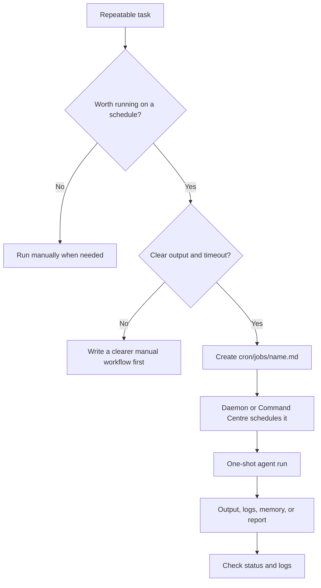
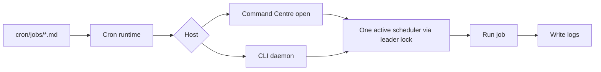

# Background Jobs

AI-OS background jobs are scheduled agent tasks. They are useful when a task is
repeatable, bounded, and worth running without you manually asking each time.

Do not automate a workflow before you understand it manually. A scheduled job
amplifies whatever prompt you give it, good or bad.

## The Short Version



## What A Job Is

Each job is a markdown file:

```text
cron/jobs/{job-name}.md
```

It has two parts:

1. YAML frontmatter with schedule, model, timeout, and status.
2. A prompt body explaining what the one-shot agent run should do.

Example:

```markdown
---
name: "My Daily Research"
time: "09:00"
days: "weekdays"
active: "true"
model: "sonnet"
timeout: "30m"
retry: "0"
notify: "on_failure"
---

You are running as a scheduled job for AI-OS.

Read CLAUDE.md for system context.

Task: Research the topic and save a short briefing.

Save output to: projects/briefs/daily-research/{today}_briefing.md
```

## How Jobs Run



There are two hosts:

| Host | Use it when |
|---|---|
| Command Centre | You already keep the local dashboard open. |
| CLI daemon | You want scheduling to continue while the dashboard is closed. |

The runtime uses a leader lock so both should not schedule the same job at the
same time.

## Common Commands

Start the daemon:

```bash
bash scripts/start-crons.sh
```

Check status:

```bash
bash scripts/status-crons.sh
```

Read logs:

```bash
bash scripts/logs-crons.sh
```

Stop the daemon:

```bash
bash scripts/stop-crons.sh
```

Run one job manually:

```bash
bash scripts/run-job.sh job-name
```

## Schedule Fields

Common frontmatter:

| Field | Meaning |
|---|---|
| `name` | Human-readable job name. |
| `time` | Exact time or interval. Examples: `09:00`, `09:00,13:00`, `every_30m`. |
| `days` | `daily`, `weekdays`, or a day pattern supported by the runtime. |
| `active` | `true` or `false`. Off jobs stay documented but do not run. |
| `model` | Agent model choice, such as `haiku`, `sonnet`, or `opus`. |
| `timeout` | Maximum run time, such as `30m` or `2h`. |
| `retry` | Retry count. Use carefully to avoid duplicate or colliding runs. |
| `notify` | Notification behavior, often `on_failure` or `on_finish`. |
| `runner` / `command` | Optional shell runner path for jobs that should run a script directly. |

## Good Jobs Versus Bad Jobs

Good scheduled jobs are:

- repeatable,
- bounded,
- cheap enough,
- safe to run unattended,
- clear about where output goes,
- easy to check from logs,
- not dependent on a human decision mid-run.

Bad scheduled jobs are:

- vague,
- open-ended research loops,
- likely to spend too much,
- likely to write to external systems without approval,
- missing a timeout,
- missing an output path,
- duplicating work that should be a manual review.

## Cost And Auth

Scheduled jobs use your agent/model provider account or plan. The cost depends
on the model and task complexity.

Use smaller models for maintenance jobs when possible. Use larger models only
when the job needs deeper reasoning.

The cron daemon runs in the background, so it needs headless auth. If jobs fail
with auth errors, read:

- [Memory And Cron](memory-and-cron.md)
- [Turn On Nightly Jobs](turn-on-nightly-jobs.md)

## Active Memory Jobs

AI-OS ships with memory maintenance jobs that keep daily memory, client memory,
and semantic recall healthy.

Examples:

| Job | What it does |
|---|---|
| `daily-memory-distill` | Promotes useful daily session context into hot memory. |
| `client-memory-distill` | Updates each client's hot memory from client session logs. |
| `nightly-memsearch-index` | Re-indexes the complete AI-OS memory source set, then proves semantic health and stable top-three retrieval quality against that completed index. |
| `daily-memory-curator` | Tidies root hot memory. |
| `semantic-memory-health` | Retired time-based duplicate; the nightly index job owns the ordered health proof. |
| `nightly-memory-backup` | Backs up gitignored live memory locally and mirrors it off-machine when a destination is configured. |

The former `weekly-memsearch-rebuild` job is inactive. It duplicated the nightly
non-forced complete-source sync and added no repair coverage.

## External Writes

Jobs should not silently perform external writes unless the job and its approval
model are explicit.

Examples of external writes:

- publishing,
- deploying,
- sending email,
- updating Notion,
- changing a CRM/database,
- posting to social media.

For those, prefer a job that prepares a report or draft, then asks for approval
before the external action.

## Troubleshooting

| Symptom | Check |
|---|---|
| Job did not run | `bash scripts/status-crons.sh` and daemon heartbeat. |
| Job failed | `bash scripts/logs-crons.sh` and the job-specific log. |
| Auth error | Headless Claude auth or cron wrapper. |
| Duplicate runs | Command Centre and daemon host/leader lock. |
| Missed overnight run | Mac sleep/power state and nightly wake. |
| Memory search lock | Avoid immediate retries around Milvus Lite index jobs. |
| Unexpected cost | Job active state, model, timeout, retry count, and prompt scope. |

## Related Docs

- [Memory And Cron](memory-and-cron.md)
- [Turn On Nightly Jobs](turn-on-nightly-jobs.md)
- [Command Centre Guide](command-centre-guide.md)
- [Cost And Privacy](cost-and-privacy.md)
- [Troubleshooting](troubleshooting.md)
