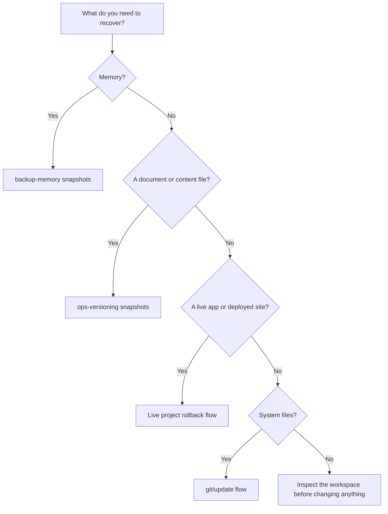
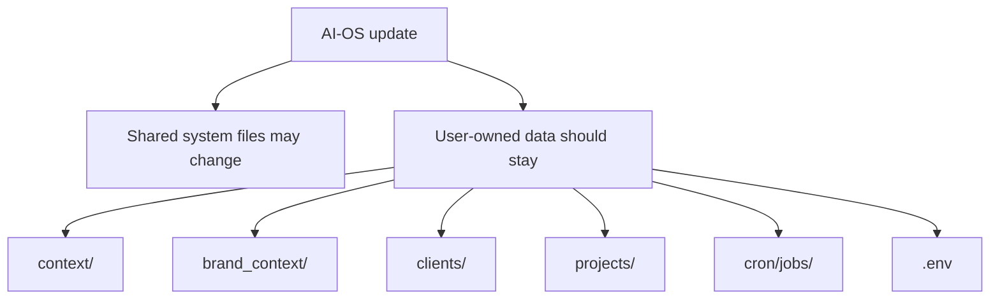

# Backups, Updates, And Undo

AI-OS has several safety layers. They protect different things, so it helps to
know which recovery path matches the problem.

## The Short Version



Do not use one recovery tool for everything. Memory backups, document versions,
live-project rollback, and git solve different problems.

## Start Here

| If this happened | Use this first | Why |
|---|---|---|
| You lost memory or client context | `bash scripts/backup-memory.sh list` | Memory is gitignored, so use memory snapshots. |
| You overwrote a markdown deliverable | `ops-versioning` or `.versions/` | Content snapshots live beside the file. |
| An AI-OS update went wrong | `bash scripts/update.sh --rollback` | Update rollback targets system update state. |
| A live app broke | That project's `WORKFLOW.md` | Live systems need deploy-aware rollback. |
| Notion docs are wrong | Reapply from local docs | Local docs are the source for Notion. |
| You are not sure | Stop and inspect | The wrong recovery path can make cleanup harder. |

## What Is Protected

| Thing | Protection |
|---|---|
| Root memory | `scripts/backup-memory.sh` snapshots. |
| Client memory | `scripts/backup-memory.sh` snapshots. |
| Documents and content | `ops-versioning` snapshots beside the file. |
| Live apps/sites | Live project workflow, branches, deploy rollback. |
| System code/docs | Git history and update flow. |
| External services | Service-specific history, if the service has it. |

## Memory Backups

AI-OS memory is gitignored on purpose. That prevents memory from forking across
branches, but it also means git is not the backup.

Use:

```bash
bash scripts/backup-memory.sh
```

List snapshots:

```bash
bash scripts/backup-memory.sh list
```

Restore the latest snapshot:

```bash
bash scripts/backup-memory.sh restore
```

Restore a specific snapshot:

```bash
bash scripts/backup-memory.sh restore 2026-06-29_113402
```

The restore command snapshots the current state first, then restores the older
snapshot. That means restoring does not destroy the present state.

Memory backups live outside the repo:

```text
~/.ai-os-memory-backup
```

## Document Versions

For markdown, copy, research, briefs, and plain text, AI-OS uses
`ops-versioning`.

Plain-language triggers:

| You say | What AI-OS should do |
|---|---|
| "Save this before I change it" | Snapshot the current file. |
| "Make a new version" | Snapshot the current file. |
| "Show versions" | List saved copies. |
| "Undo that" | Restore an older copy after saving the current one. |
| "Go back to yesterday's version" | List or restore the matching snapshot. |
| "What changed?" | Compare current file to a saved copy. |

Snapshots live next to the file in a hidden `.versions/` folder. They are local
and append-only.

Important rule: before restoring an older version, AI-OS saves the current file
first. Nothing should be thrown away.

## Live Projects And Apps

Do not use document snapshots as the main rollback path for deployed apps,
websites, or live projects.

Live projects should have their own workflow, usually under:

```text
projects/live/{name}/WORKFLOW.md
```

That workflow should explain:

- how to edit,
- how to preview,
- how to ship,
- how to tag the previous live version,
- how to roll back.

If a project has its own git repo or deployment target, use the live-project
rollback path, not plain file snapshots.

## Updating AI-OS

Update from the root workspace:

```bash
bash scripts/update.sh
```

The update flow is designed to preserve user-owned data:

- brand context,
- memory,
- projects,
- API keys,
- client workspaces,
- local skill overrides.

If you customized skills, the update flow should show diffs and preserve your
version or back it up before replacing anything.

## What Updates Should Not Overwrite



The updater is meant to improve AI-OS while preserving your working layer.

User-owned data includes:

- root memory,
- client memory,
- brand context,
- client folders,
- project outputs,
- scheduled job definitions,
- local skill overrides,
- and `.env`.

If an update wants to replace something user-owned, treat it as a risk and
inspect the diff before continuing.

## What Not To Do

Avoid destructive commands unless you are deliberately throwing work away:

```bash
git reset --hard
git checkout -- path
rm -rf path
```

In AI-OS, many important files are user-owned, gitignored, or client-specific.
Inspect before deleting or resetting.

## Recovery Decision Table

| Problem | First move |
|---|---|
| "Memory disappeared" | Check files, then list memory backups. |
| "Semantic search missed it" | Use markdown fallback before assuming memory is gone. |
| "I overwrote a doc" | Use `ops-versioning` or check `.versions/`. |
| "A live site broke" | Use that live project's rollback workflow. |
| "Update changed a skill" | Check update backup/diff output. |
| "Wrong client got an output" | Move the file and record the scope correction. |
| "Notion page got updated wrong" | Use Notion page history if available, then reapply from local docs. |

## Before A Risky Change

Use this checklist:

1. Is the file user-owned?
2. Is it in a client workspace?
3. Is it gitignored?
4. Is there a snapshot or backup?
5. Is this an external write?
6. Do I need explicit approval?

If unsure, snapshot first or ask.

## Recovery Order

Use this order when something looks wrong:

1. Stop making changes.
2. Identify which layer is affected: memory, document, live app, AI-OS system,
   client folder, or external service.
3. Check whether a local snapshot exists.
4. Restore or roll back through the right path.
5. Verify the result.
6. Write down what happened if it could happen again.

## Related Docs

- [Troubleshooting](troubleshooting.md)
- [Cost And Privacy](cost-and-privacy.md)
- [Projects Guide](projects-guide.md)
- [Template Release](template-release.md)
- [Worktree Workspace](worktree-workspace.md)
