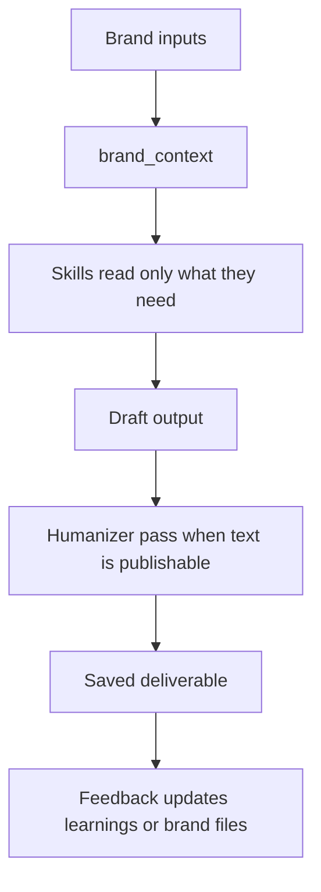
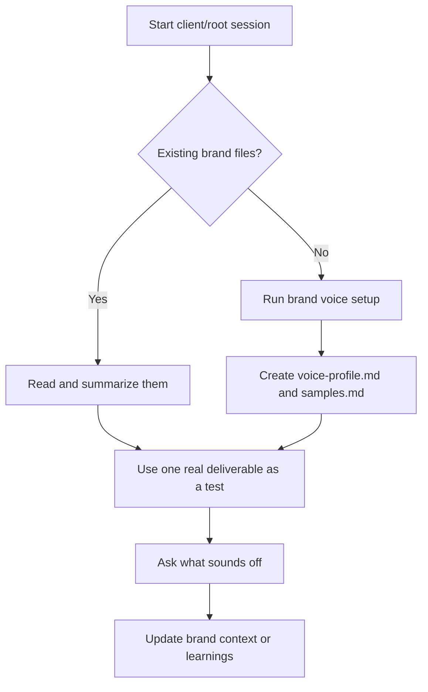

# Brand Voice And Text Quality

AI-OS separates brand memory from normal session memory. That is what lets the
agent write like the business, not like a generic assistant.

## The Short Version



Brand files are not decoration. They are operating context.

## Where Brand Context Lives

| Workspace | Brand files live here |
|---|---|
| Root AI-OS | `brand_context/` |
| Client workspace | `clients/{client}/brand_context/` |

Common files:

| File | Job |
|---|---|
| `voice-profile.md` | Tone, rhythm, vocabulary, examples, what to avoid. |
| `samples.md` | Real sentences that represent the voice. |
| `positioning.md` | Offer angle, market stance, and why the brand should be chosen. |
| `icp.md` | Ideal customer, pains, desires, language, and buying context. |
| `assets.md` | Visual brand notes such as colors, fonts, logos, and references. |

Client brand context stays inside the client folder. Do not copy client voice
up into the root unless it is deliberately becoming shared methodology.

## How Brand Voice Gets Created

The `mkt-brand-voice` skill can create or update the voice profile in four ways:

| Mode | Use it when |
|---|---|
| Import | You already have a brand guide or tone document. |
| Extract | You have real samples such as emails, posts, transcripts, or website copy. |
| Build | You are starting from scratch and need a short interview. |
| Auto-scrape | You provide a URL and want AI-OS to research the voice. |

If `voice-profile.md` already exists, AI-OS should update it carefully rather
than rebuilding it from scratch. Existing brand memory is an asset, not a thing
to overwrite casually.

## How Skills Use Brand Context

Skills load only the brand files they need.

Examples:

| Skill type | Likely context |
|---|---|
| Copywriting | voice profile, positioning, ICP, samples. |
| Brand voice work | positioning and previous voice learnings. |
| ICP work | positioning and existing audience notes. |
| Visual/ad work | voice, positioning, ICP, assets. |
| Versioning | no brand context needed. |

This keeps prompts smaller and reduces the chance that unrelated context pollutes
the work.

## Text Quality Gate

Publishable text should pass through `tool-humanizer` when available.

Humanizer looks for:

- generic AI phrases,
- bloated language,
- corporate filler,
- overused transitions,
- robotic structure,
- weak hedging,
- rhythm that feels machine-made,
- vocabulary that violates the voice profile.

Modes:

| Mode | Best for |
|---|---|
| Quick | Fast cleanup of obvious AI tells. |
| Standard | Normal public-facing cleanup with scoring. |
| Deep | Voice-matched cleanup using `brand_context/voice-profile.md`. |

Default rule: use deep mode when a voice profile exists, otherwise standard.

## What Good Output Should Do

Good AI-OS output should:

- sound like the right brand,
- speak to the right customer,
- use specific language,
- avoid generic AI patterns,
- match the requested format,
- be saved to the right workspace,
- cite or explain assumptions when context is missing.

## When Brand Context Is Missing

AI-OS should not block useful work just because brand context is incomplete.

The right behavior:

1. Produce a solid generic version.
2. Say what context would make it sharper.
3. Offer to build the missing brand file if it will help future work.

Example:

```text
I can write this now with a clean generic voice. It would get sharper once
`brand_context/voice-profile.md` exists.
```

## Updating Brand Voice

Use normal language:

```text
This sounds too polished. Make our voice more blunt and less corporate.
```

That feedback can belong in:

| Feedback type | Where it belongs |
|---|---|
| Stable voice rule | `brand_context/voice-profile.md` |
| Example sentence | `brand_context/samples.md` |
| Skill-specific habit | `context/learnings.md` under the skill section |
| One-off preference | Today's session log |

Do not rewrite brand files without care. If the change is broad or conflicts
with existing guidance, AI-OS should show the change and ask before overwriting.

## Practical First Setup

For a new brand or client:



The fastest way to improve a voice profile is not abstract discussion. It is one
real deliverable, reviewed against the user's taste.

## Related Docs

- [Getting Started](getting-started.md)
- [Multi-Client Guide](multi-client-guide.md)
- [Skills Catalog](skills-catalog.md)
- [Reply Behavior](reply-behavior.md)
