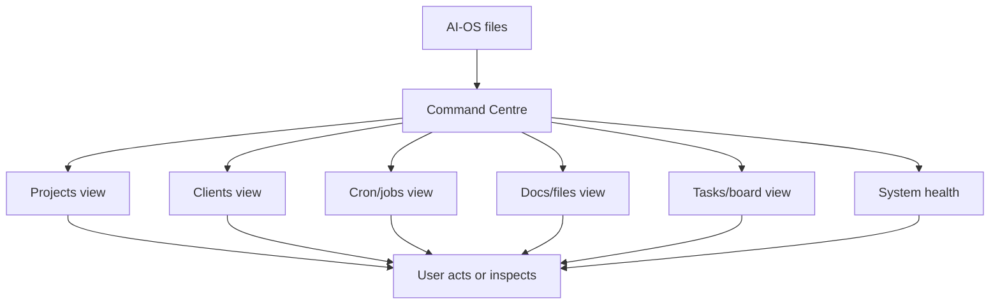
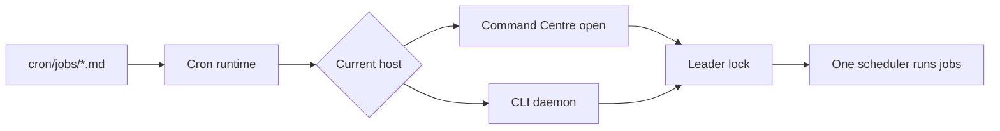
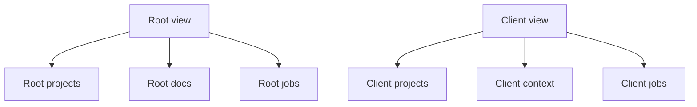

# Command Centre Guide

The Command Centre is the optional local dashboard for AI-OS. It gives you a
visual window into projects, clients, scheduled jobs, tasks, docs, and system
health.

It is not the source of truth. AI-OS files are.

## The Short Version



If Command Centre is closed or broken, AI-OS still works from the terminal.

## What It Is For

Use Command Centre when you want to:

- see active projects,
- inspect client workspaces,
- view scheduled jobs,
- check task boards,
- browse docs and files,
- see system health,
- start common actions without typing every command.

Use the terminal or agent session when you need:

- direct Claude Code work,
- file edits,
- skills,
- memory writes,
- commits,
- deeper debugging,
- external-action approvals.

## What It Reads

Command Centre reads the same files the agents use:

| Surface | Typical path |
|---|---|
| Docs | `docs/` |
| Projects | `projects/` and `clients/{client}/projects/` |
| Client list | `clients/` |
| Cron jobs | `cron/jobs/` and client cron folders |
| Skills | `.claude/skills/` |
| Health reports | `projects/system-health/` |
| Runtime state | `.command-centre/` |

The dashboard should stay read-mostly and additive. If Command Centre and the
AI-OS files disagree, trust the files.

## How It Starts

First launch:

```bash
bash scripts/centre.sh
```

After first setup:

```bash
centre
```

Windows:

```powershell
powershell -File scripts\centre.ps1
```

The launcher:

1. Checks whether the dashboard is already running.
2. Runs guided install on first launch.
3. Repairs missing bootstrap files when possible.
4. Checks dependencies.
5. Installs npm dependencies on first Command Centre run.
6. Starts the local app at `http://localhost:3000`.
7. Opens the browser.

## Local App, Not Hosted SaaS

Command Centre runs locally on your machine:

```text
http://localhost:3000
```

The terminal window running it must stay open. Closing that window stops the
local app unless you are running it through another host.

## How It Relates To Cron



Command Centre can schedule jobs while it is running. If you want scheduled jobs
to continue while the dashboard is closed, use the CLI daemon:

```bash
bash scripts/start-crons.sh
```

Check status:

```bash
bash scripts/status-crons.sh
```

Read more:

- [Background Jobs](background-jobs.md)
- [Memory And Cron](memory-and-cron.md)
- [Turn On Nightly Jobs](turn-on-nightly-jobs.md)

## Clients In Command Centre

Command Centre can switch views between root AI-OS and client workspaces. The
boundary is the same as the file boundary:



Client facts, memory, brand context, and projects still belong in:

```text
clients/{client}/
```

The dashboard does not make client data shared just because it can display
multiple clients.

## Files And Docs

Command Centre can browse docs and workspace files. It is useful for inspection
and navigation.

For substantial edits, agent sessions are usually safer because they can:

- read the relevant instructions,
- update related docs,
- run checks,
- explain what changed,
- preserve approval gates.

## What To Do If It Will Not Start

Start with:

```bash
bash scripts/centre.sh
```

If dependencies are missing:

```bash
cd command-centre
npm install
cd ..
bash scripts/centre.sh
```

If setup still feels broken, run:

```bash
bash .claude/skills/meta-systems-check/scripts/check.sh --deep
```

Common issues:

| Symptom | Likely cause | First fix |
|---|---|---|
| Browser does not open | App did not start or port is busy. | Check terminal output and `http://localhost:3000`. |
| `centre` command not found | Shell did not load shortcut. | Run `bash scripts/centre.sh` directly. |
| Missing dependencies | `node_modules` missing or stale. | Run `npm install` in `command-centre/`. |
| Wrong client shown | Client selector or URL state. | Switch client view or work from the client folder. |
| Cron not running | Dashboard closed or daemon stopped. | Run `bash scripts/status-crons.sh`. |

## What Not To Depend On

Do not make core AI-OS behavior depend on Command Centre.

AI-OS must still work when Command Centre is:

- closed,
- broken,
- out of date,
- missing dependencies,
- being rebuilt.

The source-of-truth layer is:

- `AGENTS.md`,
- `.claude/skills/`,
- `context/`,
- `brand_context/`,
- `clients/`,
- `projects/`,
- `cron/jobs/`,
- `scripts/`.

## Related Docs

- [Install And Setup](install-and-setup.md)
- [Getting Started](getting-started.md)
- [Background Jobs](background-jobs.md)
- [Multi-Client Guide](multi-client-guide.md)
- [Troubleshooting](troubleshooting.md)
