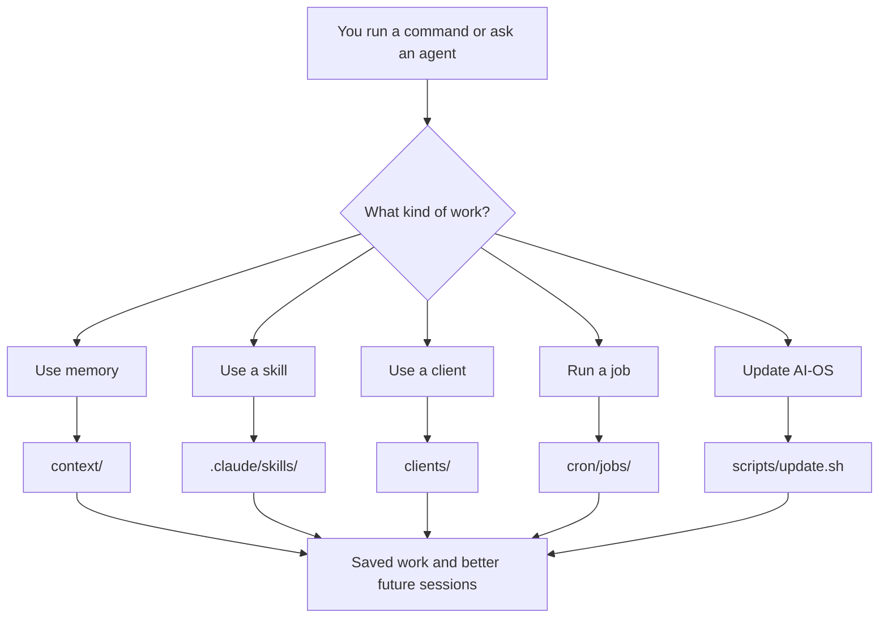
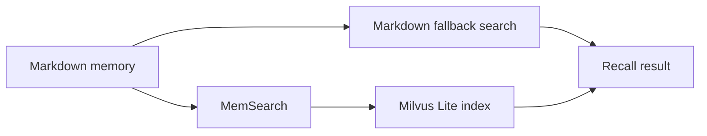

# Commands And Folder Map

This is the practical map for AI-OS commands and folders.

Use it when you know what you want to do, but you are not sure which command or
folder matters.

For the shortest version, use [Cheat Sheet](cheat-sheet.md). This guide explains
the shape behind it.

## The Big Picture

AI-OS is mostly files plus a few scripts.



Most commands are wrappers around this folder structure. The folders hold the
truth. The commands make common actions safer and faster.

## Daily Commands

Run these from the AI-OS root folder unless the guide says otherwise.

| I want to... | Run |
|---|---|
| Open the Command Centre | `bash scripts/centre.sh` |
| Open the Command Centre after installing the shortcut | `centre` |
| Open on Windows | `powershell -File scripts\centre.ps1` |
| Start Claude Code from the AI-OS root | `claude` |
| Run first-time onboarding inside Claude Code | `/start-here` |
| Run onboarding if the alias is unavailable | `/onboarding` |
| Preview an AI-OS update | `bash scripts/update.sh --dry-run` |
| Apply an AI-OS update | `bash scripts/update.sh` |
| Undo the last completed update | `bash scripts/update.sh --rollback` |
| Add a client workspace | `bash scripts/add-client.sh "Client Name"` |
| List installed skills | `bash scripts/list-skills.sh` |
| Set up searchable memory | `bash scripts/setup-memory.sh` |
| Check searchable memory | `bash scripts/setup-memory.sh --check` |
| Back up memory | `bash scripts/backup-memory.sh` |
| List memory backups | `bash scripts/backup-memory.sh list` |
| Restore memory from backup | `bash scripts/backup-memory.sh restore` |

Use the full command when in doubt. The shorter `centre` command is only an
optional shell shortcut.

## Memory Commands

Memory source files live in `context/` and `clients/*/context/`. These commands
search or refresh that memory.

| I want to... | Run |
|---|---|
| Search root memory | `bash scripts/memsearch-search.sh "query" 10 --scope root` |
| Search one client | `bash scripts/memsearch-search.sh "query" 10 --scope client --client client-name` |
| Search all clients | `bash scripts/memsearch-search.sh "query" 10 --scope clients` |
| Search all root and client memory with markdown fallback | `bash scripts/memory-search.sh "query" 10 --scope all` |
| Refresh the semantic index | `bash scripts/memsearch-reindex.sh` |
| Check MemSearch health | `bash scripts/memsearch-health.sh` |

Memory search has two layers:



Markdown memory is the source of truth. MemSearch and Milvus Lite make it easier
to find old context by meaning.

## Client Commands

Clients live under:

```text
clients/{client-name}/
```

| I want to... | Run |
|---|---|
| Create a client | `bash scripts/add-client.sh "Client Name"` |
| Start onboarding inside a client | `cd clients/client-name && claude`, then `/start-here` |
| Sync root methodology into clients | `bash scripts/update-clients.sh` |
| Audit client sync drift | `bash scripts/client-sync-audit.sh --strict` |
| Evaluate client memory quality | `bash scripts/client-memory-maintenance.sh --mode evaluate` |
| Curate client memory after review | `bash scripts/client-memory-maintenance.sh --mode curate` |

Work from inside a client folder when the work is for that client:

```bash
cd clients/client-name
claude
```

Root memory is for shared AI-OS and operator context. Client memory is for client
facts, relationship history, brand context, and client work.

## Skill Commands

Skills are operating procedures for repeatable work.

| I want to... | Run |
|---|---|
| List live skills | `bash scripts/list-skills.sh` |
| Create or improve a skill | `/meta-skill-creator` |
| Check whether a skill exists | `/meta-find-skills` |
| Add a curated skill | `bash scripts/add-skill.sh skill-name` |
| Remove a skill (parks it in `_archived/`, never deletes) | `bash scripts/remove-skill.sh skill-name` |
| Rebuild the skills catalog | `python3 scripts/gen-skills-catalog.py` |
| Rank skills by usage and maturity | `python3 scripts/skill-tiers.py` |
| Run a skill eval | `bash scripts/skill-evals.sh skill-name` |

Live skills live in:

```text
.claude/skills/
```

Candidate skills live in:

```text
skills-library/
```

Do not install random skill packs directly into `.claude/skills/`. Candidate
skills should move through the skills-library review path first.

## Scheduled Job Commands

Scheduled jobs live in:

```text
cron/jobs/
```

The Command Centre can schedule jobs while it is running. If you want jobs to
run with the Command Centre closed, start the daemon.

| I want to... | macOS/Linux | Windows |
|---|---|---|
| Start jobs daemon | `bash scripts/start-crons.sh` | `powershell -NoProfile -ExecutionPolicy Bypass -File scripts\start-crons.ps1` |
| Stop jobs daemon | `bash scripts/stop-crons.sh` | `powershell -NoProfile -ExecutionPolicy Bypass -File scripts\stop-crons.ps1` |
| Check daemon status | `bash scripts/status-crons.sh` | `powershell -NoProfile -ExecutionPolicy Bypass -File scripts\status-crons.ps1` |
| View daemon logs | `bash scripts/logs-crons.sh` | `powershell -NoProfile -ExecutionPolicy Bypass -File scripts\logs-crons.ps1` |
| Run one job manually | `bash scripts/run-job.sh job-name` | `powershell -NoProfile -ExecutionPolicy Bypass -File scripts\run-job.ps1 job-name` |

Job outputs usually appear in:

```text
cron/logs/
cron/status/
projects/system-health/
```

## Update And Recovery Commands

Use these when changing AI-OS itself or recovering from a bad update.

| I want to... | Run |
|---|---|
| Check for updates | `bash scripts/check-updates.sh` |
| Preview an update | `bash scripts/update.sh --dry-run` |
| Apply an update | `bash scripts/update.sh` |
| Roll back an update | `bash scripts/update.sh --rollback` |
| Back up memory | `bash scripts/backup-memory.sh` |
| Restore memory | `bash scripts/backup-memory.sh restore` |
| Write workspace health report | `bash scripts/workspace-health-report.sh` |
| Check template release safety | `bash scripts/template-release-check.sh` |

Update safety has two different layers:

| Layer | What it protects |
|---|---|
| `scripts/update.sh --rollback` | The last completed AI-OS update. |
| `scripts/backup-memory.sh` | Gitignored memory and client memory. |

One does not replace the other.

## Worktree Commands

Worktrees are optional isolation for side work. They are not the normal path for
basic AI-OS use.

| I want to... | Run |
|---|---|
| Create a worktree | `bash scripts/worktree-new.sh name` |
| List worktrees | `bash scripts/worktree-list.sh` |
| Finish a worktree | `bash scripts/worktree-done.sh name` |

Read [Worktree Workspace](worktree-workspace.md) before using these.

## Root Folder Map

These are the main folders and files in AI-OS.

| Path | What it is | Touch casually? |
|---|---|---|
| `AGENTS.md` | Canonical runtime contract for all agents. | No. Read first, edit carefully. |
| `CLAUDE.md` | Claude Code adapter that points to `AGENTS.md`. | Rarely. |
| `.cursor/` | Cursor adapter rules. | Rarely. |
| `.claude/skills/` | Live skill catalog. | Yes, through the skill process. |
| `skills-library/` | Candidate skill staging area. | Yes, for review and promotion. |
| `context/` | Root memory, user context, learnings, thinking docs. | Yes, but preserve meaning. |
| `brand_context/` | Root brand voice, ICP, positioning, examples. | Yes, with care. |
| `clients/` | Client workspaces. | Yes, client by client. |
| `projects/` | Saved work, briefs, reports, deliverables. | Yes. |
| `cron/jobs/` | Scheduled job definitions. | Yes, after understanding the job. |
| `cron/logs/` | Job logs. | Read often, edit rarely. |
| `cron/status/` | Job status files. | Read often, edit rarely. |
| `command-centre/` | Local dashboard app. | Only when changing the app. |
| `.command-centre/` | Local runtime state for dashboard and cron. | No, unless debugging. |
| `.memsearch/` | Local semantic memory index. | No, rebuild through scripts. |
| `docs/` | Practical docs. | Yes. |
| `docs/meta/` | Design source of truth for maintainers. | Yes, when behavior changes. |
| `scripts/` | Operational scripts. | Carefully. Verify after edits. |
| `.env` | Local secrets. Gitignored. | Yes, locally only. Never commit. |
| `.env.example` | Public list of supported keys. | Yes, when adding services. |

## Client Folder Map

Each client folder has the same basic shape:

```text
clients/client-name/
├── AGENTS.md
├── CLAUDE.md
├── brand_context/
├── context/
├── cron/
├── projects/
├── scripts/
└── .claude/skills/
```

| Client path | What it is |
|---|---|
| `clients/{client}/AGENTS.md` | Client-specific rules. |
| `clients/{client}/brand_context/` | Client brand, voice, positioning, examples. |
| `clients/{client}/context/` | Client memory and learnings. |
| `clients/{client}/projects/` | Client outputs and project files. |
| `clients/{client}/cron/jobs/` | Client scheduled jobs. |
| `clients/{client}/.claude/skills/` | Synced shared skills plus any client-only skills. |

Do not store one client's facts in another client's folder.

## Project Folder Map

AI-OS uses project levels to keep work from scattering.

| Level | Kind of work | Usual location |
|---|---|---|
| Level 1 | Single task or output | `projects/{category}-{type}/` |
| Level 2 | Small planned project | `projects/briefs/{project-name}/` |
| Level 3 | Large multi-phase project | `projects/briefs/{project-name}/` plus `.planning/` |
| Live | Ongoing system | `projects/live/{name}/` |

Read [Projects Guide](projects-guide.md) for the decision rules.

## Which Folder Wins?

When two places disagree, use this order:

1. `AGENTS.md` wins for shared runtime rules.
2. Root `.claude/skills/` wins for shared skill methodology.
3. Client `AGENTS.md`, `context/`, `brand_context/`, and `projects/` win for
   client-specific facts.
4. Markdown memory wins over MemSearch or Milvus Lite index results.
5. Local docs in `docs/` should be used to update Notion template docs.

## Common Mistakes

| Mistake | Better move |
|---|---|
| Editing client skill copies directly for a shared change. | Edit root `.claude/skills/`, then sync clients. |
| Putting project output in the repo root. | Put it under `projects/` or the relevant client `projects/`. |
| Treating Command Centre as the source of truth. | Treat it as a dashboard over files. |
| Treating `.memsearch/` as memory. | Treat markdown files as memory; rebuild indexes with scripts. |
| Storing secrets in docs or memory. | Store secrets in `.env`; document names in `.env.example`. |
| Starting cron before knowing what a job does. | Read `cron/jobs/{job}.md`, then run manually first. |
| Updating Notion without local docs. | Update local docs first, then sync Notion after approval. |

## Related Docs

- [Cheat Sheet](cheat-sheet.md)
- [Getting Started](getting-started.md)
- [Install And Setup](install-and-setup.md)
- [How AI-OS Works](how-it-works.md)
- [Memory And Cron](memory-and-cron.md)
- [Multi-Client Guide](multi-client-guide.md)
- [Background Jobs](background-jobs.md)
- [Backups, Updates, And Undo](backups-updates-and-undo.md)
- [Design And Contributing](design-and-contributing.md)
