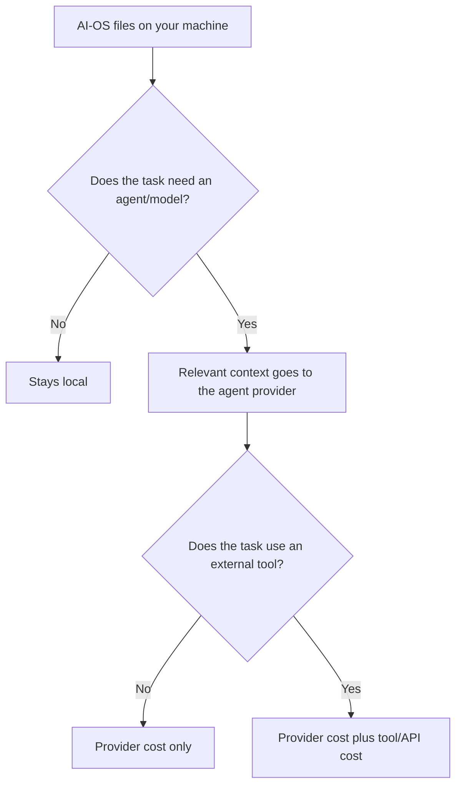
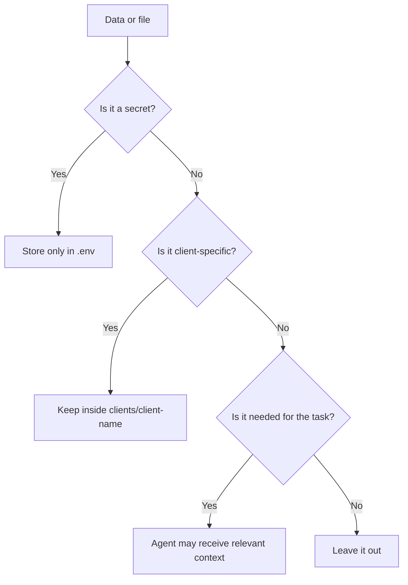

# Cost And Privacy

AI-OS is local-first, but it is not offline-only. The files live on your
machine. The agent runtime you use, such as Claude Code, may send the
relevant prompt and files to its AI provider so it can do the work.

The practical rule:



## What Stays Local By Default

These live in your AI-OS folder:

| Data | Path |
|---|---|
| Brand context | `brand_context/` or `clients/{client}/brand_context/` |
| Hot memory | `context/MEMORY.md` or client `context/MEMORY.md` |
| Daily session logs | `context/memory/` |
| Learnings | `context/learnings.md` |
| Projects and outputs | `projects/` or client `projects/` |
| Cron job definitions | `cron/jobs/` |
| API keys | `.env` |

The Command Centre runs locally at `localhost`. It is a dashboard over the same
files, not a hosted SaaS app.

## Practical Privacy Rules



| Situation | Safe default |
|---|---|
| A key or token | Store in `.env`, never in memory or docs. |
| Client facts | Keep in `clients/{client}/`. |
| Personal preference | Keep in root `context/USER.md` or memory. |
| Reusable method | Keep in root docs, root learnings, or a root skill. |
| External write | Ask for approval with target, action, artifact, and risk. |
| Unsure if a file is sensitive | Do not send it. Ask or inspect first. |

## What Can Leave Your Machine

Data can leave your machine when:

- you ask Claude Code, Codex, Cursor, Hermes, or another agent harness to do work,
- a skill uses an external API,
- a connector reads or writes an external system,
- a scheduled job runs through an agent provider,
- you approve a publish, deploy, send, sync, or Notion update.

This is normal for agent work. The safety rule is that AI-OS should send only
what is relevant to the task and should ask before external writes.

## Secrets

Secrets belong in `.env`, never in memory, docs, projects, or chat summaries.

Good:

```text
FIRECRAWL_API_KEY is configured in .env
```

Bad:

```text
FIRECRAWL_API_KEY=actual-secret-value
```

If a key is needed, AI-OS should refer to the variable name, not store the value.

## Cost Layers

AI-OS can create cost in a few places.

| Layer | What costs money | How to control it |
|---|---|---|
| Agent runtime | Model usage while doing work in Claude Code, Codex, Cursor, Hermes, or another harness. | Use the right model, keep memory bounded, avoid needless re-runs. |
| Cron jobs | Scheduled model calls. | Keep only useful jobs active and check logs. |
| External APIs | Firecrawl, HeyGen, xAI, OpenAI, YouTube, etc. | Skills should check for keys and offer fallbacks. |
| Hosted infrastructure | Hosting, databases, search services, tracing/eval tools, storage, queues, etc. | Add only when the workflow has a real need. |
| Local search | AI-OS memory search helpers. | Usually no per-query cost. First setup may download a small local model. |

The biggest avoidable cost is not one expensive call. It is letting automated
jobs, broad context, or repeated failed runs continue without checking logs.

## Cost Decision Table

| Question | Usually free/local | Might cost |
|---|---|---|
| Storing docs and memory | Markdown files in the repo. | Cloud backup or sync service if you add one. |
| Searching old memory | Markdown files and local search helpers. | Hosted retrieval if you choose one for a real workflow. |
| Running an agent session | No AI-OS fee. | Claude or model-provider usage. |
| Running scheduled jobs | No AI-OS fee. | Model calls and any APIs the job uses. |
| Scraping or researching the web | Manual paste or basic web fetch. | Firecrawl, paid search APIs, or model browsing. |
| Observing AI app traces | Local logs. | Hosted tracing or eval tooling. |
| Deploying apps | Local development. | Vercel, hosting, domains, storage, queues. |

Start with the local/default path. Add paid infrastructure only when the work
has proved it needs scale, uptime, shared access, permissions, or observability.

## Cron Cost

Scheduled jobs use your model provider account or plan. Keep them boring:

- clear purpose,
- bounded prompt,
- clear timeout,
- logs you can inspect,
- active only when the job is still useful.

Use:

```bash
bash scripts/status-crons.sh
bash scripts/logs-crons.sh
```

Stop them with:

```bash
bash scripts/stop-crons.sh
```

## Connectors And External Writes

Reading from a connector can expose external data to the active agent session.
Writing through a connector changes state outside your local folder.

External writes need explicit approval. Examples:

- updating Notion docs,
- sending email,
- publishing a site,
- deploying to Vercel,
- pushing to GitHub,
- changing a calendar event,
- modifying a database or CRM.

AI-OS should name the target, action, artifact, and risk before doing the write.

## Client Data Boundaries

Client data should stay in client folders:

```text
clients/{client}/
```

Do not promote client facts into root memory unless the fact is a reusable
method or the user explicitly asks to promote it.

When you are unsure, ask one scope question before writing.

## When To Use Hosted Tools

Hosted tools can be the right choice, but they should be added for a reason.

| Tool type | Add it when |
|---|---|
| Hosted search | You are building a production client-facing retrieval app or shared internal search workflow. |
| Tracing/eval tooling | You need model-call traces, evals, cost tracking, or prompt review. |
| Vercel | You are deploying a web app or API. |
| Notion connector | You need live Notion read/write from an agent session. |

Do not add infrastructure because a folder "feels big." Add it when the
workflow needs scale, uptime, permissions, observability, or shared access.

## Safe Defaults

- Keep memory in markdown.
- Keep secrets in `.env`.
- Keep client work in client folders.
- Keep external writes approval-gated.
- Keep cron jobs visible and logged.
- Use hosted infrastructure only when the use case has outgrown local files.

## Related Docs

- [Services, Keys, And Connectors](services-keys-and-connectors.md)
- [Backups, Updates, And Undo](backups-updates-and-undo.md)
- [Memory Search And Observability](memory-search-and-observability.md)
- [Commands And Folder Map](commands-and-folder-map.md)
