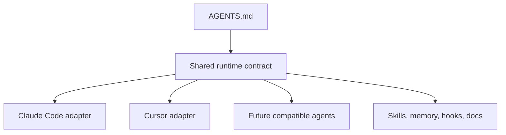
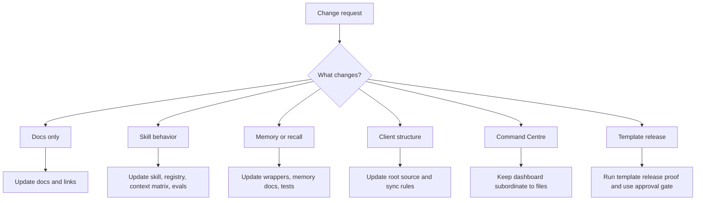
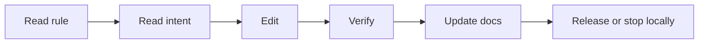
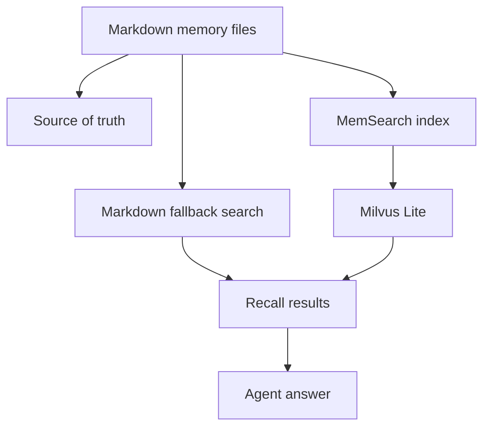

# Design And Contributing

This guide is for changing AI-OS itself.

Use it when you want to:

- improve the template,
- add a skill,
- change memory behavior,
- add a connector,
- update docs,
- change Command Centre behavior,
- prepare a template release,
- or make AI-OS safer for future users.

If you only want to use AI-OS for normal work, start with
[Getting Started](getting-started.md) instead.

## The Rule That Matters Most

AI-OS is a local, tool-agnostic agent workspace.

That means the core system must work across Claude Code, Cursor, and
other compatible agents. Do not design a core behavior that only works because
one tool happens to support it.



The adapters can be tool-specific. The rule should not be.

## Source Of Truth

When two places disagree, use this order:

| Question | Source of truth |
|---|---|
| How agents must behave | `AGENTS.md` |
| How Claude Code reads the rules | `CLAUDE.md` |
| How Cursor reads the rules | `.cursor/rules/ai-os.mdc` |
| How skills work | `.claude/skills/` and the registry in `AGENTS.md` |
| What the user or system remembers | `context/` and `clients/*/context/` |
| Brand voice and positioning | `brand_context/` and `clients/*/brand_context/` |
| Public user docs | `docs/` |
| Design intent | `docs/meta/` |
| Template release proof | `docs/template-release.md` |

Derived surfaces are useful, but they are not authority:

- Command Centre is a dashboard over files.
- MemSearch and Milvus Lite are indexes over markdown memory.
- Notion docs are a template surface that should mirror local docs.
- Reports summarize state, but the underlying files still matter.

## What Kind Of Change Are You Making?



Use the smallest change that makes the system more true. Avoid broad rewrites
unless the current shape is causing real confusion or recurring failures.

## Safe Change Workflow

For most changes:

1. Read `AGENTS.md` for the rule.
2. Read the practical doc that future users will see.
3. Read the relevant meta doc if the change affects architecture.
4. Make the smallest complete edit.
5. Add or update a test, script, eval, checklist, or doc proof when the change
   affects behavior.
6. Run the narrow verification first.
7. Update docs so the next user can understand the new behavior.



Do not treat a passing command as proof unless it covers the thing you changed.
For example, a markdown lint check does not prove memory recall boundaries are
safe.

## Docs Changes

AI-OS docs have two layers:

| Layer | Audience | Path |
|---|---|---|
| Practical docs | Users and template adopters | `docs/*.md` |
| Meta docs | Agents and maintainers changing AI-OS | `docs/meta/*.md` |

For a user-facing change, update the practical doc first. For a system behavior
change, update the meta doc too.

Good docs should:

- explain what the thing is,
- say when to use it,
- say when not to use it,
- show the files or commands involved,
- include a small diagram when structure matters,
- link to the next practical doc,
- and avoid assuming the reader already knows the system.

Bad docs usually do one of these:

- describe architecture without telling the user what to do,
- duplicate source-of-truth rules in too many places,
- skip the failure modes,
- hide cost, privacy, or external service implications,
- or explain a tool without explaining why AI-OS has it.

## Adding Or Changing Skills

Live skills live in:

```text
.claude/skills/
```

A live skill is a curated capability, not just a prompt. It should have:

- clear triggers,
- clear negative triggers,
- a bounded job,
- local fallbacks where possible,
- declared dependencies,
- relevant context loading,
- tests or evals for risky behavior,
- and a section in `context/learnings.md`.

The normal skill shape is:

```text
.claude/skills/{category}-{skill-name}/
├── SKILL.md
├── SKILL.local.md
├── references/
├── scripts/
└── assets/
```

`SKILL.local.md` is user-owned. Do not overwrite it.

When adding a live skill, update:

- its frontmatter triggers and `## Context Needs`,
- the exact matching section in `context/learnings.md`,
- generated `docs/skills-catalog.md`,
- README skill tables when relevant,
- `.env.example` if the skill needs a new key,
- `docs/connectors.md` if it needs a service or connector,
- and practical docs if users need to know it exists.

Candidate skills belong in:

```text
skills-library/
```

They are inert until promoted. Do not install random skill packs directly into
the live catalog.

## Changing Memory Or Recall

Memory changes are high-risk because they affect continuity.

Read these first:

- [Memory And Cron](memory-and-cron.md)
- [Memory Search And Observability](memory-search-and-observability.md)
- [Memory Architecture](meta/memory-architecture.md)

The important boundary:



If the index disagrees with markdown, markdown wins.

Before changing memory wrappers or client/root boundaries, run the relevant
tests or evals. At minimum, verify that:

- root recall does not leak client memory by default,
- client recall stays scoped to the selected client,
- markdown fallback still works when Milvus Lite is locked,
- direct MemSearch access respects the scoped wrappers where required,
- and generated reports land in predictable folders.

## Changing Command Centre

Command Centre is optional. AI-OS must still work when it is closed.

Read:

- [Command Centre Guide](command-centre-guide.md)
- [Background Jobs](background-jobs.md)
- [System Architecture](meta/system-architecture.md)

Command Centre can:

- show projects,
- show clients,
- show tasks,
- show docs,
- show scheduled jobs,
- and help inspect local state.

It should not become the only place where a rule, memory, task, client, or
scheduled job exists.

If a Command Centre change creates or changes files, make sure the plain file
workflow still works without the UI.

## Changing Clients

Client workspaces live under:

```text
clients/{slug}/
```

Root AI-OS holds shared methodology. Client folders hold client-specific facts,
memory, brand context, and projects.

Do not fix a shared client behavior by hand-editing every client folder. Update
the root source, then use the sync path documented in
[Multi-Client Guide](multi-client-guide.md).

The test is simple:

> Would this expose one client's memory, brand context, or work to another
> client?

If yes, stop and redesign the boundary.

## Adding Services Or Connectors

External services must be explicit.

When adding a service, update:

- `.env.example`,
- [Connectors](connectors.md),
- [Services, Keys, And Connectors](services-keys-and-connectors.md),
- and the skill or script fallback behavior.

Never put real keys in docs, memory, examples, or reports.

Any external write needs the approval gate from `AGENTS.md`. Examples:

- sending email,
- updating Notion,
- pushing to GitHub,
- publishing a template,
- changing a live deployment,
- writing to a CRM,
- or starting a paid cloud resource.

## Releasing Template Changes

Template releases affect future users, so local confidence is not enough.

Read:

- [Template Release](template-release.md)
- [Team Sharing](team-sharing.md)
- [Backups, Updates, And Undo](backups-updates-and-undo.md)

Before publishing a template update, prove:

- the target repo and branch,
- the exact commit,
- no private memory or client data is included,
- no proprietary or unverified-licence material is included,
- generated artifacts are not accidentally shipped,
- memory and routing guard tests pass,
- and the external approval gate names the target and action.

Generic approval like "go ahead" is not enough for a publish.

### Licence Boundary

Not everything in this repo may be republished. `skills-library/` carries vendored
third-party packs, and some of them are proprietary or have an unverified licence.
`skills-library/LICENSES.md` records the status of each one, and it is the source
of truth.

Anything that must never ship publicly is listed under `never_publish` in
`config/update-manifest.json`. Two things enforce it:

- `scripts/template-sync.sh` skips those paths, so they can never be propagated.
- `scripts/template-release-check.sh` fails if they are present in a checkout,
  which catches a hand-added file or a bypassed sync.

`TEAM_STRIP` in `scripts/lib/team.sh` does the same job for team copies.

The rule is simple: scrubbing does not make someone else's all-rights-reserved
material republishable. If a pack cannot be redistributed, exclude it rather than
editing it. When you vendor a new pack, add its row to `skills-library/LICENSES.md`
first, commit its upstream `LICENSE` file if the licence requires attribution, and
add it to `never_publish` if it cannot be shared. Skills promoted into
`.claude/skills/` from a licensed pack get a row in `.claude/skills/ATTRIBUTION.md`.

## What Not To Do

Avoid these patterns:

- Do not make Claude Code the owner of a core behavior.
- Do not make one tool's local config the canonical rule.
- Do not move memory authority into a vector database.
- Do not make Notion the only copy of docs.
- Do not make Command Centre required for normal AI-OS use.
- Do not silently write to external systems.
- Do not overwrite `SKILL.local.md`.
- Do not store secrets in memory or docs.
- Do not add a service without a fallback or a clear no-key behavior.
- Do not delete user/client data as a cleanup shortcut.

## Practical Checklists

### Docs-only change

- [ ] Updated the relevant practical doc.
- [ ] Updated `docs/README.md` if the doc should be discoverable.
- [ ] Updated Notion sync plan if the Notion template needs the change.
- [ ] Checked links.

### Skill change

- [ ] Read existing similar skills first.
- [ ] Updated `SKILL.md`.
- [ ] Preserved `SKILL.local.md`.
- [ ] Updated frontmatter and `## Context Needs` if triggers or scope changed.
- [ ] Regenerated `docs/skills-catalog.md`.
- [ ] Updated learnings section.
- [ ] Ran the skill eval or closest test.
- [ ] Updated user-facing docs if needed.

### Memory change

- [ ] Read memory docs and meta memory architecture.
- [ ] Verified root/client scope.
- [ ] Verified markdown fallback.
- [ ] Verified Milvus Lite lock behavior if applicable.
- [ ] Updated troubleshooting docs.

### External release or write

- [ ] Named the exact target.
- [ ] Named the exact action.
- [ ] Named the durable artifact expected.
- [ ] Got explicit approval.
- [ ] Verified the live target after the write.

## Related Docs

- [AI-OS Docs](README.md)
- [How AI-OS Works](how-it-works.md)
- [Command Centre Guide](command-centre-guide.md)
- [Memory Search And Observability](memory-search-and-observability.md)
- [Services, Keys, And Connectors](services-keys-and-connectors.md)
- [Template Release](template-release.md)
- [Team Sharing](team-sharing.md)
- [Meta Docs](meta/README.md)
