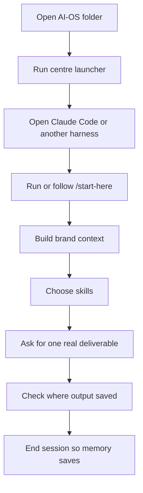

# Getting Started With AI-OS

This guide is for the first few hours with AI-OS. It assumes the template is
already on your machine and you want to know exactly what to do next.

If you are brand new, read [Start Here And First Run](start-here-first-run.md)
first. That page explains the `/start-here` onboarding command in detail.

## The First 90 Minutes



The mistake is starting with every optional setup path. Do not do that. The
first job is to prove the core loop:

```text
context -> skill -> work output -> memory -> next session is sharper
```

## Step 1: Launch AI-OS

From the root folder:

```bash
bash scripts/centre.sh
```

After first setup, you can usually run:

```bash
centre
```

Then open Claude Code from the same root folder:

```bash
claude
```

If you are using Codex, Cursor, Hermes, or another compatible harness, open the
same AI-OS root folder and ask it to follow [Start Here And First Run](start-here-first-run.md).

## Step 2: Run `/start-here`

Inside Claude Code, run:

```text
/start-here
```

If that alias is unavailable, run:

```text
/onboarding
```

This command checks backup setup, asks the core business questions, builds or
confirms brand context, walks through skill selection, explains projects and
clients, and gives a first recommendation.

Do not skip it on a new install. Most of the "AI-OS feels generic" problem
comes from trying to use skills before brand context and user context exist.

## Step 3: Know What It Will Ask

`/start-here` asks up to four core questions:

1. What does your business do?
2. Who is your ideal customer?
3. What makes you different?
4. How do you want to come across?

It may also ask for links, existing copy, or brand assets. If you have a
website, LinkedIn page, YouTube channel, or example writing, share it during
this setup.

The output is saved mainly in:

```text
brand_context/
context/USER.md
context/learnings.md
```

## Step 4: Choose Skills

After brand context exists, `/start-here` shows the optional skill list. You can
keep all skills or remove what you do not need.

Example:

```text
keep all
```

or:

```text
remove 5, 6, 9
```

The full live catalog is generated here:

```text
docs/skills-catalog.md
```

The practical explanation is here:

```text
docs/skills-and-capabilities.md
```

## Step 5: Ask For One Real Deliverable

Good first asks:

- "Write a short homepage section for my offer."
- "Audit this landing page copy."
- "Turn this idea into a simple project brief."
- "Create a client onboarding checklist."
- "Summarize these notes and save the finding."

Avoid huge first asks like:

- "Set up my whole business."
- "Build the full client delivery system."
- "Rewrite all docs and automate everything."

AI-OS can handle larger work, but the first session should prove the basic
cycle.

## Step 6: Know Where Output Goes

Single-task outputs usually go under:

```text
projects/{category-type}/
```

Project briefs usually go under:

```text
projects/briefs/
```

Client-specific outputs go under the same paths inside the client folder:

```text
clients/{client}/projects/
```

If you are unsure where something saved, ask:

```text
Where did you save the output from this session?
```

## Step 7: End The Session Normally

Say:

```text
done for today
```

or:

```text
that's it
```

AI-OS should write the session to today's memory log:

```text
context/memory/YYYY-MM-DD.md
```

Do this before switching clients or closing the session if you want
continuity.

## Step 8: Check Memory Once

Memory lives in files. The most useful ones to know:

| File | What it means |
|---|---|
| `context/MEMORY.md` | Small active scratchpad. |
| `context/memory/YYYY-MM-DD.md` | Daily session logs. |
| `context/learnings.md` | Durable lessons and skill feedback. |

If searchable memory is set up, test it:

```bash
bash scripts/memsearch-search.sh "what did we work on today" 5 --scope root
```

If semantic search is unavailable, use markdown fallback:

```bash
bash scripts/memory-search.sh "what did we work on today" 5 --scope root
```

## When To Add A Client

Add a client when work has its own:

- brand voice,
- memory,
- projects,
- client-specific facts,
- deliverables,
- cron jobs,
- secrets or API settings.

Create one from the root workspace:

```bash
bash scripts/add-client.sh "Client Name"
```

Then work from the client folder:

```bash
cd clients/client-name
claude
/start-here
```

Read [Multi-Client Guide](multi-client-guide.md) before doing real client work.

## What To Read Next

| If you want to understand | Read |
|---|---|
| The first-run command | [Start Here And First Run](start-here-first-run.md) |
| The system shape | [How AI-OS Works](how-it-works.md) |
| Commands and paths | [Cheat Sheet](cheat-sheet.md) |
| Memory and search | [Memory And Cron](memory-and-cron.md) |
| Larger projects | [Projects Guide](projects-guide.md) |
| Client workspaces | [Multi-Client Guide](multi-client-guide.md) |
| Skills | [Skills And Capabilities](skills-and-capabilities.md) and [Skills Catalog](skills-catalog.md) |
| Problems and fixes | [Troubleshooting](troubleshooting.md) |

## The Rule Of Thumb

Use AI-OS like an operator would use a workspace:

- run `/start-here` on a fresh install,
- keep the source files clean,
- end sessions so memory saves,
- put client work in client folders,
- use skills for repeatable work,
- turn on automation only after the manual workflow makes sense.
