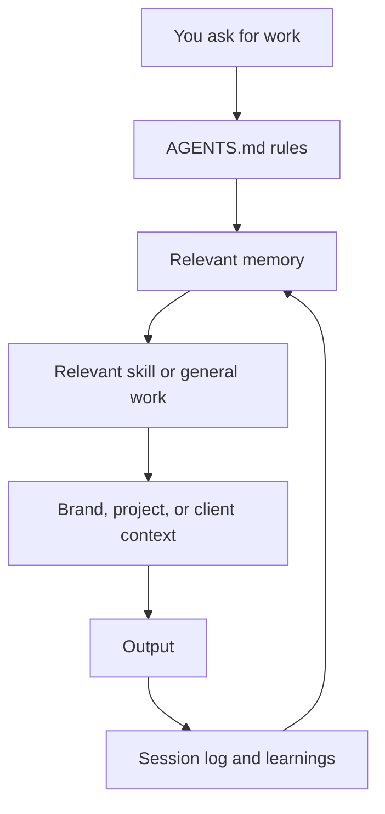

# How AI-OS Works

This is a plain-words tour of what happens under the hood. You do not need all
of it to use AI-OS, but it helps when you want to understand why the system
behaves the way it does.

## The Big Idea

AI-OS turns an agent harness, such as Claude Code, Codex, Cursor, Hermes, or a
similar tool, into a more consistent business assistant.

The harness does the model work. AI-OS gives it a shared workspace:

- rules,
- memory,
- skills,
- brand context,
- project folders,
- client folders,
- scheduled jobs.

Most of that workspace is plain text. The agent reads useful files when a
session starts, does the work, and saves the important result back to files.

## The Four Main Layers

| Layer | What it means | Where it lives |
|---|---|---|
| Identity | Who the assistant is and who you are. | `context/SOUL.md`, `context/USER.md` |
| Rules | How the assistant should behave and what must be protected. | `AGENTS.md` |
| Skills | Practical methods for repeatable work. | `.claude/skills/` |
| Memory | What should carry forward between sessions. | `context/` and `clients/*/context/` |

Brand context and projects sit beside those layers. They give the agent voice,
business context, and a clear place to save work.



## How A Session Flows

1. You open an agent inside the AI-OS folder.
2. The agent reads the project rules and startup memory.
3. You ask for work.
4. The agent checks whether a skill fits the task.
5. It gathers the local context needed for the work.
6. It saves the output in the right place.
7. Session notes and lessons are saved so future sessions start warmer.

The goal is continuity. You should not have to re-explain the same preferences,
client context, or project history every time.

## How Memory Works

The agent does not truly remember everything by itself. AI-OS gives it memory
files to read.

| File or folder | Job |
|---|---|
| `context/MEMORY.md` | Small active note loaded at root session start. |
| `context/memory/YYYY-MM-DD.md` | Daily session log. |
| `context/learnings.md` | Lessons that skills and the system should reuse. |
| `clients/{client}/context/` | Client-specific memory and current-state notes. |
| `brand_context/` | Voice, positioning, audience, and examples. |

Search helpers can find older notes, but the markdown files remain the source of
truth. If a search helper is unavailable, the agent can still inspect the files.

For the practical memory guide, read [Memory And Cron](memory-and-cron.md).

## First-Run Onboarding

For a fresh install, the first useful command is:

```text
/start-here
```

If that alias is unavailable, run:

```text
/onboarding
```

The onboarding flow helps you:

- confirm the workspace is backed up,
- create or review your brand foundation,
- fill in `context/USER.md`,
- choose optional skills,
- understand projects and client folders,
- learn how sessions save memory,
- decide whether scheduled jobs matter yet.

It is the bridge between "I copied the repo" and "AI-OS has enough context to
help me."

## How Skills Get Picked

A skill is a task-specific method. When your request matches a skill, the agent
should read that skill and follow it.

Examples:

- marketing copy uses a marketing or copywriting skill,
- system changes use AI-OS meta skills,
- website work uses website or frontend skills,
- memory work uses memory-related skills.

If no skill fits, the agent should handle the work normally and note the gap
when the gap matters.

## Where Things Live

| You want | Look in |
|---|---|
| The agent's shared rules | `AGENTS.md` |
| Claude Code adapter | `CLAUDE.md` |
| Your profile | `context/USER.md` |
| Active memory | `context/MEMORY.md` |
| Daily session logs | `context/memory/` |
| Lessons | `context/learnings.md` |
| Brand voice and audience | `brand_context/` |
| Live skills | `.claude/skills/` |
| Projects and outputs | `projects/` |
| Client workspaces | `clients/` |
| Scheduled jobs | `cron/jobs/` |
| Optional local dashboard | Command Centre |

## What Makes It Tool-Agnostic

AI-OS does not need every agent tool to be identical. It needs the project
contract to be clear.

`AGENTS.md` is the shared contract. Claude Code reads it through `CLAUDE.md`.
Codex can read it directly. Cursor gets a pointer through its rules folder.
Other harnesses should follow the same project instructions when they support
that pattern.

This means the same workspace can guide different tools without copying memory
or rewriting the whole system for each one.

## Related Docs

- [What AI-OS Is](what-ai-os-is.md)
- [Start Here And First Run](start-here-first-run.md)
- [Memory And Cron](memory-and-cron.md)
- [Memory Search, Vector Databases, and AI Observability](memory-search-and-observability.md)
- [Commands And Folder Map](commands-and-folder-map.md)
- [Multiple Client Workspaces](multi-client-guide.md)
- [Command Centre](command-centre-guide.md)
