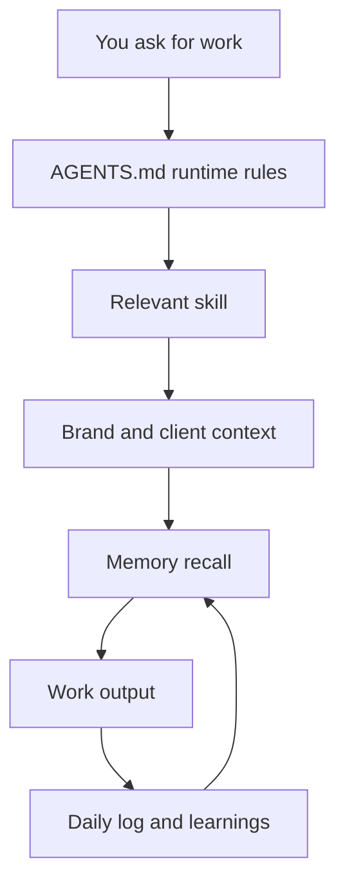

# How AI-OS Works

A plain-words tour of what is happening under the hood. You do not need any of this to use AI-OS. It is here for when you want to understand why it behaves the way it does.

## The big idea

AI-OS turns a coding agent (Claude Code, Cursor) into a business assistant that knows you, remembers your work, and gets sharper every session. It does this with plain text files, not magic. The agent reads those files when a session starts, does the work, and writes back what it learned when the session ends.

## The four layers

1. **Identity** - who the agent is and who you are. `context/SOUL.md` is the agent's character. `context/USER.md` is your profile (name, business, how you like to work).
2. **Skills** - what the agent can do. Each skill is a folder in `.claude/skills/`. A skill is just instructions the agent follows when your request matches its triggers.
3. **Brand context** - your voice, positioning, and ideal customer, in `brand_context/`. Skills read these so output sounds like you, not like generic AI.
4. **Memory** - what the agent remembers between sessions (below).



## How memory works

The agent wakes up fresh every session. These files are its memory, read at the start:

- `context/SOUL.md` - the agent's character. Rarely changes.
- `context/USER.md` - who you are.
- `context/MEMORY.md` - a small scratchpad of durable facts, active threads, and pending decisions. Capped at 2,500 characters on purpose, so it stays fast.
- `context/memory/{date}.md` - a log for each day, one block per session. This is the running diary.
- `context/learnings.md` - lessons each skill has picked up. Loaded only when that skill runs.

One thing to know: edits to `MEMORY.md` during a session save to disk but only take effect next session. That is deliberate. It keeps startup fast and cheap.

Searchable memory is optional. When it is enabled, AI-OS still keeps the plain
text files as the source of truth. MemSearch and Milvus Lite create a derived
semantic index so the agent can find older notes by meaning, while markdown
fallback keeps exact file search available if the semantic index is locked or
unavailable. For the practical breakdown of MemSearch, Milvus Lite, Pinecone,
and Langfuse, read `docs/memory-search-and-observability.md`.

## How a session flows

1. **Start** - the agent reads the memory files above, so it already knows you.
2. **Work** - you ask for something. The agent matches it to a skill and follows that skill's instructions, using your brand context.
3. **End** - when you sign off, the agent saves what happened to today's log and updates learnings.

Next time, it picks up where you left off.

## How first-run onboarding works

For a fresh install, the first real command should be:

```text
/start-here
```

`/start-here` is the canonical first-run command. `/onboarding` is kept as a
compatibility alias that points back to `.claude/commands/start-here.md`.
The command walks the new user through the actual AI-OS setup path:

1. check whether the workspace is backed up to the user's own GitHub repo,
2. scan existing brand context and user profile,
3. ask the core business and operating-context questions one at a time,
4. collect links and assets,
5. build brand voice, positioning, and ICP files,
6. update `context/USER.md`,
7. ask which optional skills to keep,
8. gather role, recurring work, client, tool, privacy, and first-success context,
9. explain projects, client workspaces, sessions, and nightly jobs,
10. recommend the first useful task.

That command is the bridge between "I copied the repo" and "AI-OS has enough
context to help me." Read [Start Here And First Run](start-here-first-run.md)
for the full plain-words version.

## How skills get picked

When you ask for something, the agent checks for a skill whose triggers match. If one fits, it runs that skill. If none fits, it tells you there is a gap and offers to build a skill or handle it with general knowledge. It never silently ignores a skill that exists.

## Where things live

| You want | Look in |
|----------|---------|
| The agent's character | `context/SOUL.md` |
| Your profile | `context/USER.md` |
| Durable facts and threads | `context/MEMORY.md` |
| Daily session logs | `context/memory/` |
| Your brand voice and audience | `brand_context/` |
| What the agent can do | `.claude/skills/` |
| The rules the agent follows | `AGENTS.md` (and `CLAUDE.md` for Claude) |

## Related docs

- Design source of truth: `docs/meta/README.md`
- Commands and paths at a glance: `docs/cheat-sheet.md`
- Practical command and folder map: `docs/commands-and-folder-map.md`
- Memory and the nightly jobs: `docs/memory-and-cron.md`
- Memory search, vector databases, and observability: `docs/memory-search-and-observability.md`
- Working with multiple clients: `docs/multi-client-guide.md`
- The optional dashboard: `docs/command-centre-guide.md`
