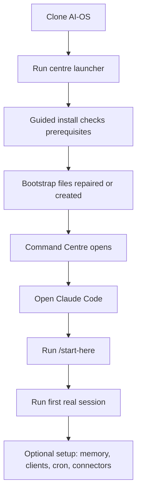

# Install And Setup

This guide is for a new AI-OS template user starting from a fresh machine or a
fresh clone.

## The Short Version



Start with the smallest working setup. Add optional pieces only when you need
them.

## Requirements

You need:

| Tool | Why |
|---|---|
| Git | Clone and update AI-OS. |
| Bash | Run the setup scripts. |
| Python 3 | Run helper scripts and checks. |
| Node.js + npm | Run the Command Centre dashboard. |
| Claude Code | Main runtime interface. |

## Fresh Install

Clone the repo:

```bash
git clone https://github.com/camrontaylor/AI-OS-Template.git AI-OS
cd AI-OS
```

No token or account is needed. That repo is the clean template: the system, the
skills, and the docs, with nobody else's memory, clients, or keys in it. Your own
memory and brand context are built on your machine as you use it, and stay there.

Run the launcher:

```bash
bash scripts/centre.sh
```

On Windows:

```powershell
powershell -File scripts\centre.ps1
```

The first launch runs the guided install. It checks prerequisites, prepares
local bootstrap files, repairs what it can, asks one-time setup questions, and
starts the Command Centre.

## What `centre` Does

After first setup, you can usually run:

```bash
centre
```

The launcher:

1. Reuses an already-running Command Centre if one exists.
2. Runs guided install on first launch.
3. Repairs missing bootstrap files on later launches.
4. Checks dependencies.
5. Installs Command Centre npm dependencies if needed.
6. Starts the local dashboard at `http://localhost:3000`.

The Command Centre is optional. AI-OS can still run from the terminal if the
dashboard is closed or broken.

## Manual Maintenance Commands

Run guided install directly:

```bash
bash scripts/install.sh
```

Repair local bootstrap files only:

```bash
bash scripts/install.sh --repair
```

Check dependencies:

```bash
bash scripts/setup.sh --check
```

Refresh dependencies:

```bash
bash scripts/setup.sh
```

## First Agent Session

After setup, open Claude Code from the repo root:

```bash
claude
```

Then run:

```text
/start-here
```

If that alias is unavailable, run:

```text
/onboarding
```

The onboarding command builds or confirms the foundation:

- who you are,
- what the business is,
- brand voice,
- positioning,
- ideal customer,
- what kind of work AI-OS should help with,
- which optional skills to keep,
- how sessions, projects, clients, and cron work.

Then ask for one real deliverable. Do not start by configuring everything.

## Optional Setup

### Searchable memory

Set up semantic memory:

```bash
bash scripts/setup-memory.sh
```

Check it:

```bash
bash scripts/setup-memory.sh --check
```

Read:

- [Memory And Cron](memory-and-cron.md)
- [Memory Search And Observability](memory-search-and-observability.md)

### Clients

Add a client when work needs separate memory, brand context, projects, and
deliverables:

```bash
bash scripts/add-client.sh "Client Name"
```

Read:

- [Multi-Client Guide](multi-client-guide.md)

### Scheduled jobs

Start cron only after you understand what should run:

```bash
bash scripts/start-crons.sh
```

Read:

- [Background Jobs](background-jobs.md)
- [Turn On Nightly Jobs](turn-on-nightly-jobs.md)

### Services and connectors

Do not add every key on day one. Add the key or connector when a real workflow
needs it.

Read:

- [Services, Keys, And Connectors](services-keys-and-connectors.md)
- [Cost And Privacy](cost-and-privacy.md)

## Setup Checklist

| Step | Required? | Done when |
|---|---|---|
| Clone repo | Yes | `AI-OS/` exists locally. |
| Run `bash scripts/centre.sh` | Yes | Guided install finishes. |
| Open Command Centre | Optional | `http://localhost:3000` opens. |
| Open Claude Code | Yes for Claude users | `claude` starts in repo root. |
| Run `/start-here` | Yes for new users | Backup, brand foundation, user profile, and skill selection are handled. |
| Build brand foundation | Strongly recommended | `brand_context/` has useful files. |
| Run first deliverable | Yes | Output is saved somewhere clear. |
| End session normally | Yes | Daily memory log is written. |
| Set up semantic memory | Optional | `setup-memory.sh --check` passes. |
| Add clients | Optional | `clients/{client}/` exists. |
| Start cron | Optional | `status-crons.sh` shows daemon status. |
| Add keys/connectors | Optional | A real workflow needs them. |

## If Setup Fails

Use the systems check:

```bash
bash .claude/skills/meta-systems-check/scripts/check.sh
```

For Command Centre runtime checks:

```bash
bash .claude/skills/meta-systems-check/scripts/check.sh --deep
```

Read:

- [Troubleshooting](troubleshooting.md)
- [Command Centre Guide](command-centre-guide.md)

## Related Docs

- [Getting Started](getting-started.md)
- [Start Here And First Run](start-here-first-run.md)
- [How AI-OS Works](how-it-works.md)
- [Cheat Sheet](cheat-sheet.md)
- [Services, Keys, And Connectors](services-keys-and-connectors.md)
