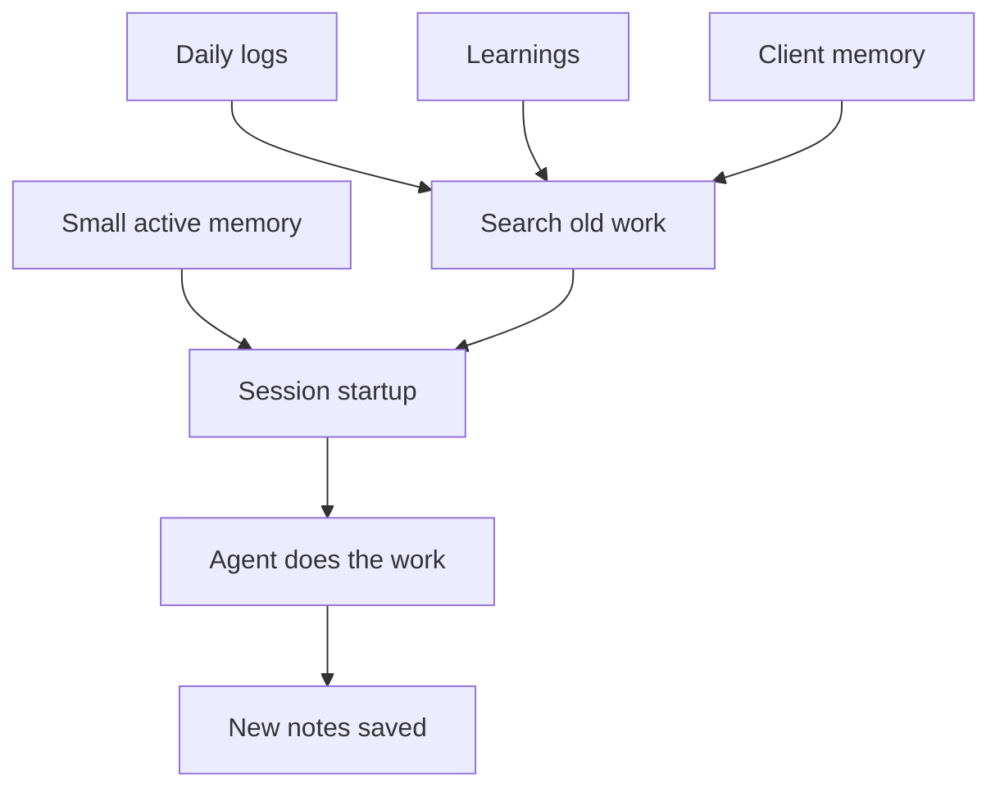

# How AI-OS memory and cron jobs work (plain words)

AI-OS memory is ordinary files plus a few helpers that keep those files useful.
You do not need to understand databases to use it.

Use this page when you want to know what AI-OS remembers, where it saves that
memory, how to search old work, and what the nightly jobs do.

If you only need commands, start with [Commands And Folder Map](commands-and-folder-map.md)
or [Background Jobs](background-jobs.md).

## Fast Checks

| Need | Command or file |
|---|---|
| See today's session log | `context/memory/YYYY-MM-DD.md` |
| See active root memory | `context/MEMORY.md` |
| Search AI-OS memory | `bash scripts/memsearch-search.sh "query" 10 --scope root` |
| Search one client | `bash scripts/memsearch-search.sh "query" 10 --scope client --client client-name` |
| Check memory setup | `bash scripts/setup-memory.sh --check` |
| Refresh the search index | `bash scripts/memsearch-reindex.sh` |
| Start scheduled jobs | `bash scripts/start-crons.sh` |
| Check scheduled jobs | `bash scripts/status-crons.sh` |
| Read job logs | `bash scripts/logs-crons.sh` |

## What AI-OS Remembers

AI-OS has several memory files because each file has a different job.

| Memory layer | Path | What it is for |
|---|---|---|
| Active memory | `context/MEMORY.md` | The small note loaded at the start of a root session. It holds current threads, stable facts, and pending decisions. |
| Daily logs | `context/memory/YYYY-MM-DD.md` | The dated record of what happened in each session. |
| Learnings | `context/learnings.md` | Durable lessons the system or a skill should remember next time. |
| User profile | `context/USER.md` | Basic information about you and how you like to work. |
| Client memory | `clients/{client}/context/` | Client-specific memory, daily logs, learnings, and current-state notes. |

The active memory file is intentionally small. It should not hold every detail.
It should point to the best source when details live elsewhere.


```mermaid
flowchart TD
  A["Small active memory"] --> D["Session startup"]
  B["Daily logs"] --> E["Search old work"]
  C["Learnings"] --> E
  F["Client memory"] --> E
  E --> D
  D --> G["Agent does the work"]
  G --> H["New notes saved"]
```

## How Memory Gets Used

When you open Claude Code, Codex, Cursor, Hermes, or another compatible agent
harness inside AI-OS, the agent reads the shared rules and the relevant memory.
That gives it a warm start instead of a blank chat.

During the session, the agent can also search older memory when the current task
depends on past work. The safe command is:

```bash
bash scripts/memsearch-search.sh "what did we decide about onboarding?" 10
```

That wrapper searches the AI-OS memory files and returns source paths. If the
semantic search helper is unavailable, it falls back to direct markdown search.
The source markdown files remain the truth either way.

Use the deeper search page when you need to decide whether local search is
enough or a production app needs separate retrieval infrastructure:
[Memory Search, Vector Databases, and AI Observability](memory-search-and-observability.md).

## What Gets Saved After A Session

At the end of useful work, AI-OS should save:

- the goal,
- the main deliverables,
- decisions made,
- open threads,
- corrections,
- useful lessons.

Those notes go into the dated daily log first. Stable items can later be
distilled into active memory or learnings.

Memory written during a session is saved to disk, but newly written startup
memory usually becomes active in the next session. That keeps the current
session stable.

## Client Memory

Client work should stay inside the client folder:

```text
clients/{client}/
```

That boundary matters. A client folder can have its own memory, brand context,
projects, and instructions while still using the shared AI-OS rules and skills.

Use client memory for:

- client facts,
- relationship history,
- active client projects,
- client voice and positioning,
- client-specific decisions.

Use root memory for AI-OS itself, your personal operating preferences, and
methods that apply across clients.

## Cron Jobs

A cron job is a scheduled task. In AI-OS, cron jobs are local markdown files in:

```text
cron/jobs/
```

Each job says when it runs, what model or runtime it should use, and what task
prompt should be executed. The cron daemon reads those files and starts the job
at the right time.

Common scheduled jobs:

| Job type | What it does |
|---|---|
| Memory distill | Keeps active memory small and useful. |
| Client current-state brief | Builds a readable client summary from recent work. |
| Correction distill | Turns confirmed corrections into durable lessons. |
| Memory search index | Refreshes searchable memory. |
| Memory backup | Copies memory to the local backup location and, if configured, an external destination. |
| Health checks | Reports problems before they become invisible drift. |

Check the live job list instead of trusting a copied list:

```bash
bash scripts/status-crons.sh
```

## Why Scheduled Jobs Need Auth

Scheduled jobs run without you sitting in the chat. That means the headless
agent runtime needs its own credential.

If cron jobs fail with an auth error, check:

```bash
bash scripts/status-crons.sh
bash scripts/logs-crons.sh
```

Then follow the cron setup guide:
[Turn On Nightly Jobs](turn-on-nightly-jobs.md).

Do not paste API keys or tokens into docs, memory, or chat summaries. Store
secrets in `.env` or the configured secret location.

## The Mac Still Has To Be Awake

On a laptop, scheduled jobs only run while the Mac is awake. AI-OS groups most
nightly jobs into one window so the machine can wake, run the batch, and sleep
again.

If the Mac is closed, unplugged, or asleep through the window, the daemon should
catch up when the machine is awake again. Use the job logs to confirm what
happened.

## If Memory Feels Wrong

Use this order:

1. Check the current memory file: `context/MEMORY.md`.
2. Check today's daily log: `context/memory/YYYY-MM-DD.md`.
3. Search old memory with `scripts/memsearch-search.sh`.
4. If search looks stale, run `bash scripts/memsearch-reindex.sh`.
5. If a scheduled job failed, read `bash scripts/logs-crons.sh`.
6. If the issue is client-specific, switch to that client folder and check the
   client `context/` files.

The main rule is simple: if a search helper fails, inspect the markdown source.
The files are still the source of truth.

## Related Docs

- [How AI-OS Works](how-it-works.md)
- [Memory Search, Vector Databases, and AI Observability](memory-search-and-observability.md)
- [Background Jobs](background-jobs.md)
- [Turn On Nightly Jobs](turn-on-nightly-jobs.md)
- [Cost And Privacy](cost-and-privacy.md)
