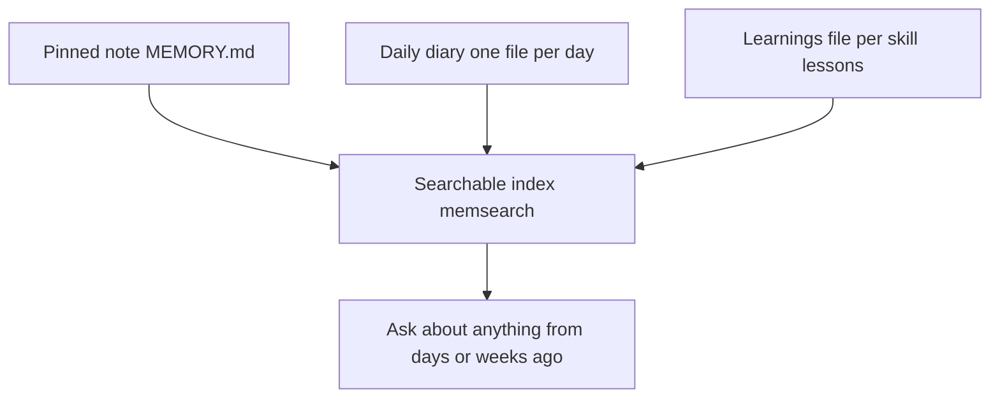

# How AI-OS memory and cron jobs work (plain words)

*Updated 2026-06-22. A non-technical explainer so you know what is actually happening under the hood.*

> Same system, two docs: this file explains the memory stack and how to make cron durable in plain words. For the command reference (start, stop, status, logs, schedule options, and the Command Centre host), see the README "Scheduled Jobs (Cron)" section. The daemon described here is the same managed runtime the README documents.
>
> For the practical decision guide on MemSearch, Milvus Lite, Zilliz, Pinecone,
> and Langfuse, see [Memory Search, Vector Databases, and AI
> Observability](memory-search-and-observability.md).

## Use this when

Read this page when you want to understand:

- what AI-OS remembers,
- where memory is stored,
- why MemSearch and Milvus Lite exist,
- what the nightly memory jobs do,
- why scheduled jobs need auth,
- and what to check when memory or cron feels broken.

If you only need commands, use [Commands And Folder Map](commands-and-folder-map.md)
or [Background Jobs](background-jobs.md).

## Fast checks

| Need | Command or file |
|---|---|
| See today's session log | `context/memory/YYYY-MM-DD.md` |
| See hot root memory | `context/MEMORY.md` |
| Search root memory | `bash scripts/memsearch-search.sh "query" 10 --scope root` |
| Search one client | `bash scripts/memsearch-search.sh "query" 10 --scope client --client client-name` |
| Check memory setup | `bash scripts/setup-memory.sh --check` |
| Refresh semantic index | `bash scripts/memsearch-reindex.sh` |
| Start scheduled jobs | `bash scripts/start-crons.sh` |
| Check scheduled jobs | `bash scripts/status-crons.sh` |
| Read job logs | `bash scripts/logs-crons.sh` |

## The memory stack, top to bottom

AI-OS keeps memory in four layers. Each layer has a different job, and they work together.

```mermaid
flowchart TD
  A[Pinned note MEMORY.md] --> D[Searchable index memsearch]
  B[Daily diary one file per day] --> D
  C[Learnings file per skill lessons] --> D
  D --> E[Ask about anything from days or weeks ago]
```

1. **The pinned note** (`context/MEMORY.md`). One small file capped at 2,500 characters. Holds your current working threads, environment facts, and decisions waiting on you. Loaded silently at the start of every session, so the assistant always knows the lay of the land.

2. **The daily diary** (`context/memory/{YYYY-MM-DD}.md`). One file per day. The first real prompt creates a session block. Ordinary Stop hooks keep that block useful by replacing empty placeholders with conservative details from the assistant response, especially Next Actions, and by mining the raw session transcript for the real files written that turn (Write/Edit/MultiEdit), so Deliverables reflect what was actually done, not what got re-mentioned. Overnight, `session-backfill` reads the full transcript of any session that ended without a wrap-up and reconstructs its Goal, Decisions, Corrections, Preferences, and Open threads. Full wrap-up still finalises it with the clean goal, deliverables, decisions, and loose ends - it is now the top layer, not the only thing standing between you and lost memory. Today's file is loaded silently at session start.

3. **The client current-state brief** (`clients/{slug}/context/current-state.md`). A generated readable brief for each client. It expands hot memory with recent session signals, key source files, reference files, and project folders, so `MEMORY.md` can stay small without feeling thin. It is loaded silently at client session start for the active client, and remains available on demand elsewhere.

4. **The learnings file** (`context/learnings.md`). Per-skill lessons accumulated over time. Loaded only when a skill runs, not at startup.

5. **The searchable memory index** (memsearch). The durable memory layers get turned into a bounded semantic search index. Client brand context can be searched when recall is scoped to clients; broader reference surfaces such as root brand context, Notion sync, and chat transcripts are explicit deep-search/reference material, not routine memory recall.

## Memsearch and Milvus, in plain words

**Memsearch** is the search tool. You type a question in normal English, it finds matching notes.

**Milvus** is the engine that does the matching. It stores "embeddings" of every note (a list of numbers that represents the meaning of the text). When you search, it turns your query into the same kind of number list and finds the closest matches by distance. Think of it like a library where every book sits on a shelf based on what it is about, not alphabetically. Two books about the same thing end up next to each other.

AI-OS uses **Milvus Lite**, the version that runs inside the memsearch process. There is no separate server to start. The data lives in one file: `~/.memsearch/milvus.db`. The harmless `too_many_pings` warning you may see in logs is just gRPC keepalive noise. It is silenced by setting `GLOG_minloglevel=3` and `GRPC_VERBOSITY=NONE` in any environment that runs memsearch.

Milvus Lite is single-process. While an index job is writing to it, live semantic search may return a lock error. That is temporary unavailability, not missing memory. Agents should fall back to the markdown search layer and retry semantic search after the job finishes if semantic matching is still needed.

Manual recall should use `bash scripts/memsearch-search.sh "your query" 10`, which resolves the canonical AI-OS collection, runs semantic search, runs deterministic markdown recall, and fuses both result sets. This matters because semantic search can return broad nearby context while exact markdown hits catch specific terms like attachment fields, duplicate handling, or workflow names. From the root workspace, the wrapper defaults to root AI-OS memory only. From inside a client folder, it defaults to `workspace` scope: that client plus the root layer (root learnings, root MEMORY), never other clients (2026-07-28 - the old client-only default walled client sessions off from root lessons). Force a boundary with `--scope root|client|clients|all|workspace` and `--client slug` when needed. If Milvus cannot start, the wrapper returns markdown results only. The markdown layer reads root/client `context/MEMORY.md`, `context/memory/`, `context/learnings.md`, and client `brand_context/` only when client scope is included, so it needs no lock file, local port, or external service. Root transcripts and broad reference archives require explicit deep search. The plugin's `.memsearch/memory/` shadow captures are diagnostic material only; they are not authoritative AI-OS recall sources.

Do not use raw `memsearch search`, `memsearch expand`, `memsearch index`, or `memsearch stats` for routine AI-OS recall. Direct MemSearch calls can bypass the canonical collection and fallback layer. Use `scripts/memsearch-search.sh` for recall and `scripts/memsearch-reindex.sh` for indexing.

## Auto-recall: relevant memory comes to you

Semantic search used to be a tool the assistant had to remember to reach for. In practice it rarely did, so a healthy index sat mostly unused (2026-07-20 audit: recall fired in only a handful of sessions and almost never in organic work). The `.claude/hooks/auto-recall.js` UserPromptSubmit hook fixes that. On substantive prompts it runs a `memsearch-search.sh` query built from your prompt and injects the top few hits as context, the same way `MEMORY.md` and today's diary are injected at startup. Memory now comes to the session instead of waiting to be asked for.

It is built to be quiet and safe:
- Fires up to 4 times per session (90s cooldown, doubling after zero-yield fires), starting from the first non-greeting prompt. Recalibrated 2026-07-28: the old once-per-session fire meant a mid-session question could never be caught even when the right chunk scored 0.9.
- Injects nothing unless a hit clears its lane's relevance bar: semantic hits need >= 0.5 (recalibrated 2026-07-28 against real July queries where correct answers scored 0.50-0.90), and up to two exact-match markdown hits (term-rarity scores, floor 10) get reserved slots. File-list headings (Deliverables) are skipped. Silence beats noise.
- Skips anything already loaded at startup (`MEMORY.md`, today's and yesterday's diary), so it only ever adds NEW context: learnings, older logs, wiki, client memory.
- Never blocks the prompt. On any timeout, Milvus lock, or error it stays silent and the prompt proceeds. It respects client-vs-root scope from the session folder.
- Skips scheduled cron runs (no human, and it would hammer Milvus on every sweep).

Turn it off or tune it with env vars: `AI_OS_AUTORECALL_DISABLE=1`, `AI_OS_AUTORECALL_MIN_SCORE`, `AI_OS_AUTORECALL_MAX_HITS`, `AI_OS_AUTORECALL_TIMEOUT_MS`. It is registered in the tracked `.claude/settings.json` as the 8th `UserPromptSubmit` hook (alongside the existing 7), so it ships as an AI-OS default and propagates via template-sync. It takes effect from the next session start.

The embedding model is **ONNX**, running locally on your CPU. No external API call, no cost per query. The tradeoff is speed: about half a second to embed one chunk. That is fast enough for live search, but slow for a full reindex. The single nightly owner lists the complete semantic source set - root memory plus every discovered `clients/*` memory workspace - without `--force`, so unchanged files are skipped and destructive-sync never drops sources. Client brand context stays in scoped markdown recall, and transcripts stay behind explicit deep search because transcript archives can be too large and often contain client-specific material that should not appear in root recall. Manual force rebuilds are still possible with `bash scripts/memsearch-reindex.sh --force`, but they are intentionally not scheduled.

## Cron jobs, in plain words

A cron job is a task that runs on a schedule. AI-OS has active root and client memory jobs that maintain the memory system without you having to think about it.

Each job is a markdown file in `cron/jobs/` with two parts:
- A YAML header (name, time, schedule, model, timeout). Example: `time: '23:30', days: daily, active: 'true', timeout: 2h`.
- A prompt body. When the schedule fires, the cron daemon spawns a one-shot `claude` session, feeds it the prompt body, and waits for it to finish.

The cron daemon is a node process that watches the schedule and does the spawning. Run it manually with `bash scripts/start-crons.sh`. Make it run on its own forever via launchd (see `~/Library/LaunchAgents/com.aios.cron-daemon.plist`).

### What each active memory job does

| Job | Schedule (exact) | On or Off | What it does |
|-----|------------------|-----------|--------------|
| `session-backfill` | 06:50 daily | On | Reconstructs Goal/Decisions/Corrections/Preferences/Open threads for yesterday's auto-finalized session blocks (sessions that ended without a manual wrap-up) by reading the raw transcript via `scripts/session-digest.js`. Strictly additive, never touches human or wrap-up blocks. Runs before the distills so they consume enriched blocks. |
| `daily-memory-distill` | 23:00 daily | On | Reads today's session blocks and updates MEMORY.md (promotes warm threads, retires resolved ones). |
| `client-memory-distill` | 23:05 daily | On | Reads today's client session blocks and updates each client `context/MEMORY.md` without writing root memory. |
| `client-current-state-brief` | 23:06 daily | On | Generates each client `context/current-state.md` from hot memory, recent logs, key source files, reference files, and project folders. |
| `client-memory-evaluator` | Sun 23:07 | On | Checks each client hot-memory file after distill and before curation. |
| `client-memory-gaps` | Sun 23:08 | On | Writes per-client memory gap reports before curation. |
| `client-memory-curator` | 23:10 daily | On | Normalizes client hot memory and consolidates only files near the size limit. |
| `daily-correction-distill` | 23:10 daily | On | Promotes explicit confirmed corrections into scope-correct learnings. |
| `weekly-memory-gaps` | Sun 23:11 | On | Flags root coverage gaps and stale items before the root curator. |
| `daily-memory-curator` | 07:26 daily | On | Keeps root hot memory within budget without rewriting healthy files. |
| `nightly-memsearch-index` | 23:30 daily | On | Runs one strict complete-source index, records the completed generation, proves semantic health, then runs the stable top-three retrieval benchmark. A skip, a dead semantic-paraphrase case, or recall below the hard floor fails the job; a healthy dip below the aspirational target is a non-fatal WARN, so a working index never reports a false FAILURE (two-tier gate, 2026-07-20). |
| `semantic-memory-health` | 23:37 daily | Off | Retired time-based follow-up. Health now runs inside the nightly index job only after indexing finishes. |
| `nightly-memory-backup` | 23:45 daily | On | Runs the deterministic append-only local backup and, when configured, mirrors it to a user-chosen external disk or synced folder. A configured mirror failure exits non-zero. |
| `weekly-memsearch-rebuild` | Sun 23:33 | Off | Retired duplicate of the nightly complete-source sync, kept as design history. |

The local backup lives at `~/.ai-os-memory-backup`. That protects against branch
and workspace mistakes, but not a failed Mac disk. After choosing an external
disk or synced folder, put its full destination path in
`.command-centre/brain-backup-dest`, then run `bash scripts/backup-memory.sh`.
For a cloud-synced folder on the boot volume, add `kind: synced-folder` on line
two only after confirming the provider really syncs that folder off the Mac.
The systems check verifies mirror freshness and volume separation for external
disks; the synced-folder declaration is an explicit user trust decision.

The shared reindex script uses `scripts/memsearch-fast-index.py` when available. The canonical routine set includes root/client hot memory, dated logs, learnings, top-level synthesis and wiki files, the generated Notion catalog, daily notes, and policy-named curated knowledge folders (`myob-exo/`, `operator/`). Raw Notion items, transcripts, brand files, project trees, agency internals, client directives/docs, and execution artifacts stay deep-search-only or excluded. Authority: `config/memory-index-policy.json`; parity is enforced by `scripts/test-memory-index-policy.sh`.

The job files are authoritative for current active state. Run the cron list/status command rather than relying on a copied list in docs. Optional content jobs and the retired weekly MemSearch duplicate remain off until deliberately enabled.

### Why a cron job needs auth (and the auth wall you just hit)

The cron daemon spawns the `claude` binary directly and runs the bare binary. If the bare binary has no credential, every job fails with HTTP 401 "Invalid authentication credentials."

The headless auth path (see `scripts/claude-cron-wrapper.sh` for the wrapper that uses it):
1. **OAuth token via `claude setup-token`.** A long-lived (~1 year) token stored in `~/.config/claude-code-oauth-token` (or the launchd env). The wrapper exports it as `CLAUDE_CODE_OAUTH_TOKEN`. Run `bash scripts/enable-cron.sh <token>` to wire it up. This is the path in use.
2. **OAuth via `claude /login`.** Creates `~/.claude/.credentials.json`, which the bare binary reads as a fallback.

## The daemon is durable now

The launchd plist at `~/Library/LaunchAgents/com.aios.cron-daemon.plist` starts the daemon on every login (running `cron-daemon.cjs serve`), restarts it if it dies, and routes claude through the auth wrapper. Once you set the credential, load it with one command (see the runbook in `projects/meta-audit/2026-06-21_cron-and-search-fixes.md`).

## But the Mac has to be awake (the nightly wake)

The daemon can only run a job while the Mac is awake. A laptop asleep at 23:00 runs nothing at 23:00. So on a laptop, two things make it reliable without keeping the Mac awake all night:

- **One nightly wake.** macOS wakes the Mac once a night while it is plugged in: `sudo pmset repeat wakeorpoweron MTWRFSU 23:35:00`. Every job is scheduled just before that wake, so they run as one batch in scheduled-time order, then the Mac sleeps again.
- **Failsafes.** If the Mac is closed or unplugged at the wake, the batch runs the moment you next open it. It also survives a reboot: the daemon remembers the last run in `.command-centre/cron-last-sweep.json`.

This is why memory maintenance jobs sit between 23:00 and 23:45. The 23:35 wake catches up earlier jobs in schedule order, then lets the post-index health check and backup finish. Full setup is in `turn-on-nightly-jobs.md`.

---
Part of the AI-OS docs (see README.md for the map). Read next: Turn on the nightly jobs (turn-on-nightly-jobs.md), or the practical guide to [memory search, vector databases, and observability](memory-search-and-observability.md). For the design source behind memory, semantic recall, and health loops, see `docs/meta/memory-architecture.md` and `docs/meta/health-and-regression.md`.

## Correction Capture Backend (canonical detail; AGENTS.md points here)

The interactive contract lives in AGENTS.md "Correction Capture": record confirmed mistakes as one-line `### Corrections` bullets in the day's session block, silently. The backend then runs on its own:

- **Promote (nightly).** `cron/jobs/daily-correction-distill.md` runs `scripts/correction-distill.sh` after the memory-distill jobs. It reads the day's `### Corrections` bullets from session logs, root and every client, and appends each as a durable lesson to the scope-correct `context/learnings.md` via `scripts/capture-correction.sh` (creates the section if missing, dedups on the text, append-only, never copies a client lesson up into root). No LLM re-derivation and no transcript mining: the judgment already happened at record time, so this layer is pure plumbing.
- **Resurface.** The nightly memsearch index covers `context/learnings.md`, and skills read their own learnings section before running, so the lesson returns both through recall and through skill loading.
- **Detect and report (weekly health arm).** `cron/jobs/correction-capture-health.md` runs `scripts/correction-capture-health.sh`, which reports, across root and every client, corrections recorded in daily logs versus promoted into learnings, flags any promotion gap (recorded but not distilled) or silent window (nothing recorded), and confirms the distill job is active. It writes a dated report to `projects/ops-cron/` and stays silent when healthy. Honest limit it states itself: it verifies recording-to-promotion, not capture completeness - it cannot see a correction that was never recorded in a daily log. The transcript backstop that gap called for now exists: `session-backfill` (06:50 daily) reads the raw transcript of any unwrapped session and reconstructs `### Corrections` (and Goal/Decisions/Preferences/Open threads) before the correction distill runs, so a confirmed mistake the in-session model failed to record still gets promoted into learnings.

## Decision Ledger Backend (canonical detail; AGENTS.md points here)

The interactive contract lives in AGENTS.md "Decision Ledger": directional calls (positioning, offer, pricing, naming, ICP, strategy) are recorded in `context/decisions.md` with a reopen gate, so a settled decision is not silently rewritten by the next session. This is the sibling of Correction Capture: corrections capture confirmed wrong facts, the ledger captures directional calls and the bar to reopen them.

- **File.** `context/decisions.md`, root and per client, append-only. One entry per decision as a `## Topic` heading followed by bullets: `Status` (Decided / Reopened / Proposed / Unresolved / Retired), `Decided` (date), `Call` (the decision in one or two lines), `Reopen gate` (what must be true to reopen - a buyer signal, a test result, explicit user direction), `Gate met` (yes / no / n-a), `Reopened` (an integer, with optional detail after it), and optional `Note` / `Source`.
- **Surface (session start).** A shared parser, `scripts/lib/decision_ledger.py`, is imported by `scripts/client-memory-maintenance.sh --mode brief` (one parser, so the surfacer and the health guard never drift on format). The brief writes an `## Open Decisions (do not silently reopen)` section at the top of `current-state.md`, which `load-memory-snapshot.js` injects at client session start. It surfaces any entry that is Proposed / Unresolved / Open, has an unmet gate, or has been Reopened at least once. Retired and clean decided-with-gate-met entries stay hidden, so the section carries only what genuinely needs guarding. Root-scope surfacing rides a one-line pointer in `MEMORY.md` for now; a SessionStart injection of the root ledger is the natural follow-on.
- **Maintain (session close).** `meta-wrap-up` Step 3g appends a new entry when the session made a directional decision, and bumps `Reopened` plus appends the new call when it reopened an existing one, recording in `Note` whether the reopen was authorized. Append-only, like the correction log; never overwrite a prior call.
- **Why it exists.** A client positioning decision was rewritten four times across seven weeks with zero buyer contact, because a settled call left no durable, surfaced object carrying its reopen gate. The correction loop could not catch it (nobody was wrong), and the curation posture pushes settled decisions out of surfaced hot memory rather than keeping them visible with their gate: `curate` mode removes bullets labeled resolved / superseded / complete, and `evaluate` flags decided-sounding Pending Decisions for clearing. So a settled call tends to vanish from view and each session re-opens the same question from a blank slate. The ledger is the missing decision object.
- **Health check (detect and report).** `scripts/decision-ledger-check.sh` reads every ledger through the shared parser and flags chronic churn (a decision reopened 3 or more times, so the reopen gate is not holding) and malformed entries (missing a required field, so they would silently fail to surface). It writes a dated report to `projects/system-health/`, exits non-zero on chronic churn, and never edits a ledger. `cron/jobs/decision-ledger-check.md` runs it weekly (shipped `active: false`; enable deliberately). `scripts/test-decision-ledger.sh` is a 27-case hermetic stress suite over the parser and the guard: missing / empty / retired / clean / gated / chronic / proposed / malformed entries, plus adversarial values (colon in a value, non-numeric count, unicode, stray bullets), plus the guard end to end. It complements `client-facts-drift` (authority docs versus live billed reality); this one checks the decisions themselves.
- **Live truth defers to Facts of Record.** A ledger entry records a decision and its reopen gate, not live reality. Any live fact inside a `Call` (a price, a tier name, what is actually shipped) defers to `context/facts-of-record.md`, which wins on facts. This keeps a proposal in the ledger from being mistaken for what is billed.
- **Deferred.** A cross-date `### Decisions` thrash detector for churn that never became a ledger entry is still deferred; the ledger plus the health check covers recorded decisions, and clustering free-text decision bullets needs care. Add it if churn recurs despite the ledger.
