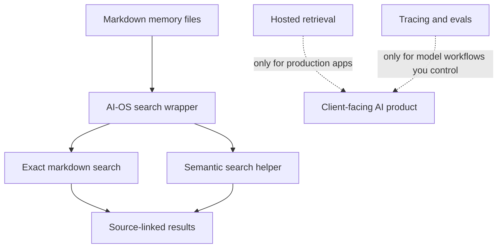
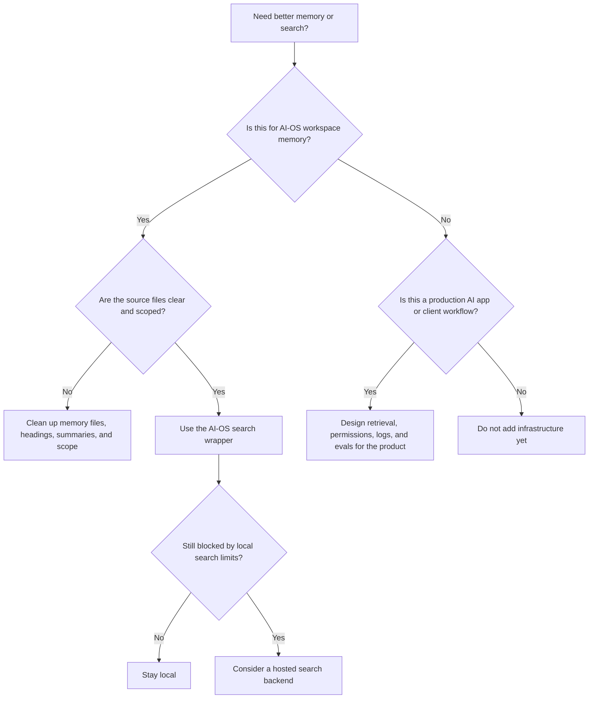

# Memory Search, Vector Databases, and AI Observability

This page helps you decide what kind of memory or search setup you need.

For normal AI-OS use, the answer is usually simple: keep memory in local
markdown files, search it with the AI-OS wrapper, and add extra tools only when
a real workflow needs them.

## The Short Version



| Need | Start with |
|---|---|
| Remember what happened in AI-OS | Local memory files. |
| Find older notes by meaning | `scripts/memsearch-search.sh`. |
| Find exact names, commands, or file paths | Markdown search. |
| Search one client only | Client-scoped memory search. |
| Build a client-facing AI app with many users | A separate hosted retrieval layer. |
| Debug a repeatable model workflow | App logs, then tracing/evaluation tooling if logs are not enough. |

## What The Search Wrapper Does

The normal command is:

```bash
bash scripts/memsearch-search.sh "what did we decide about onboarding?" 10
```

The wrapper:

- searches the AI-OS memory files,
- uses semantic search when available,
- runs exact markdown search too,
- blends the results,
- returns source paths,
- falls back to markdown if semantic search is blocked or locked.

That last point matters. Search can degrade without losing memory. The markdown
files remain the source of truth.

## Plain Words For The Terms

| Term | Meaning |
|---|---|
| Memory files | The markdown files AI-OS reads and writes, such as `context/MEMORY.md` and dated logs. |
| Semantic search | Search by meaning, not only exact words. |
| Embedding | A numeric representation of text meaning. You do not need to edit it. |
| Vector database | A database that stores embeddings and finds similar meanings. |
| Local search index | A derived search helper that can be rebuilt from the markdown files. |
| Hosted retrieval | A separate search system for a production app or many users. |
| Observability | Logs, traces, scores, cost, and error records for model workflows. |

## When Local AI-OS Memory Is Enough

Stay with local AI-OS memory when:

- one person or a small team is using the workspace,
- the important knowledge lives in memory files, projects, and client folders,
- you need recall for your agent sessions,
- answers should point back to local source files,
- occasional local search fallback is acceptable,
- the problem is "what did we decide?" or "where did we save that?"

This is the default for AI-OS and for ordinary client workspaces.

## Improve The Source Before Buying Tools

Most memory problems are source-shape problems, not infrastructure problems.

| Symptom | Better first fix |
|---|---|
| Active memory feels crowded | Move details into a daily log, project brief, or reference file. |
| Search returns broad results | Improve headings, file names, and summaries. |
| The agent misses exact details | Search the markdown files or use the wrapper so exact hits are included. |
| Client facts appear in root answers | Search from the client folder or pass `--scope client --client slug`. |
| A client has many raw docs | Create curated reference notes instead of dumping everything into active memory. |
| Search seems stale | Run `bash scripts/memsearch-reindex.sh` and check cron logs. |

AI-OS works best when the source files are readable. A better database will not
fix unclear notes.

## Search By Scope

Root memory search:

```bash
bash scripts/memsearch-search.sh "memory setup" 10 --scope root
```

One client:

```bash
bash scripts/memsearch-search.sh "dashboard notes" 10 --scope client --client acme
```

All clients:

```bash
bash scripts/memsearch-search.sh "which clients have active dashboard work?" 10 --scope clients
```

Direct markdown fallback:

```bash
bash scripts/memory-search.sh "Acme request patterns" 10 --scope client --client acme
```

## When A Production Retrieval Layer Makes Sense

Use a separate hosted retrieval layer when you are building an AI product or
workflow for other users, not just searching your own AI-OS memory.

It starts to make sense when most of these are true:

- many users or teams need access,
- the system must work while your laptop is off,
- documents are uploaded and changed continuously,
- the app needs permissions or tenant boundaries,
- uptime and backups matter,
- retrieval is part of a paid client deliverable,
- the app needs to search a large document set,
- you need production monitoring around search quality and failures.

Examples:

- a client knowledge-base assistant,
- internal SOP search for a company,
- support triage over thousands of tickets,
- product or parts lookup,
- sales enablement over permissioned docs.

Keep AI-OS as the builder's workspace. Put production retrieval in the product
when the product needs it.

## When Observability Makes Sense

Observability means you can inspect what a model workflow did: prompts, outputs,
errors, cost, latency, trace steps, test scores, and failures.

Start with normal logs. Add tracing or eval tooling when:

- a script, app, or automation calls a model repeatedly,
- a client deliverable needs quality checks,
- cost or latency is hard to understand,
- failures are hard to reproduce,
- prompt changes need regression tests,
- several people need to review the same model workflow.

It is less useful for ordinary conversational agent sessions because those
sessions usually run inside Claude Code, Codex, Cursor, Hermes, or another
harness you do not fully control.

## A Practical Decision Path



## The Rule Of Thumb

Use AI-OS memory for your workspace, decisions, client context, and operating
history.

Use production retrieval when an app or client workflow needs its own search
system.

Use observability when a repeated model workflow needs debugging, scoring, cost
review, or quality control.

## Related Docs

- [How AI-OS memory and cron jobs work](memory-and-cron.md)
- [How AI-OS Works](how-it-works.md)
- [Cost And Privacy](cost-and-privacy.md)
- [Services, Keys, And Connectors](services-keys-and-connectors.md)
- [Memory Architecture](meta/memory-architecture.md)
