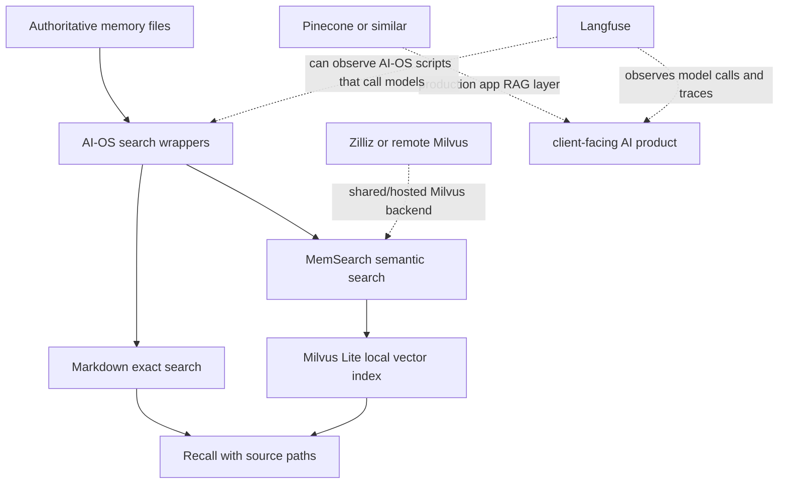
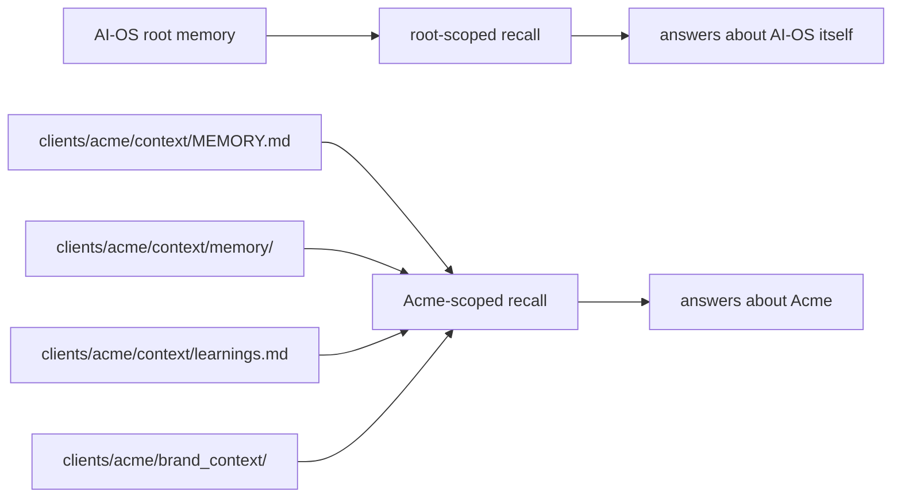
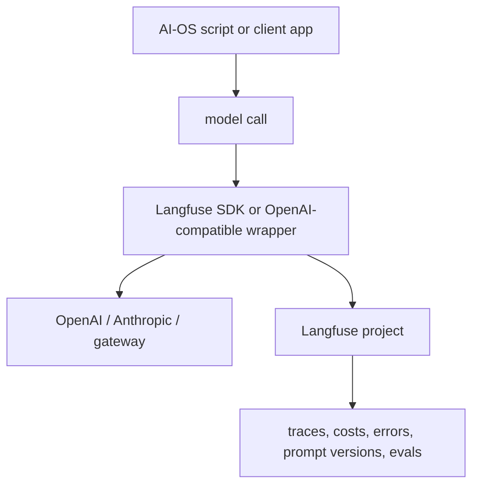
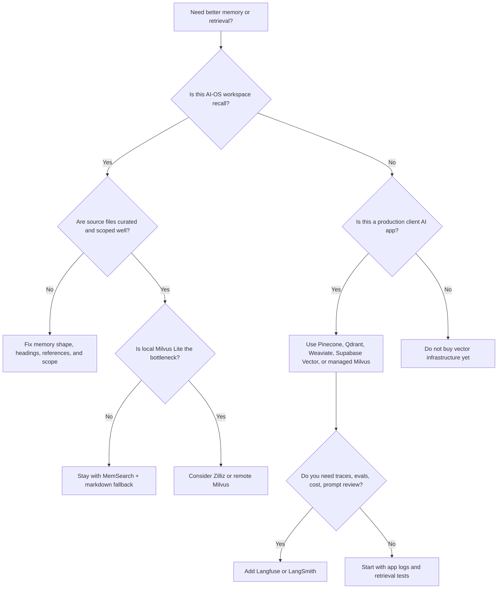

# Memory Search, Vector Databases, and AI Observability

AI-OS memory is deliberately local-first. The source of truth is still plain text
inside the workspace. Tools such as MemSearch, Milvus Lite, Zilliz, Pinecone,
and Langfuse sit around that source of truth. They make it easier to find,
scale, or inspect AI work, but they do not replace the memory files unless the
system is explicitly redesigned to do that.

Use this guide when you are asking:

- What is MemSearch doing?
- What is Milvus Lite?
- When is local AI-OS memory enough?
- When should a client build use Pinecone or another managed vector database?
- What would Langfuse add to AI-OS today?

## The Short Version



The important distinction:

- **Memory files** are the truth.
- **MemSearch** is the recall tool.
- **Milvus Lite** is the local vector engine MemSearch uses.
- **Pinecone** is usually for production app retrieval, not personal workspace memory.
- **Langfuse** is observability and evaluation, not memory storage.

## What AI-OS Memory Is Actually Doing

AI-OS has multiple memory layers because each layer has a different job.

| Layer | Path | Job |
|---|---|---|
| Hot memory | `context/MEMORY.md` | Tiny active scratchpad loaded at session start. Current threads, stable facts, pending decisions. |
| Daily logs | `context/memory/YYYY-MM-DD.md` | Chronological record of sessions, decisions, deliverables, and unresolved threads. |
| Learnings | `context/learnings.md` | Durable lessons and behavior changes, usually organized by skill. |
| Client memory | `clients/{client}/context/` | Client-specific hot memory, logs, learnings, request patterns, relationship notes, and references. |
| Search index | `~/.memsearch/milvus.db` | Derived index that makes old memory searchable by meaning. Not authoritative. |

The design choice is intentional: AI-OS can still work if the semantic index is
broken, deleted, locked, or not installed. The agent can read and search the
markdown files directly. That is why the system is robust in a way a pure
database-backed memory product is not.

## What Is An Embedding?

An embedding is a list of numbers that represents the meaning of a piece of
text. Text about the same topic ends up numerically close together, even if it
does not use the exact same words.

Example:

- "Where did we document the Acme dashboard?"
- "Find the client task board notes for Acme"

Those questions use different words, but they point at similar meaning. A
semantic search engine can find relevant memory even when keyword search misses
the exact phrase.

## What MemSearch Does

MemSearch is the semantic recall tool. AI-OS uses it through wrapper scripts,
not through raw `memsearch` commands.

The normal command is:

```bash
bash scripts/memsearch-search.sh "what did we decide about Acme dashboards?" 10
```

The wrapper does several things:

1. Resolves the canonical AI-OS memory collection.
2. Runs semantic search through MemSearch.
3. Runs exact markdown search against authoritative memory files.
4. Fuses the results so exact source matches can outrank broad semantic matches.
5. Returns source paths so the agent can cite or open the underlying file.
6. Falls back to markdown search if Milvus Lite is unavailable.

That hybrid design matters. Semantic search is good at "find the nearby idea."
Markdown search is good at "find the exact file, command, client name, or env
var." AI-OS uses both because business memory needs both.

## What Milvus Lite Does

Milvus is the vector database underneath MemSearch. AI-OS uses Milvus Lite on
macOS and Linux. Milvus Lite is embedded, so there is no separate server to
start.

The local database lives here:

```text
~/.memsearch/milvus.db
```

Its job is to store vector embeddings for memory chunks and return the closest
matches when a query embedding comes in.

There are two practical consequences:

- It can be rebuilt from the markdown memory files because it is a derived
  index.
- It is single-process. If an index job is writing to it, live semantic search
  may hit a temporary lock.

Milvus Lite uses a local database file and binds a loopback port. If that is
blocked, the AI-OS wrapper returns markdown fallback results. A sandbox or lock
failure means "semantic search was unavailable," not "memory is empty."

## Why AI-OS Built It This Way

AI-OS optimizes for long-term operating memory, not just fancy retrieval.

The system keeps the source of truth as files because files are:

- easy to inspect,
- easy to edit,
- easy to version,
- easy to back up,
- easy to move between Claude Code, Cursor, and future agents,
- resilient when a vendor API, local database, or plugin has a bad day.

MemSearch and Milvus Lite add semantic recall without taking ownership of the
memory. This is the right default for an agent workspace used by one operator
across many clients.

## How Client Memory Fits

Client folders have their own memory boundaries:



From the root workspace, recall defaults to root AI-OS memory. From inside a
client folder, recall defaults to that client. You can force a boundary:

```bash
bash scripts/memsearch-search.sh "dashboard notes" 10 --scope client --client acme
bash scripts/memsearch-search.sh "memory architecture" 10 --scope root
bash scripts/memsearch-search.sh "all clients with dashboard issues" 10 --scope clients
```

For a client like Acme, "we have lots of context" does not automatically mean
"we need Pinecone." The current practical question is usually: is the client
memory well organized, scoped correctly, and searchable from the right place?

## When Local AI-OS Memory Is Enough

Stay with local AI-OS memory when most of these are true:

- One main operator is using the workspace.
- The authoritative knowledge is markdown memory, brand context, project notes,
  and curated reference files.
- You need recall for agent work, not a public or internal app with many users.
- Search is mostly across hundreds or low thousands of memory chunks.
- Occasional local lock/fallback behavior is acceptable.
- The right answer must point back to local files.
- The problem is "remember what we decided," not "serve millions of chunks."

This is the current default for AI-OS and for normal client folders.

## When To Improve AI-OS Memory Before Buying Infrastructure

Upgrade the local memory shape before adding Pinecone when the symptoms are:

| Symptom | Better first fix |
|---|---|
| `MEMORY.md` feels crowded | Move details into dated logs or stable reference files. Keep hot memory under the budget. |
| The agent remembers vague context but misses exact facts | Use the AI-OS wrapper so semantic and markdown recall are fused. |
| Client facts leak into root answers | Fix scope: search from the client folder or pass `--scope client --client slug`. |
| A client has many raw docs | Create curated indexes and stable reference files instead of dumping everything into hot memory. |
| Search results are broad | Improve file names, headings, and summaries. Semantic search performs better on well-shaped source chunks. |
| Indexing feels stale | Run `bash scripts/memsearch-reindex.sh` or check the nightly cron status. |

The highest-leverage work is usually curation, not infrastructure.

## Automatic Intake, Not Automatic Adoption

AI-OS should make bringing in external material easy, but it should not treat
new material as trusted operating context the moment it appears.

The right pattern is already used for external skills:

```text
external source -> backlog -> triage -> review -> promote or park
```

The same pattern should apply to client memory, reference material, new tools,
and AI infrastructure ideas.

| Material type | Automatic intake | Safe default | Promotion trigger |
|---|---|---|---|
| External skills | Vendor into `skills-library/backlog/` | Inert candidate, not live | User moves to triage or asks to promote |
| Client documents | Save to client `projects/` or `context/inbox/` | Searchable only by explicit deep search | Curated summary moves to `context/reference/` |
| Durable client facts | Log in dated memory first | Not hot memory by default | Distill into `context/MEMORY.md` if it stays useful |
| Tool/product research | Save as a brief under `projects/briefs/` | Reference material, not architecture | Promote to docs/AGENTS only after a decision |
| Retrieval infrastructure | Record recommendation and threshold | No database switch | Use when a real workflow hits the threshold |
| Observability/evals | Prototype on one workflow | Not global instrumentation | Promote after traces/evals prove useful |

This prevents two failure modes:

- **manual bottleneck**: the user has to remember where every useful thing
  should go;
- **catalog pollution**: every interesting skill, note, or tool becomes active
  before it earns that status.

The operating rule is:

```text
Capture automatically.
Classify automatically.
Summarize automatically.
Index cautiously.
Promote deliberately.
```

For client folders, AI-OS implements this with the `meta-context-intake` skill,
`scripts/context-intake.py`, and `config/memory-index-policy.json`. New clients
get:

```text
clients/{slug}/context/inbox/
clients/{slug}/context/reference/
clients/{slug}/context/intake/review/
clients/{slug}/context/intake/parked/
```

Run intake from the AI-OS root:

```bash
bash scripts/context-intake.sh --client acme
```

The command creates a dated promotion plan under
`clients/acme/context/intake/review/`. It classifies each inbox file, proposes
a destination, states the indexing tier, and leaves every source file in place.
That report is the gate: only approved rows get distilled into hot memory,
dated logs, reference files, the skill library, docs, or infrastructure.

For external skills, this means "bringing in a skill" should be normal and safe.
The skill lands as candidate material. It can be trialed for one job. It does
not become part of AI-OS until it has been assessed, bundled to the right grain,
registered, tested, and accepted.

## When To Upgrade To Remote Milvus Or Zilliz

Remote Milvus or Zilliz is the natural upgrade when you want the same memory
model but a hosted vector backend.

Use it when:

- local Milvus Lite locks or platform issues become frequent,
- multiple machines need the same semantic index,
- Windows-native setup needs a backend without local watcher problems,
- you want managed Milvus while keeping the AI-OS MemSearch pattern,
- the use case is still workspace recall, not a production client app.

This is an infrastructure upgrade for the existing memory pattern. It is not a
product architecture by itself.

## When Pinecone Starts To Make Sense

Pinecone becomes worth considering when you are no longer solving AI-OS personal
workspace memory. You are building retrieval into a client-facing AI product.

Use Pinecone, or a similar managed vector database, when most of these are true:

- The AI system serves multiple users or teams.
- Retrieval must be available even when your local machine is off.
- Documents are uploaded, changed, and queried continuously.
- You need namespaces, metadata filters, tenancy boundaries, backups, uptime,
  and predictable operations.
- The app needs permission-aware retrieval.
- Retrieval is part of a paid client deliverable or production workflow.
- You need to search large document sets, not just curated workspace memory.
- You need observability around query latency, retrieval quality, and failures.

Examples where Pinecone can be justified:

- client knowledge-base chatbot,
- internal SOP assistant for a company,
- support triage agent grounded in thousands of tickets and docs,
- sales enablement assistant with document permissions,
- product catalog or parts lookup with fast semantic search.

Do not use Pinecone just because a client folder feels large. Use it when the
retrieval layer is itself part of the product or client operation.

## Pinecone Versus Milvus Lite Versus Zilliz

| Option | Best for | What it replaces | What it does not replace |
|---|---|---|---|
| Milvus Lite | Local single-operator AI-OS memory | Nothing. It is already the default local vector engine. | Markdown memory, client context, source files. |
| Zilliz / remote Milvus | Hosted Milvus backend for AI-OS-like recall | Local Milvus Lite storage and lock behavior. | Memory curation, source files, product app logic. |
| Pinecone | Production RAG in client apps | A DIY vector backend in the client product. | AI-OS memory, project docs, agent operating rules. |

## What Langfuse Would Look Like In AI-OS Today

Langfuse is observability for LLM apps and agents. It tracks traces, spans,
model calls, prompts, scores, evaluations, costs, and failures.

It does not automatically see everything Claude Code does internally.
It can observe AI-OS work when the relevant model calls go through code we
control, such as scripts, apps, automations, or client-facing AI builds.



For AI-OS today, Langfuse is most useful for:

- instrumenting client AI builds,
- tracing repeatable scripts that call models,
- comparing prompt versions,
- tracking cost and latency,
- reviewing failures,
- building evaluation datasets for workflows that must improve over time.

It is less useful for:

- normal conversational Claude sessions,
- local memory files,
- manual research work that does not go through an instrumented app or script.

## Langfuse Setup Shape

The recommended path is Langfuse Cloud first. Self-host only when a client has a
clear data, compliance, or procurement reason. Production self-hosting is not a
small local service: it uses app containers, workers, Postgres, Redis or Valkey,
ClickHouse, and blob storage.

Typical setup:

1. Create a Langfuse Cloud project.
2. Generate API keys.
3. Add credentials to your local secret store, not directly into tracked docs:

```bash
LANGFUSE_SECRET_KEY=...
LANGFUSE_PUBLIC_KEY=...
LANGFUSE_BASE_URL=https://cloud.langfuse.com
```

4. Pick one AI-OS script or client app workflow that already calls a model.
5. Add Langfuse instrumentation around that workflow.
6. Run the workflow and open Langfuse to inspect the trace.
7. Add naming conventions for traces, users, clients, environments, and prompt
   versions.

Time estimate:

| Setup depth | Time | Result |
|---|---:|---|
| Hello-world trace | 30 to 60 minutes | One script or sample call appears in Langfuse. |
| One real AI-OS workflow | 2 to 4 hours | A repeatable script or client build emits useful traces. |
| Reusable AI-OS pattern | 1 day | Shared helper, naming conventions, docs, and one example workflow. |
| Evals and prompt management | 2 to 3 days | Datasets, scoring, regression checks, and review workflow. |

AI-OS also has a skill-intake rule: do not directly run external skill installers
such as `npx skills add langfuse/skills` against the live catalog. Vendor or
trial the skill through `skills-library/backlog/`, then promote deliberately if
it earns a permanent place.

## Recommended Decision Path



## Practical Rule For Client Builds

For AI builds for companies:

- Use AI-OS memory for your consulting workspace, client relationship history,
  project notes, strategy, and operating context.
- Use a production vector database when the client app itself needs retrieval.
- Use Langfuse or LangSmith when the client app has model calls that need
  debugging, evaluation, cost tracking, or quality review.
- Use LangChain or LangGraph when the app needs a stateful workflow or agent
  graph that would be awkward as plain scripts.
- Use simple SDK calls or the Vercel AI SDK when the app is a straightforward
  chat, extraction, summarization, or generation workflow.

The escalation is not "AI-OS versus Pinecone." It is "workspace memory versus
production retrieval architecture."

## Useful Commands

Search root AI-OS memory:

```bash
bash scripts/memsearch-search.sh "what did we decide about memory architecture?" 10 --scope root
```

Search one client:

```bash
bash scripts/memsearch-search.sh "dashboard and task notes" 10 --scope client --client acme
```

Search all client memory:

```bash
bash scripts/memsearch-search.sh "which clients have active dashboard work?" 10 --scope clients
```

Run markdown fallback directly:

```bash
bash scripts/memory-search.sh "Acme request patterns" 10 --scope client --client acme
```

Refresh the semantic index:

```bash
bash scripts/memsearch-reindex.sh
```

Check memory setup:

```bash
bash scripts/setup-memory.sh --check
```

## Related Docs

- [How AI-OS memory and cron jobs work](memory-and-cron.md)
- [How AI-OS Works](how-it-works.md)
- [Memory Architecture](meta/memory-architecture.md)
- [Health And Regression](meta/health-and-regression.md)
- [Connectors](connectors.md)
- [Pinecone docs](https://docs.pinecone.io/)
- [Langfuse docs](https://langfuse.com/docs)
- [Milvus Lite docs](https://milvus.io/docs/milvus_lite.md)
- [MemSearch architecture](https://zilliztech.github.io/memsearch/architecture/)
