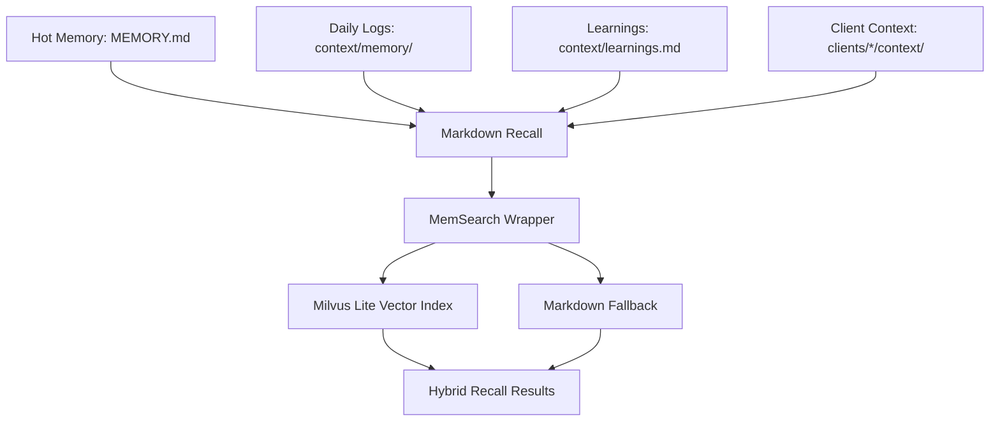

# Memory Architecture

AI-OS memory is designed to be local, inspectable, bounded at startup, and
searchable when needed.

For a practical user-facing guide to MemSearch, Milvus Lite, remote
Milvus/Zilliz, Pinecone, and Langfuse, see
[`../memory-search-and-observability.md`](../memory-search-and-observability.md).

## The Layers



## Hot Memory

`context/MEMORY.md` and `clients/{slug}/context/MEMORY.md` are startup
scratchpads. They are capped at 2,500 characters.

Client startup also includes `clients/{slug}/context/current-state.md` when it
exists for the active client. That generated brief gives more readable recent
work context without turning `MEMORY.md` into a long project history.

They should hold:

- active threads,
- stable environment notes,
- pending decisions,
- pointers to the best source file.

They should not hold:

- long project histories,
- every implementation detail,
- repeated no-op session notes,
- resolved decisions,
- full transcripts,
- or Notion/cache dumps.

## Cold Memory

Cold memory is the larger record:

- `context/memory/YYYY-MM-DD.md`,
- `context/learnings.md`,
- client daily logs,
- client learnings,
- client reference docs,
- project handoffs.

Daily logs are created by the first real prompt and conservatively patched by
the Stop auto-finalizer until a full wrap-up polishes the session block.

Scheduled automation is not a human session. Cron already has job status, logs,
and durable reports, so `session-memory-block.js` skips scheduled-job prompts.
This prevents routine procedure text from entering daily logs and semantic
recall. `memory-system-audit.sh` detects the known historical pollution shapes.

Cold memory can be searched. It does not all need to be loaded at startup.

## Semantic Memory

AI-OS uses MemSearch for semantic recall. On macOS/Linux, MemSearch uses Milvus
Lite locally. Milvus Lite is embedded in the process and persists data under
`~/.memsearch/milvus.db`.

Important rule: the semantic index is derived. It is not the source of truth.

Rebuild it with:

```bash
bash scripts/memsearch-reindex.sh
```

The reindex script lists the complete canonical source set in one pass:

- root `context/MEMORY.md`,
- root `context/memory/`,
- root `context/learnings.md`,
- root top-level `context/*.md` (the durable synthesis + `decisions.md` Decision
  Ledger + `SOUL.md`/`USER.md`), non-recursively; `learnings.shared.md` and
  `prompt-tags.md` are skipped (git-tracked mirror of learnings, and prompt
  config, not recall memory),
- root `context/wiki/` and the generated `context/notion/CATALOG.md`,
- curated root/client knowledge subfolders named by policy (currently
  `myob-exo/` and `operator/`), with noisy machine indexes excluded,
- `daily/`,
- each client `context/MEMORY.md`,
- each client `context/memory/`,
- each client `context/learnings.md`,
- each client top-level `context/*.md` (overview, relationship-history, ops
  synthesis, timeline, current-state, ...), non-recursively.

The top-level `context/*.md` layer was added 2026-07-27: previously only
`MEMORY.md`/`learnings.md` were indexed, so the richest curated knowledge (a
client's relationship history, ops synthesis, and the Decision Ledger) was
invisible to semantic recall. It is deliberately non-recursive, so
deep-search-only subfolders (`agency/`, `meetings/`, `inbox/`, `intake/`,
`transcripts/`, `directives/`, `docs/`, `reference/`, `notion/items/`) and
`brand_context/` stay out per
`config/memory-index-policy.json` - raw transcripts never enter routine recall,
but the synthesis files that summarize them do. The markdown fallback
(`scripts/memory-search.py`) covers the same set so recall does not lose
surfaces when Milvus is locked.

That complete list matters because MemSearch indexing can behave like a sync:
if a source set is incomplete, old indexed sources can disappear.

The nightly non-forced run is the one scheduled index owner. A second weekly
run of the same command was retired because unchanged-file skipping made it a
duplicate, not an independent repair. Forced rebuilding remains a manual repair.

## Recall Wrapper

Agents should not call raw `memsearch search`, `memsearch index`,
`memsearch expand`, or `memsearch stats` in AI-OS.

Use:

```bash
bash scripts/memsearch-search.sh "query" 10
```

The wrapper:

- resolves the canonical AI-OS collection,
- runs semantic recall,
- runs deterministic markdown recall,
- scopes root/client results,
- fuses both result sets,
- and falls back safely when Milvus Lite is blocked or locked.

## Milvus Lite Access

Read-only semantic search still needs access to:

- the local database under `~/.memsearch`,
- a `LOCK` file,
- and a local loopback port.

If that access is unavailable, it is a tool access issue, not proof that memory
is missing.

Use:

```bash
bash scripts/memsearch-health.sh
```

This should prove semantic recall when local Milvus access is available.
Without access, markdown fallback may still work.

## Client Memory Evaluation

When a client `MEMORY.md` exceeds 2,500 characters, AI-OS should evaluate the
shape of that client memory instead of blindly deleting text.

Run:

```bash
bash scripts/client-memory-maintenance.sh --mode evaluate --client acme
```

The evaluator looks for:

- over-budget hot memory,
- placeholder/no-op lines,
- duplicate bullets,
- too many pending decisions,
- detail-heavy lines better suited to a dated log or project handoff,
- available reference files,
- and dated session log coverage.

It writes:

```text
clients/{slug}/context/memory/YYYY-MM-DD_memory-health.md
```

This report is the curation target. The goal is better access and organization,
not memory degradation.

## Regression Checks

Memory changes should pass:

```bash
bash scripts/test-client-memory-maintenance.sh
bash scripts/test-memory-search.sh
bash scripts/test-memsearch-search.sh
bash scripts/test-memsearch-reindex.sh
bash scripts/memory-system-audit.sh
```

For semantic proof with local Milvus access:

```bash
bash scripts/memsearch-health.sh
```

## References

- [Milvus Lite documentation](https://milvus.io/docs/milvus_lite.md)
- [Milvus Lite GitHub repository](https://github.com/milvus-io/milvus-lite)
- [MemSearch architecture](https://zilliztech.github.io/memsearch/architecture/)
- [MemSearch design philosophy](https://zilliztech.github.io/memsearch/design-philosophy/)
