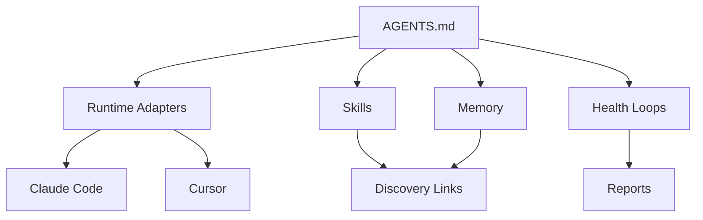

# System Architecture

This is the plain source map for AI-OS.

## Top-Level Shape



## Runtime Contract

`AGENTS.md` is the canonical rule file.

Adapters exist only to let different tools read or enforce the same rules:

- `CLAUDE.md` points Claude Code to `AGENTS.md`.
- `.cursor/rules/ai-os.mdc` points Cursor back to `AGENTS.md`.

If a tool-level default conflicts with AI-OS, the tool-level default should be
neutralized or scoped away from this repo. Do not reshape AI-OS around one tool.

## Skills

Live skills live in `.claude/skills/`.

That filesystem is the live registry. `docs/skills-catalog.md` is generated from
it for people. `.claude/skills/_catalog/` is only the first-run optional-skill
selector, not another registry. `.agents/skills/` and client skill entries are
discovery links back to the one canonical source.

Each skill should be treated as a small operating procedure:

- frontmatter says when to use it,
- `SKILL.md` gives the method,
- optional `SKILL.local.md` adds user-owned overrides,
- references are loaded only when needed,
- tests or evals are added for risky behavior.

Candidate skills live in `skills-library/`. They are inert until promoted.

## Clients

Clients live under `clients/{slug}/`.

Each client has its own:

- `AGENTS.md`,
- `CLAUDE.md`,
- `context/`,
- `brand_context/`,
- `projects/`,
- client-only skills when needed.

Shared root skills, commands, hooks, scripts, settings, and cron templates are
exposed to clients as symlinks created by:

```bash
bash scripts/update-clients.sh
```

There are no shared client copies to edit. Change the root source. Client-only
skills remain real folders in that client, and client memory, context, projects,
brand files, cron jobs, and local proxy scripts remain client-owned.

## Memory

Memory has two authorities:

- root memory for AI-OS and the operator,
- client memory for each client workspace.

Clients should not leak into root hot memory unless the fact is about the shared
system. Root should not overwrite client memory during sync.

See [Memory Architecture](memory-architecture.md).

## Cron And Reports

Cron jobs live in `cron/jobs/`.

The preferred health-loop shape is:

1. Read current state.
2. Write a small durable report.
3. Recommend the next action.
4. Avoid destructive or external changes without approval.

Reports should live in predictable places:

- system reports: `projects/system-health/`,
- root memory reports: `context/memory/`,
- client memory reports: `clients/{slug}/context/memory/`.

## Current Health Owners

| Area | Owner |
|---|---|
| Install health | `.claude/skills/meta-systems-check/scripts/check.sh` |
| Workspace drift | `scripts/workspace-health-report.sh` |
| Worktree details | `.claude/skills/meta-worktree/scripts/audit.sh` |
| Root/client memory boundaries | `scripts/memory-system-audit.sh` |
| Client memory quality | `scripts/client-memory-maintenance.sh --mode evaluate` |
| Client memory pruning | `scripts/client-memory-maintenance.sh --mode curate` |
| Semantic recall | `scripts/memsearch-health.sh` |
| Semantic indexing | `scripts/memsearch-reindex.sh` |
| Client runtime/discovery topology | `scripts/client-sync-audit.sh --strict` |
| Live skill integrity | `scripts/skill-system-audit.sh` |

## Source Of Truth Rule

If two places disagree:

1. `AGENTS.md` wins for runtime behavior.
2. Root `.claude/skills/` wins for shared skill methodology.
3. Generated `docs/skills-catalog.md` is a view, never an authority.
4. Root scripts win for shared maintenance behavior.
5. Client `context/`, `brand_context/`, and client-only skills win for client
   specifics.
6. Markdown memory wins over semantic index results.
