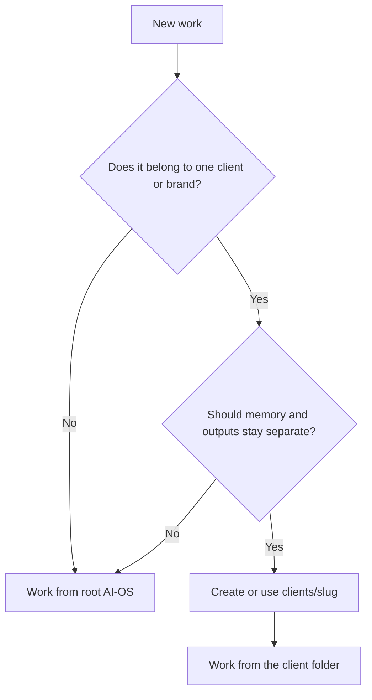
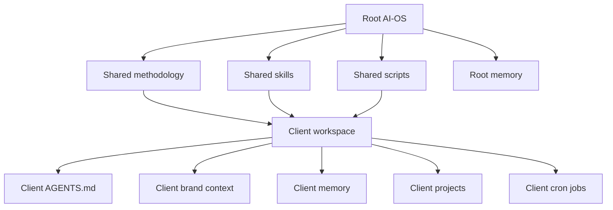
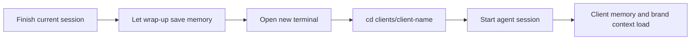

# Running AI-OS for Multiple Clients

Use this guide when you want AI-OS to support more than one business, brand,
client, or private workspace without mixing their memory.

## The Key Principle

AI-OS has two layers:

1. **Shared methodology** - `AGENTS.md`, `CLAUDE.md`, `SOUL.md`, skills, scripts. Version-controlled and shared. Lives at the root of your AI-OS folder.
2. **Client data** - `brand_context/`, memory, learnings, projects, and cron jobs. Unique per client. Lives inside `clients/{client-name}/`.

Claude remains the primary runtime. The compatibility change is structural:
- `AGENTS.md` is now the canonical shared instruction file
- root `CLAUDE.md` imports `@AGENTS.md` for Claude Code
- each client gets its own `AGENTS.md` for client-specific instructions
- each client also gets a thin `CLAUDE.md` wrapper that imports the local `AGENTS.md`

Everyone starts as a solo operator working from the root folder. When you need a second client, run `add-client.sh` and AI-OS creates a client workspace with separate context and outputs.

---

## When To Create A Client Folder

Create a client folder when the work has its own facts, voice, deliverables, or
memory that should stay separate from root AI-OS.

| Situation | Create a client? | Why |
|---|---|---|
| You are doing work for a paying client. | Yes | Their memory, brand, and files need a boundary. |
| You are running a separate business or brand. | Usually | Different voice and projects should not blend. |
| You are doing one small internal task. | No | Use root AI-OS. |
| You are researching reusable AI-OS methodology. | No | Keep shared methodology at root. |
| You need private personal memory separate from business work. | Yes | It deserves its own context boundary. |



The test is simple: if mixing this memory with another client would create
confusion or risk, use a client folder.

---

## The Mental Model



Root AI-OS is the operating system. A client folder is a scoped workspace using
that operating system. Shared methodology flows down. Client facts do not flow
back up unless you deliberately promote a reusable lesson.

---

## How the Shared Instructions Load

### Claude Code

Claude Code reads `CLAUDE.md` files from parent directories. In AI-OS:

```text
AI-OS/
├── CLAUDE.md                    <- imports root AGENTS.md
├── AGENTS.md                    <- canonical shared methodology
└── clients/
    └── client-one/
        ├── CLAUDE.md            <- imports client AGENTS.md
        ├── AGENTS.md            <- client-specific instructions
        └── ...
```

When you `cd clients/client-one && claude`:
- the root `CLAUDE.md` loads and imports the root `AGENTS.md`
- the client `CLAUDE.md` loads and imports the client `AGENTS.md`
- the result is shared methodology from the root plus client-specific instructions from the client folder

## Client Routing Guard

If you are at the root and ask for work that clearly belongs to exactly one client, AI-OS should pause before doing the work. The assistant asks:

```text
This looks like {Client Name} work. Should I switch scope to clients/{slug}/ before proceeding?
```

If you confirm, memory, learnings, projects, outputs, and client-specific decisions go under that client folder. If you say it is root/shared AI-OS work, it stays at the root.

This guard is generic. It discovers clients from `clients/*` and the first line of each client `AGENTS.md`, so it still works if you have 4 clients or 40. It does not fire for all-client work, AI-OS/template/system work, sync/update tasks, memory-system migration, or prompts that already include an explicit path like `clients/{slug}/...`.

## Safe Switching Flow

Switching clients is mostly about changing folders.



Do not keep one session open and mentally switch clients inside it. End the
session first so the right memory gets saved in the right place.

---

## What's Shared vs What's Separate

| What | Where | How clients get it |
|------|-------|-------------------|
| `AGENTS.md` (shared methodology) | Root | Shared directly from the root |
| `CLAUDE.md` (shared wrapper) | Root | Auto-inherited by Claude Code |
| `context/SOUL.md` | Root | Inherited at startup in root and client sessions |
| `context/USER.md` | Root | Inherited at startup in root and client sessions |
| `.claude/skills/` | Root (clients link to it) | Symlinked on client creation; client-only skills stay real folders |
| `scripts/` | Root (clients link to it) | Symlinked on client creation; client cron proxy scripts stay real |
| `AGENTS.md` (client-specific) | Each client | Created by `add-client.sh` |
| `CLAUDE.md` (client wrapper) | Each client | Created by `add-client.sh` |
| `brand_context/` | Each client | Built automatically on first session |
| `context/learnings.md` | Root + each client | Root has system-wide learnings; clients start with a copy and diverge |
| `context/MEMORY.md` | Root + each client | Root has system-wide hot memory; clients keep their own hot memory |
| `context/current-state.md` | Each client | Generated client brief loaded at startup for the active client |
| `context/memory/` | Root + each client | Root has system-wide session history; clients keep their own session history |
| `projects/` | Each client | Per-client deliverables |
| `.env` | Each client | Overrides-only stub; shared keys are inherited from the root `.env` |
| `cron/jobs/` | Each client | Per-client scheduled tasks |

### What stays in sync automatically

- Shared methodology at the root
- Shared skills and scripts when you run `update.sh` or `scripts/update-clients.sh`
- Claude wrappers and client instruction backfills when `update-clients.sh` runs during updates
- `SKILL.local.md`, `*.local.md`, `local/`, and `.local/` inside shared client skill folders stay client-owned during sync

### What you manage separately

- Brand context
- Learnings
- Session memory
- Projects
- Cron jobs
- API keys if you want client-specific secrets

---

## How Skills Stay in Sync

Skills live in the root folder as the single source. Each client folder links to them with symlinks, so there is nothing to drift: an edit at root is live in every client instantly.

The links are created and repaired automatically in two situations:
1. `add-client.sh` symlinks every shared skill into the new client folder
2. `update.sh` (via `update-clients.sh`) re-links skills, scripts, commands, settings, hooks, and instruction-file backfills for every client folder

`scripts/client-sync-audit.sh` verifies every link daily (the `daily-client-sync-audit` cron job) and fails loudly if anything drifts back to a copy.

Always edit shared skills at the root level:

```text
Edit here:     AI-OS/.claude/skills/mkt-copywriting/SKILL.md
Not here:      AI-OS/clients/client-one/.claude/skills/mkt-copywriting/SKILL.md
```

Client-only skills are still fine. Create them directly in the client's `.claude/skills/` folder and `update.sh` will preserve them.

Shared skill paths in clients are symlinks to root. Do not put a client-only
`SKILL.local.md` through one of those links because it would change the shared
skill for every workspace. Put client facts and execution notes in that client's
`context/learnings.md`, or create a genuinely client-only skill when the method
itself differs.

---

## Scenario 1: Solo Operator

```text
~/Projects/AI-OS/
├── AGENTS.md
├── CLAUDE.md
├── context/
├── brand_context/
├── .claude/skills/
├── projects/
├── cron/jobs/
└── .env
```

This is the default setup. You work directly from the root folder.

---

## Scenario 2: Multiple Clients

```text
~/Projects/AI-OS/
├── AGENTS.md
├── CLAUDE.md
├── context/
├── .claude/skills/
├── scripts/
└── clients/
    ├── client-one/
    │   ├── AGENTS.md
    │   ├── CLAUDE.md
    │   ├── .claude/skills/
    │   ├── scripts/
    │   ├── brand_context/
    │   ├── context/
    │   ├── projects/
    │   ├── cron/
    │   └── .env
    └── client-two/
        └── ...
```

### Adding a New Client

```bash
cd ~/Projects/AI-OS
bash scripts/add-client.sh "Client One"
```

This creates `clients/client-one/` with:
- a client `AGENTS.md` for client-specific instructions
- a client `CLAUDE.md` wrapper for Claude Code
- starter files from `templates/client/`, when present
- skills and scripts symlinked from root (client-only skills and cron proxies stay real files)
- learnings seeded from root
- empty `brand_context/`, `projects/`, and `context/memory/` folders
- a client-specific `.env` stub if a root `.env` exists

Then start working:

```bash
cd clients/client-one
claude
```

Claude automatically detects it's a new client and walks through the brand foundation.

### What Claude Sees in a Client Folder

When you `cd clients/client-one && claude`:
1. root `CLAUDE.md` loads and imports root `AGENTS.md`
2. client `CLAUDE.md` loads and imports client `AGENTS.md`
3. Claude heartbeat reads `context/SOUL.md` and `context/USER.md` from the root when needed
4. `brand_context/`, `context/memory/`, and `context/learnings.md` come from the client folder
5. `.claude/skills/` comes from the client folder

## Updating

```bash
cd ~/Projects/AI-OS
bash scripts/update.sh
```

That pulls the latest upstream changes and syncs client folders. It does not touch client data like brand context, memory, learnings, projects, or cron jobs.

Existing clients created before the `AGENTS.md` change are handled conservatively:
- if `AGENTS.md` is missing, `update-clients.sh` seeds it from the old client `CLAUDE.md`
- if the old client `CLAUDE.md` still matches the untouched scaffold, it is replaced with a wrapper automatically
- if the old client `CLAUDE.md` contains custom content, it is preserved and you can clean it up manually later

---

## Sharing API Keys

If all clients use the same API keys:

```bash
cp .env clients/client-two/.env
```

`add-client.sh` already does this automatically when the root `.env` exists.

If a client needs different keys, edit that client's `.env` locally. Do not put
real keys in docs, memory, or project files.

---

## Cron Across Clients

One managed cron runtime covers the root workspace plus every `clients/*` workspace. Start it once from the workspace root:

```bash
cd ~/Projects/AI-OS
bash scripts/start-crons.sh
```

The Command Centre UI also schedules root and client jobs while the server is running. If the UI and daemon coexist, a shared leader lock in `.command-centre/` ensures only one host schedules jobs at a time.

---

## Rules of Thumb

- Work from the root folder when you are operating for yourself
- Work from `clients/{slug}/` when you are operating for a specific client
- If a root session sees one-client work, confirm the client scope before writing
- Edit shared methodology in root `AGENTS.md`
- Keep `CLAUDE.md` files as wrappers; do not put the canonical shared rules there
- Edit shared skills at the root
- Let client `AGENTS.md` files hold client-specific instructions

## Common Mistakes

| Mistake | Safer move |
|---|---|
| Doing client work from the root folder. | Stop and switch to `clients/{slug}/` before writing files. |
| Copying one client's brand context into another. | Build or update each client's `brand_context/` separately. |
| Editing shared client skill copies. | Edit the root skill, then sync clients. |
| Putting reusable AI-OS methodology in one client folder. | Promote the lesson to root docs, root memory, or a root skill. |
| Assuming Command Centre changed the source of truth. | Treat Command Centre as a dashboard over the same files. |
| Running cron from several places without checking status. | Use `bash scripts/status-crons.sh` and the shared leader lock. |

## Related Docs

- [What AI-OS Is](what-ai-os-is.md)
- [Commands And Folder Map](commands-and-folder-map.md)
- [Projects Guide](projects-guide.md)
- [Memory And Cron](memory-and-cron.md)
- [Services, Keys, And Connectors](services-keys-and-connectors.md)
