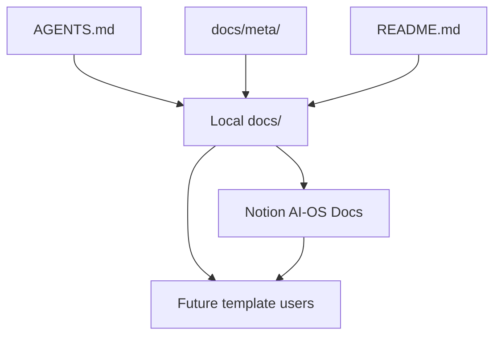

# Notion Template Docs Map

This is the local source map for the Notion AI-OS Docs template.

Use it when updating the Notion docs, checking coverage, or deciding where a
new explanation should live.

The rule is simple:

> Local docs are the source. Notion is the template surface.

If Notion and local docs disagree, update the local doc first, then sync Notion
after external-write approval.

## The Sync Shape



`AGENTS.md` is still the runtime source of truth. `docs/` explains the system
for users. Notion mirrors the practical version for people using the template.

For the page-by-page write packet, use:

```text
projects/briefs/2026-06-29_ai-os-docs-notion-sync-packet.md
```

Before writing to Notion, run the local coverage check:

```bash
bash scripts/notion-docs-coverage-report.sh
```

## Page Coverage Matrix

| Notion page | Primary local source | Supporting local source | Sync action |
|---|---|---|---|
| `AI-OS Docs` | `docs/README.md` | `README.md` | Refresh root index, reader path, and section ordering. |
| `What AI-OS Is` | `docs/what-ai-os-is.md` | `docs/how-it-works.md` | Refresh as the plain-language front door. |
| `Install AI-OS From Scratch` | `docs/install-and-setup.md` | `README.md` | Refresh install flow, launcher, checks, and first session. |
| `Start Here and First Run` | `docs/start-here-first-run.md` | `.claude/commands/onboarding.md`, `.claude/commands/start-here.md` | Refresh the existing practical first-run guide for new template users. |
| `Get Started` | `docs/getting-started.md` | `docs/cheat-sheet.md` | Refresh first 90 minute path. |
| `Complete Setup Guide` | `docs/install-and-setup.md` | `docs/services-keys-and-connectors.md` | Refresh full setup and optional configuration. |
| `How AI-OS Works` | `docs/how-it-works.md` | `docs/what-ai-os-is.md`, `docs/meta/system-architecture.md` | Refresh system map and session flow. |
| `Memory and Recall` | `docs/memory-and-cron.md` | `docs/memory-search-and-observability.md`, `docs/meta/memory-architecture.md` | Refresh memory layers and add cross-link to the deeper tooling guide. |
| `Memory Search, Vector Databases, and AI Observability` | `docs/memory-search-and-observability.md` | `docs/meta/memory-architecture.md` | Refresh the existing child page as a practical decision guide. |
| `Skills and Capabilities` | `docs/skills-and-capabilities.md` | `docs/skills-catalog.md`, `docs/skill-tiers.md` | Refresh skill routing, fallbacks, library, and catalog link. |
| `Projects and Work Sizes` | `docs/projects-guide.md` | `docs/README.md` | Refresh Level 1, Level 2, Level 3, Live, and decision diagram. |
| `Reply Behavior` | `docs/reply-behavior.md` | `AGENTS.md` | Refresh session titles, updates, approvals, Considerations, and Next Actions. |
| `Brand Voice and Text Quality` | `docs/brand-voice-and-text-quality.md` | `brand_context/` structure notes | Refresh brand context, samples, voice profile, and humanizer. |
| `Saving, Versions, and Undo` | `docs/backups-updates-and-undo.md` | `AGENTS.md` versioning section | Refresh snapshots, update rollback, memory backups, and restore paths. |
| `Can I Undo Mistakes?` | `docs/backups-updates-and-undo.md` | `docs/troubleshooting.md` | Keep short and practical. Point to full recovery guide. |
| `Services, Keys, and Connectors` | `docs/services-keys-and-connectors.md` | `docs/connectors.md` | Refresh `.env`, MCPs, desktop connectors, fallbacks, and external writes. |
| `Command Centre` | `docs/command-centre-guide.md` | `docs/background-jobs.md` | Refresh dashboard boundary, startup, clients, jobs, files, and failure modes. |
| `Background Jobs` | `docs/background-jobs.md` | `docs/memory-and-cron.md`, `docs/turn-on-nightly-jobs.md` | Refresh job files, daemon, logs, costs, and safe automation. |
| `Multiple Client Workspaces` | `docs/multi-client-guide.md` | `docs/commands-and-folder-map.md` | Refresh root/client boundary, client memory, sync, and diagrams. |
| `Working As A Team` | `docs/team-sharing.md` | `docs/optional-capabilities.md` | Refresh the existing child page under "Doing real work". Two-repo sharing, what never leaves the machine, the `team_context/` pack, and the publish approval gate. |
| `Backups and Updates` | `docs/backups-updates-and-undo.md` | `docs/template-release.md` | Refresh update safety, rollback, memory backups, and what is protected. |
| `Cost and Privacy` | `docs/cost-and-privacy.md` | `docs/services-keys-and-connectors.md` | Refresh local-first model, costs, keys, and external tools. |
| `What Will AI-OS Cost?` | `docs/cost-and-privacy.md` | `docs/services-keys-and-connectors.md` | Keep short. Explain optional costs and what is free/local. |
| `Is AI-OS Safe With My Data?` | `docs/cost-and-privacy.md` | `docs/backups-updates-and-undo.md` | Keep short. Explain local files, secrets, external actions, and backups. |
| `Commands and Folder Map` | `docs/commands-and-folder-map.md` | `docs/cheat-sheet.md` | Refresh command tables, folder map, source order, and common mistakes. |
| `Troubleshooting and FAQ` | `docs/troubleshooting.md` | `docs/commands-and-folder-map.md` | Refresh symptoms, causes, safe fixes, and escalation points. |
| `Design and Contributing` | `docs/design-and-contributing.md` | `docs/meta/README.md` | Refresh safe change workflow, source of truth, skills, memory, clients, services, and releases. |
| `Glossary` | `docs/glossary.md` | All practical docs | Refresh plain-English definitions. |

## Pages That Need Extra Care

### AI-OS Docs root

The Notion root page is not just a list. It should teach the reading order:

1. What AI-OS is.
2. How to install and run it.
3. Why the first Claude Code command is `/start-here`, and how other harnesses
   should follow the same first-run guide.
4. What `/start-here` sets up.
5. How one session works.
6. How memory works.
7. How real work is organized.
8. How to add clients and jobs only when needed.
9. How to troubleshoot and safely change the system.

### Start Here and First Run

This page should answer the question a brand-new user has after copying the
repo and opening Claude Code, Codex, Cursor, Hermes, or another harness:

> What do I type first, and what is AI-OS going to run me through?

Use `docs/start-here-first-run.md` and `.claude/commands/onboarding.md`. It
must cover:

- `/start-here` and `/onboarding`,
- backup remote check,
- brand context setup,
- `context/USER.md`,
- optional skill selection,
- project modes,
- first client setup,
- session memory,
- nightly jobs,
- and systems check.

### Memory and Recall

This page should stay practical. Do not turn it into a database comparison.

Use:

- `docs/memory-and-cron.md` for the plain memory model,
- `docs/memory-search-and-observability.md` for local memory search, hosted
  retrieval, tracing/evals, and alternatives,
- `docs/meta/memory-architecture.md` only for maintainer-level design detail.

### Short FAQ pages

These pages should be short:

- `Can I Undo Mistakes?`
- `What Will AI-OS Cost?`
- `Is AI-OS Safe With My Data?`

They should answer the question plainly, then link to the fuller guide.

### Design and Contributing

This page should prevent future breakage. It should explain that:

- `AGENTS.md` is the runtime contract,
- local docs are the Notion source,
- Command Centre is optional,
- memory markdown beats indexes,
- client folders must stay separate,
- external writes need approval,
- and template releases need proof.

## Sync Verification Checklist

Before Notion is updated, verify the local package:

```bash
bash scripts/notion-docs-coverage-report.sh
```

After Notion is updated, verify:

- every Notion page above still exists,
- no duplicate page was created for an existing target,
- the root page still has the grouped structure,
- the existing memory tooling page remains under `How it works`,
- every refreshed page names or reflects its local source,
- diagrams are preserved or converted to clear plain flows,
- short FAQ pages stay short,
- external approval language remains visible,
- and no private local memory, client data, or `.env` value was copied into
  Notion.

## Approval Boundary

Reading local docs and planning the sync is local work.

Writing to Notion is an external action. Use the approval gate in the active
Notion sync plan before creating or editing Notion pages.
