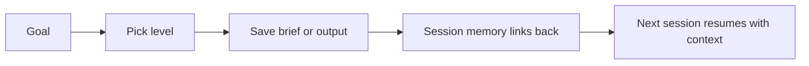
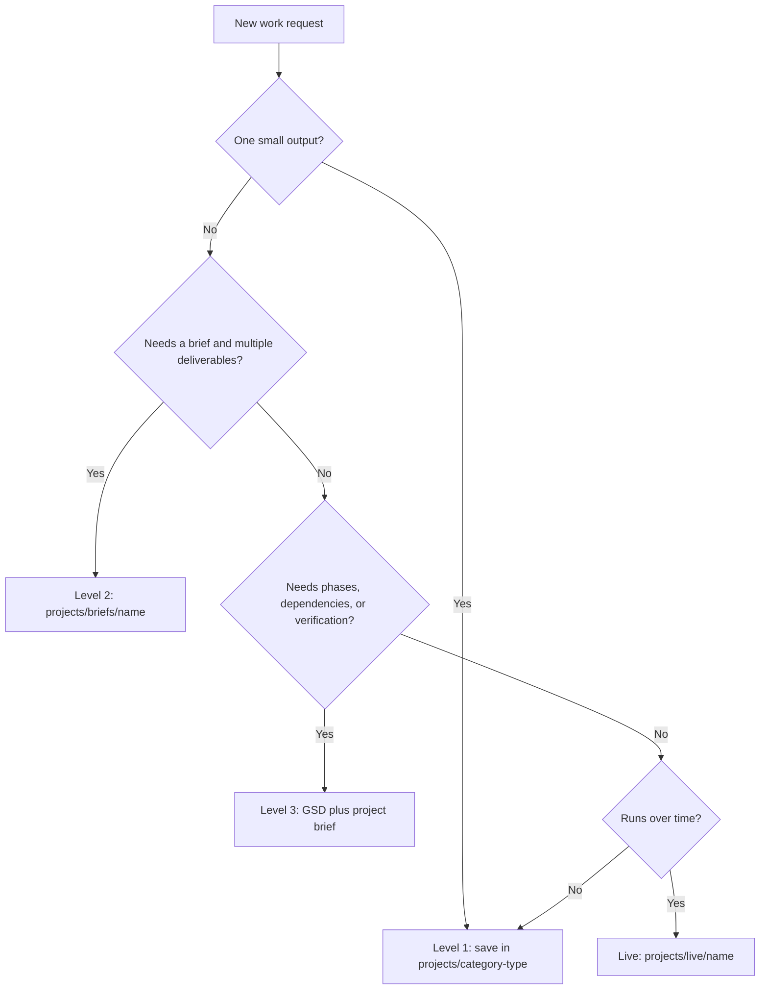
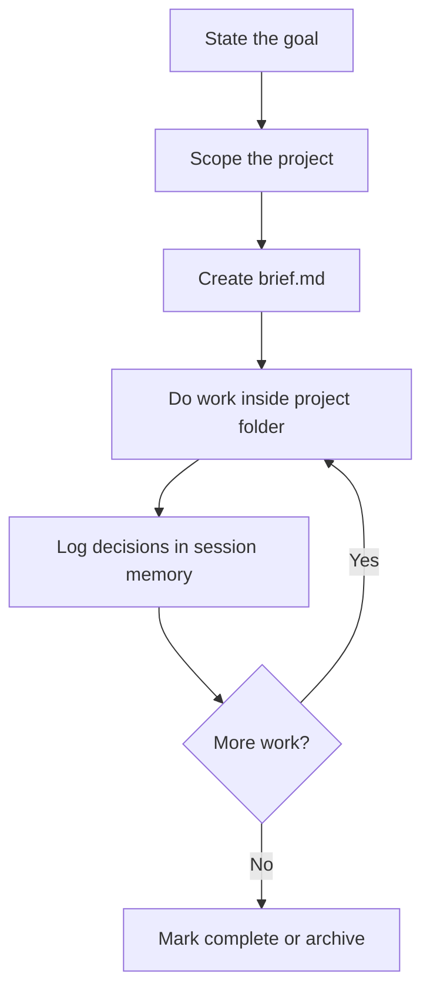

# Working on Projects

Not everything is a single task. When you have a larger piece of work, such as
a product launch, a content series, or a website overhaul, you need a way to
scope it, track it, and keep context across sessions.

There are four practical levels. When you tell the agent your goal, it helps you
pick the right one.

## Start Here

| If the work is... | Use | What happens |
|---|---|---|
| One output you can finish now | Level 1 | The output goes into a category folder. |
| A few linked deliverables | Level 2 | AI-OS creates a project folder with a `brief.md`. |
| A multi-phase build with dependencies | Level 3 | GSD manages the plan and AI-OS stores the outputs. |
| A thing you keep running | Live | The project gets a maintained home under `projects/live/`. |

The point is not ceremony. The point is avoiding scattered work.



---

## The Three Levels

| Level | Name | When | Where |
|-------|------|------|-------|
| **1** | Single task | One or a few small deliverables | `projects/{category}/` |
| **2** | Planned project | Multi-deliverable, cross-session — campaigns, launches | `projects/briefs/{project-name}/` |
| **3** | GSD project | Complex multi-phase with dependencies | `projects/briefs/{project-name}/` + `.planning/` |
| **Live** | Running system | Deployed or scheduled, maintained over time — websites, automations, content engines | `projects/live/{name}/` |

**"Your working folder"** = the root `AI-OS/` folder for solo/system-wide work, or `clients/client-name/` for client-specific work. All paths are relative to wherever you `cd`'d.



---

## Level 1: Single Task

Just ask Claude. Output goes to `projects/{category}-{type}/`. No brief, no project folder. Use Shift+Tab twice for plan mode if upfront thinking helps.

```
projects/mkt-copywriting/2026-03-24_blog-post.md
```

Use Level 1 for:

- one blog post,
- one email,
- one research note,
- one small script,
- one quick audit,
- or one small fix.

Do not use Level 1 when the work will create several related files that need to
stay together.

---

## Level 2: Planned Project

For multi-deliverable work, such as campaigns, launches, or client
deliverables, the agent runs a short scoping conversation and writes a
`brief.md`.

The project gets its own folder under `projects/briefs/`. All outputs for that
project go inside it, not scattered across category folders. Projects are
listed most-recent-first by `created` date in frontmatter when reporting to the
user.

```
projects/briefs/q2-product-launch/   <- project folder
├── brief.md                         <- scope, deliverables, acceptance criteria
├── 2026-03-24_landing-page.md       <- outputs live WITH the brief
├── 2026-03-25_email-sequence.md
└── 2026-03-22_competitor-scan.md
```

### What goes in the brief

Claude scopes the project by asking:
- What's the goal? (one sentence)
- What are the deliverables? (checklist)
- How will you know it's done? (acceptance criteria)
- Any timeline or constraints?

The brief is saved as `projects/briefs/{project-name}/brief.md` with frontmatter:

```yaml
---
project: q2-product-launch
status: active
level: 2
created: 2026-03-24
---
```

---

## Project Lifecycle

Most Level 2 and Level 3 projects follow the same loop:



The `brief.md` is the anchor. If a future session is confused, read the brief
before reading every output file.

## Examples

| Request | Likely level | Why |
|---|---|---|
| "Write a homepage hero for this offer." | Level 1 | One clear output. |
| "Build the full launch messaging pack." | Level 2 | Multiple linked deliverables. |
| "Rebuild this client website with content, design, QA, and launch." | Level 3 | Multi-phase and dependency-heavy. |
| "Maintain the website and keep shipping improvements." | Live | Ongoing system, not a finished deliverable. |

When in doubt, start smaller. A Level 1 task can become a Level 2 project if the
work grows.

---

## Level 3: GSD Project

For complex multi-phase work with dependencies and milestones.

GSD uses a `.planning/` folder at the root of each workspace to store its roadmap, requirements, phase plans, and state. For client work, this lives inside the client folder — `clients/client-name/.planning/`. The root `AI-OS/` folder should never have `.planning/`; keeping it clean is what allows multiple clients to run GSD projects in parallel.

Your project's outputs and brief live in `projects/briefs/{project-name}/` inside the same workspace.

```
clients/website-client/              <- client workspace
├── .planning/                       <- GSD working space (at client root)
│   ├── PROJECT.md
│   ├── config.json
│   ├── REQUIREMENTS.md
│   ├── ROADMAP.md
│   ├── STATE.md
│   └── phases/
│       ├── 01-foundation/
│       └── 02-build/
└── projects/briefs/website-rebuild/ <- project outputs
    ├── brief.md
    ├── 2026-03-24_homepage-copy.md
    └── 2026-03-25_sitemap.excalidraw
```

### Multiple GSD projects in parallel

Each client workspace runs its own independent GSD project:

- **`clients/abc/`** → active GSD project at `clients/abc/.planning/`
- **`clients/xyz/`** → active GSD project at `clients/xyz/.planning/`

To start a GSD project for a client, select that client in the command-centre and ask Claude to run `/gsd-new-project`. GSD creates `.planning/` in the client workspace root automatically.

### Archiving a completed GSD project

When you're done with a GSD project, run `/archive-gsd`. This updates the brief's status to `complete` and leaves `.planning/` in place as a historical record. Start a new GSD project any time with `/gsd-new-project`.

---

## Live Projects

Some work is never "done" — it runs. A website, an automated content system, a recurring data pipeline. These are **live projects**: deployed or scheduled systems you maintain over time, not tasks with an end state.

They live under `projects/live/{name}/` inside the workspace (usually a client):

```
clients/your-company/projects/live/
└── website/
    ├── brief.md       <- what it is, current state, backlog
    ├── WORKFLOW.md    <- the exact edit + ship process
    ├── plans/         <- planning and design notes
    └── site/          <- the running app, its OWN git repo (Vercel-deployed)
```

What makes something `live/` rather than a Level 2 project:
- It has a running deployment or a schedule.
- It often has its own repo or state, kept separate from the OS so the two never tangle. The OS gitignores those nested repos (`clients/*/projects/live/*/site/`).
- You maintain it, you do not finish it. Its `brief.md` carries a rolling backlog, not acceptance criteria.

Editing and shipping a live product follows the project's own `WORKFLOW.md` and any `ops-*` skill it ships with. For the website: branch off `dev`, preview, then a gated promote to `main` that tags the previous live version for one-step rollback.

---

## Research Findings Hub

Reusable research that should inform AI-OS and future client work lives in the root workspace, not inside a single client:

```text
projects/str-research-findings/
├── README.md
├── INDEX.md
└── YYYY-MM-DD_descriptive-finding.md
```

Use this hub for pasted research, discovery-call notes, workflow observations, tool-stack hypotheses, and process findings. The `str-research-findings` skill saves the full note and updates the index.

Research findings are reference material by default. Promote them only when they become something stronger:
- `context/learnings.md` when they change how a skill or workflow behaves
- `context/MEMORY.md` when they are active or needed at session start
- `AGENTS.md`, docs, or skills when they become an operating rule
- a client folder only when the finding is confirmed as client-specific

---

## How It All Fits Together

```
projects/
├── mkt-copywriting/                <- single task category folder (Level 1)
│   └── 2026-03-20_blog-post.md
├── str-trending-research/          <- single task category folder
│   └── 2026-03-18_ai-trends.md
├── str-research-findings/          <- shared research findings hub
│   ├── INDEX.md
│   └── 2026-06-29_managed-ai-systems-vs-n8n.md
└── briefs/                         <- all Level 2/3 projects (most recent first)
    ├── kanban-dashboard/           <- Level 2 planned project (has brief.md)
    │   ├── brief.md
    │   └── 2026-03-24_architecture.md
    └── q2-product-launch/          <- Level 2 planned project
        ├── brief.md
        ├── 2026-03-24_landing-page.md
        └── 2026-03-25_email-sequence.md

clients/
└── website-client/                 <- Level 3 GSD project lives inside a client workspace
    ├── .planning/                  <- GSD working space (at client root, never at AI-OS root)
    │   ├── PROJECT.md
    │   ├── config.json
    │   ├── REQUIREMENTS.md
    │   ├── ROADMAP.md
    │   ├── STATE.md
    │   └── phases/
    └── projects/briefs/
        └── website-rebuild/        <- project outputs
            ├── brief.md
            └── 2026-03-24_homepage-copy.md
```

**How to tell them apart:**
- Category folders live directly under `projects/` using `{category}-{type}` naming (e.g., `mkt-copywriting`) — no `brief.md` inside
- Project folders live under `projects/briefs/` with descriptive names (e.g., `kanban-dashboard`) — always have a `brief.md` inside
- When listing projects, most recent first (by `created` date in frontmatter)

The heartbeat scans for `brief.md` files inside `projects/briefs/*/` to find active projects.

---

## Session Memory and Projects

When you're working on a Level 2 or 3 project, each session's memory block (`context/memory/YYYY-MM-DD.md`) includes a `### Project` field that links back to the project name. This means when Claude starts your next session and reads yesterday's memory, it automatically loads the project's `brief.md` for full context — you don't need to re-explain what you're working on.

For single tasks (Level 1), the project field is omitted and sessions work as before.

---

## Working Directory Matters

Be explicit about WHERE you work:

**Solo user or shared work:**
```bash
cd ~/Projects/AI-OS
claude
# "Start a project for Q2 product launch"
# -> Creates projects/briefs/q2-product-launch/brief.md
# -> All outputs go to projects/briefs/q2-product-launch/
```

**Client-specific projects:**
```bash
cd ~/Projects/AI-OS/clients/client-one
claude
# "Start a project for Q2 product launch"
# -> Creates projects/briefs/q2-product-launch/brief.md (inside client-one/)
# -> All outputs go to clients/client-one/projects/briefs/q2-product-launch/
```

The paths are always relative to your working directory. If you're in the wrong folder, outputs go to the wrong place. The heartbeat confirms which workspace you're in.

All three levels coexist. You might use Level 1 for daily requests, Level 2 for a campaign, and Level 3 for a website rebuild — all within the same workspace.
