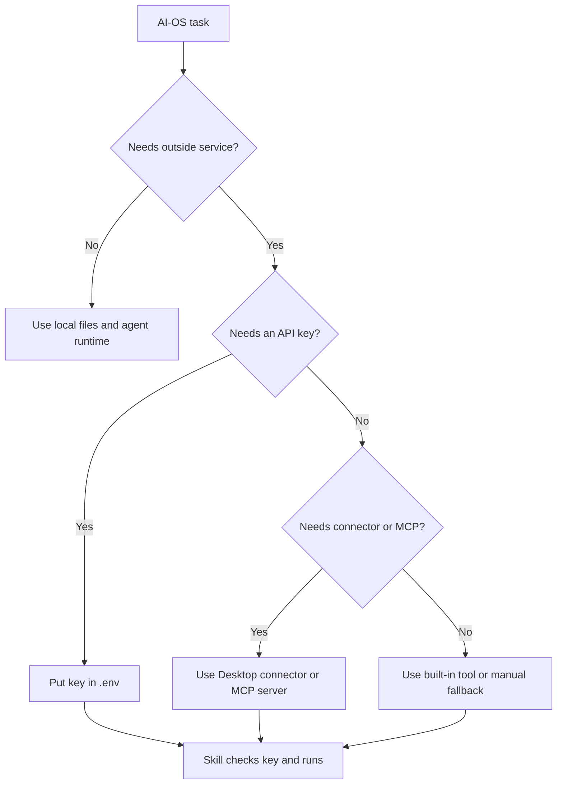
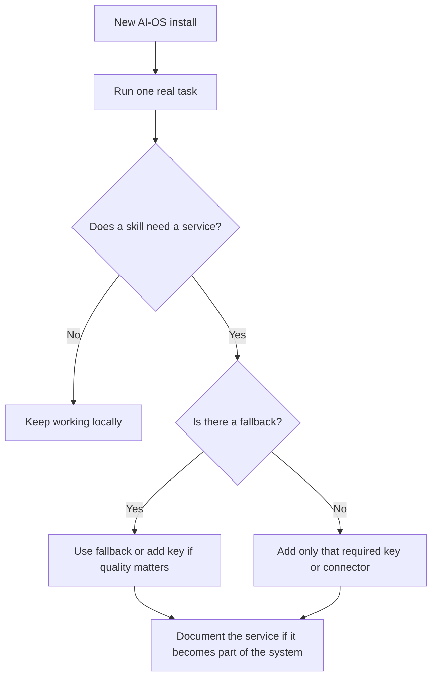
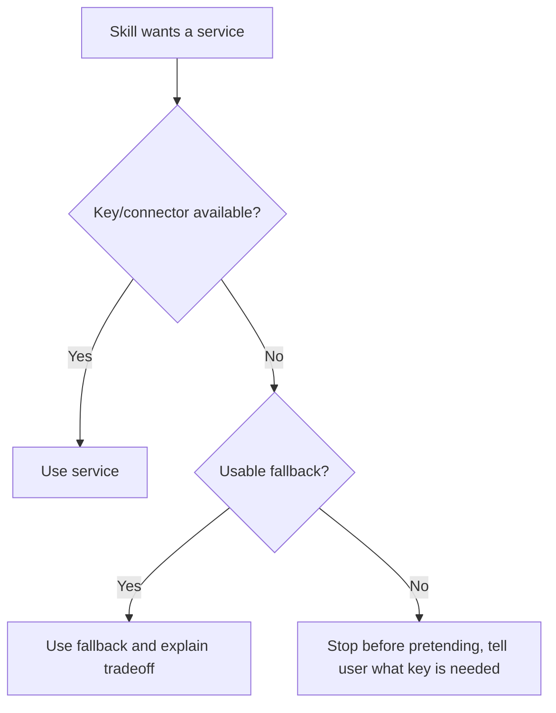

# Services, Keys, And Connectors

AI-OS can work with external services, but the core system does not depend on
all of them. Most keys and connectors make specific skills better. They should
not be treated as required setup unless your workflow needs them.

## The Short Version



Three layers matter:

| Layer | Where it lives | Example |
|---|---|---|
| `.env` API keys | `.env` in the workspace | Firecrawl, OpenAI, HeyGen, Notion API. |
| CLI MCP servers | User-level tool config | Search, task tools, design references. |
| Desktop connectors | App-managed connector settings | Notion, Figma, Google Calendar, Vercel. |

## Start With Nothing Optional

Most template users should not configure every key on day one.



The setup trap is spending the first day connecting tools before proving AI-OS
works for real work. Start local, then add services when a workflow asks for
them.

## `.env` Keys

Keys go in:

```text
.env
```

The template for available keys is:

```text
.env.example
```

Do not put secret values in docs, memory, chat summaries, or project files.
AI-OS should refer to env var names, not actual secret values.

## Current Key-Based Services

| Key | Service | What it enables | Fallback |
|---|---|---|---|
| `FIRECRAWL_API_KEY` | Firecrawl | Web scraping and brand asset extraction. | WebFetch or manual paste. |
| `OPENAI_API_KEY` | OpenAI | Reddit/web search in trending research. | WebSearch without some engagement metrics. |
| `XAI_API_KEY` | xAI | X/Twitter search. | WebSearch without X engagement metrics. |
| `YOUTUBE_API_KEY` | YouTube Data API | Channel listing, handle lookup, video search. | Direct video URL transcript mode. |
| `FAL_KEY` | fal.ai | Multi-model ad creative images/video. | Figma/local templates. |
| `FIGMA_TOKEN` / `FIGMA_FILE_KEY` | Figma API | Pixel-exact Figma template export. | Local HTML-to-image rendering where supported. |
| `HEYGEN_API_KEY` | HeyGen | Avatar and UGC video generation. | No full fallback. |
| `NOTION_API_KEY` | Notion API | Credit-free sync scripts and database queries. | Interactive Notion connector may still work. |
| `GOOGLE_WORKSPACE_CLI_CLIENT_ID` / `_SECRET` | Google Workspace CLI | CLI access to Calendar, Drive, Gmail. | Interactive Google connectors may still work. |
| `TELEGRAM_BOT_TOKEN` / `TELEGRAM_ALLOWED_USERS` | Telegram | Bot notifications and remote command channel. | Channel disabled. |
| `ZILLIZ_URI` / `ZILLIZ_TOKEN` | Zilliz Cloud | Remote Milvus backend for native Windows memory search. | macOS/Linux use local Milvus Lite; Windows can skip semantic recall or use WSL. |
| `AGENTMAIL_API_KEY` | AgentMail | Agent-owned inbox for magic links and OTPs. | No fallback for agent-owned email. |

All keys are optional until the skill or workflow needs them.

## Where To Configure Each Kind Of Access

| Need | Configure it in | Do not put it in |
|---|---|---|
| API key for a script or skill | `.env` | Docs, memory, chat, project files. |
| Public example of a key name | `.env.example` | `.env` with a real value. |
| Desktop app connector | The app connector settings | Repo files unless documented as a connector map. |
| MCP server | The tool's MCP config | A random script with hidden assumptions. |
| Client-specific key | `clients/{client}/.env` | Root `.env` if it should not be shared. |
| Service behavior docs | `docs/connectors.md` and this guide | A private memory note only. |

## Desktop Connectors

Desktop connectors are usually configured in the app, not in this repo.

Examples:

| Connector | Used for |
|---|---|
| Notion | Docs, databases, meeting notes. |
| Figma | Reading or writing design files. |
| Vercel | Deployments, logs, project management. |
| Google Calendar | Scheduling and availability. |
| Google Drive | Docs, Sheets, Slides, and files. |

If a connector is missing, AI-OS should say what is unavailable and offer a
fallback. It should not pretend the connector exists.

## MCP Servers

MCP means Model Context Protocol. In plain words, it is a way for external tools
to expose actions or data to agents.

AI-OS documents configured MCPs in:

```text
docs/connectors.md
```

MCP servers can be repo-level or user-level. The connector map should say where
the current connection lives.

## How Skills Should Behave With Missing Keys

Good behavior:



Examples:

| Situation | Right behavior |
|---|---|
| Firecrawl missing | Try WebFetch or ask for pasted content. |
| YouTube API missing | Still handle direct video URLs when transcript access works. |
| Figma unavailable | Save a local design spec or use another available path. |
| HeyGen missing | Save the script and explain the video step is blocked. |
| Notion write requested | Ask for explicit external-action approval first. |

## Adding A New Service

When a new service becomes part of AI-OS:

1. Add the key to `.env.example`.
2. Add it to `docs/connectors.md` with consumers and fallback.
3. Confirm the key name appears in the correct setup docs.
4. Document which skill uses it.
5. Document the fallback.
6. Never store real key values in tracked files.

Use the house env block shape:

```text
# Service: what it is (https://signup-or-docs-url)
# Used by: skill-name (what it enables)
# Pricing or fallback note
SERVICE_KEY=
```

## Service Readiness Checklist

Before treating a service as part of AI-OS, check:

1. Is the key name documented in `.env.example`?
2. Is the service listed in `AGENTS.md` or `docs/connectors.md` as appropriate?
3. Does the related skill explain what happens without the service?
4. Is there a local fallback when possible?
5. Are external writes approval-gated?
6. Are real key values absent from tracked files, memory, and docs?

## External Writes

Reading from a connector is one thing. Writing through it changes another
system.

External writes need approval before action:

```text
Approve external action?
Target:
Action:
Artifact:
Risk:
Approval cue:
```

The cue can be plain language. Do not require a magic phrase when the user
clearly approves the named target and action.

Examples:

- updating Notion docs,
- sending an email,
- deploying a site,
- pushing to GitHub,
- changing a calendar event,
- editing a CRM record.

## Setup Order

For a new AI-OS template user:

1. Start without optional keys.
2. Use the first skill that needs a service.
3. Let the skill tell you what key would improve the result.
4. Add only that key.
5. Re-run the task.
6. Add more connectors only as workflows prove they need them.

This avoids the setup trap where you spend the first day configuring tools
instead of proving that AI-OS works for real work.

## Related Docs

- [Connectors Map](connectors.md)
- [Cost And Privacy](cost-and-privacy.md)
- [Skills And Capabilities](skills-and-capabilities.md)
- [Troubleshooting](troubleshooting.md)
