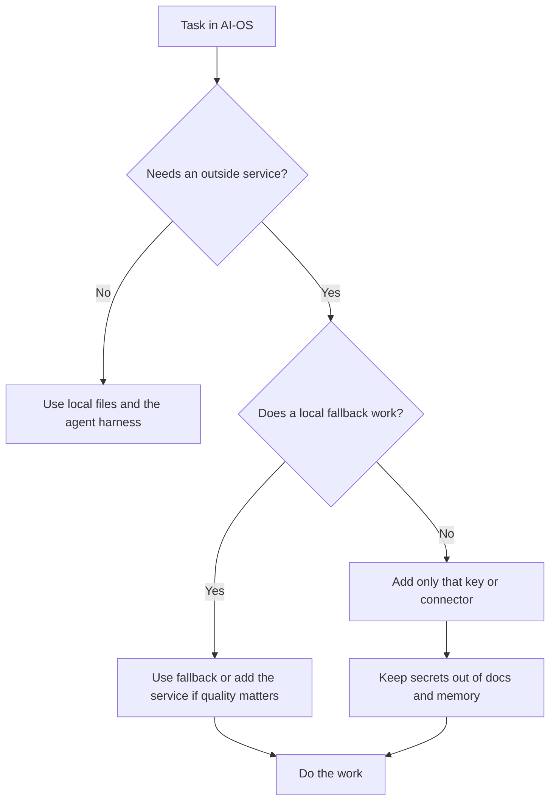
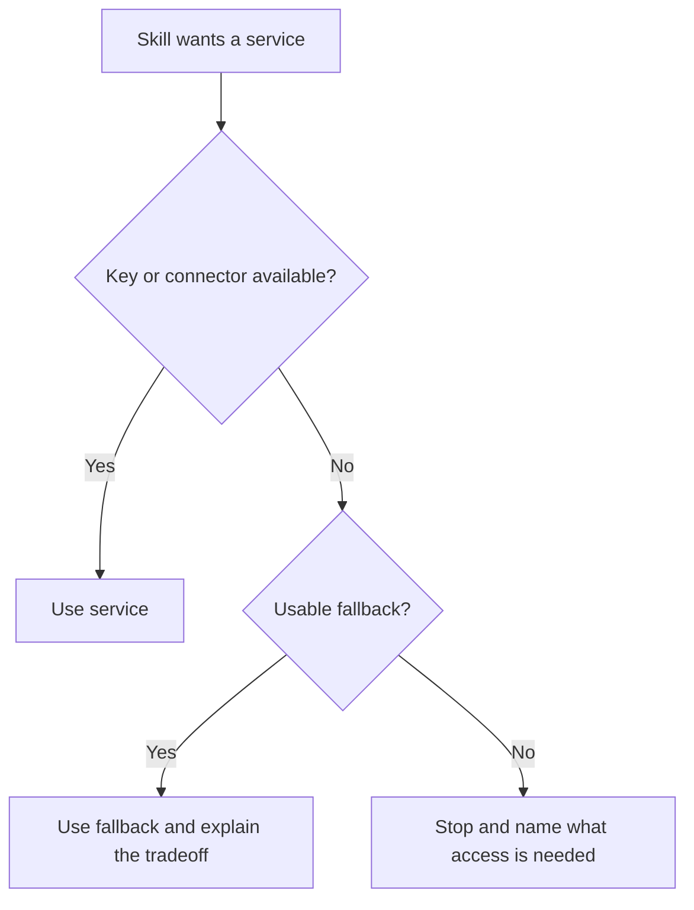

# Services, Keys, And Connectors

AI-OS can use outside services, but a new install does not need every key or
connector on day one. Add a service when a real workflow asks for it.

## The Short Version



Start local. Add services only when they improve a task you actually do.

## Three Kinds Of Connections

| Kind | Where it is set up | Examples |
|---|---|---|
| API key | `.env` in the workspace | Web scraping, video generation, model APIs, Notion scripts. |
| Desktop connector | The agent app's connector settings | Notion, Figma, Google Calendar, Google Drive, Vercel. |
| MCP server | The tool's MCP config | Search tools, task tools, design references, app-specific actions. |

The exact inventory lives in [Connectors Map](connectors.md). This page is the
plain-language setup guide.

## Start With Nothing Optional

For a fresh install:

1. Run the setup.
2. Run `/start-here`.
3. Ask for one real deliverable.
4. Let the relevant skill tell you if a key or connector would improve the work.
5. Add only that service.

The setup trap is spending the first day connecting tools before AI-OS has done
one useful job.

## Where Keys Go

Secrets go in:

```text
.env
```

The public list of possible key names lives in:

```text
.env.example
```

Do not put real secret values in:

- docs,
- memory,
- project files,
- chat summaries,
- Notion pages,
- screenshots.

AI-OS should refer to the key name, not the value.

Good:

```text
FIRECRAWL_API_KEY is configured in .env
```

Bad:

```text
FIRECRAWL_API_KEY=actual-secret-value
```

## Common Reasons To Add A Service

| Workflow | Service type that may help | Safe fallback |
|---|---|---|
| Scrape a website for brand or research context | Web scraping API | Paste the page content or use built-in fetch/search. |
| Read or update Notion | Notion connector or Notion API key | Work from local docs until Notion access is approved. |
| Work with Figma | Figma connector or API key | Save a local design brief or HTML/image fallback. |
| Send or receive email | Gmail, Outlook, or AgentMail-style connector | Draft locally and let the user send. |
| Generate video or ad creative | Creative API key or design connector | Save the script, storyboard, or static creative plan. |
| Deploy a site | Hosting connector | Build and test locally first. |
| Run scheduled jobs | Agent auth and any keys used by the job | Keep the job off until auth is ready. |

All of these are optional until the workflow needs them.

## Desktop Connectors

Desktop connectors are usually configured in the app running the agent, not in
the repo.

Examples:

- Notion,
- Figma,
- Vercel,
- Google Calendar,
- Google Drive,
- Gmail or Outlook,
- Slack or other team tools.

If a connector is missing, AI-OS should say what is unavailable and use a local
fallback when one exists. It should not pretend it has live access.

## MCP Servers

MCP means Model Context Protocol. In plain words, it lets outside tools expose
actions and data to agents.

AI-OS documents configured MCPs in:

```text
docs/connectors.md
```

If a new MCP becomes part of AI-OS, document what it does, where it is
configured, what uses it, and what happens when it is unavailable.

## How Skills Should Behave With Missing Access

Good behavior:



Examples:

| Situation | Right behavior |
|---|---|
| Web scraper missing | Try built-in fetch/search or ask for pasted content. |
| Video API missing | Save the script and explain the video generation step is blocked. |
| Figma unavailable | Save a local design spec or use another available path. |
| Notion write requested | Ask for explicit external-action approval first. |
| Calendar connector missing | Draft the event details instead of creating the event. |

## Adding A New Service To AI-OS

When a new service becomes part of the system:

1. Add the key name to `.env.example`.
2. Add the service to `docs/connectors.md`.
3. Document which skill or workflow uses it.
4. Document the fallback.
5. Keep real values out of tracked files.
6. Keep external writes approval-gated.

Use this shape in `.env.example`:

```text
# Service: what it is
# Used by: skill-name or workflow name
# Fallback: what happens without it
SERVICE_KEY=
```

## External Writes

Reading from a connector is one thing. Writing through it changes another
system.

External writes need approval before action:

```text
Approve external action?
Target:
Action:
Artifact:
Risk:
Approval phrase:
```

Examples:

- updating Notion docs,
- sending an email,
- deploying a site,
- pushing to GitHub,
- changing a calendar event,
- editing a CRM record.

## Related Docs

- [Connectors Map](connectors.md)
- [Cost And Privacy](cost-and-privacy.md)
- [Skills And Capabilities](skills-and-capabilities.md)
- [Troubleshooting](troubleshooting.md)
