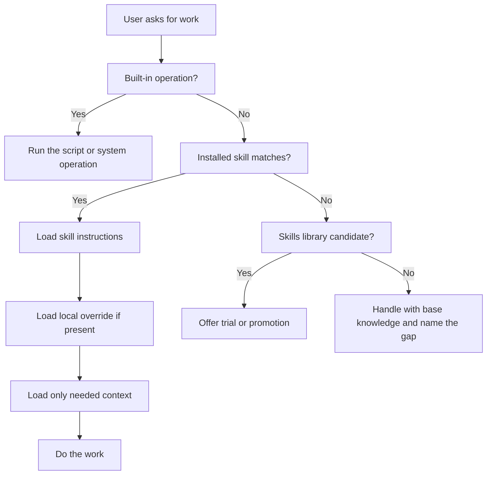
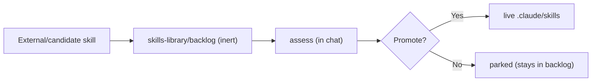
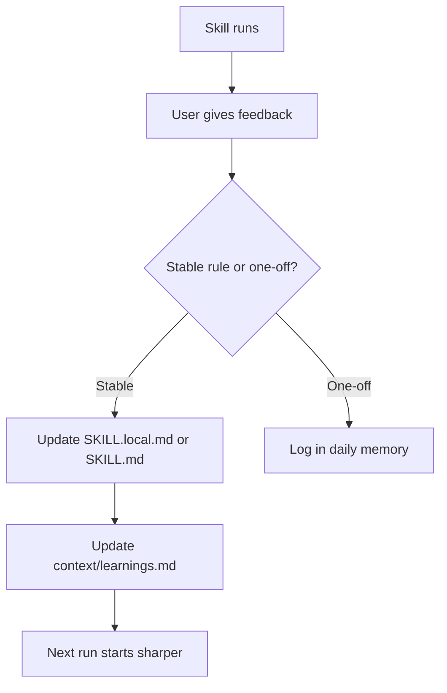

# Skills And Capabilities

Skills are how AI-OS turns repeated work into a method. A skill is not just a
prompt. It is a small operating manual for a type of work.

## The Short Version



The important rule: if a skill exists for the task, AI-OS should use it. If no
skill exists, it should say there is a gap instead of pretending the system is
more capable than it is.

## What A Skill Is

A live AI-OS skill is a folder under:

```text
.claude/skills/{skill-name}/
```

The main file is:

```text
.claude/skills/{skill-name}/SKILL.md
```

That file usually defines:

- what the skill does,
- when it should run,
- what context it needs,
- what files it writes,
- what tools or API keys are optional,
- what fallbacks exist,
- how to evaluate whether it worked.

## Skill Names

AI-OS skills use category prefixes:

| Prefix | Meaning | Examples |
|---|---|---|
| `meta` | System/meta work | `meta-wrap-up`, `meta-systems-check` |
| `q` | Inquiry/questions | `q-question` |
| `mkt` | Marketing | `mkt-brand-voice`, `mkt-copywriting` |
| `str` | Strategy | `str-ai-seo`, `str-resources` |
| `ops` | Operations | `ops-cron`, `ops-versioning` |
| `viz` | Visual/video/design | `viz-interface-design`, `viz-excalidraw-diagram` |
| `tool` | Utility/integration | `tool-humanizer`, `tool-youtube` |

The folder name, frontmatter name, learnings section, and output conventions
should line up. That is what keeps the system understandable as it grows.

### Vendored packs keep their author's name

A skill pack brought in from an outside author does not get an AI-OS category
prefix. It keeps the author's namespace instead:

```text
{author}-{pack}-{skill-name}
```

For example `coreyhaines-marketing-copywriting`, from
[coreyhaines31/marketingskills](https://github.com/coreyhaines31/marketingskills).

This is deliberate, for three reasons:

- You can see at a glance in the `/` picker whose methodology you are about to run.
- Someone else's approach stays visibly separate from AI-OS's own `mkt-*` and
  `str-*` skills.
- A vendored skill cannot quietly compete with a native one for the same request.
  `mkt-copywriting` and `coreyhaines-marketing-copywriting` both write copy, and
  the name tells you which is which.

Every other rule still applies: folder name matches the frontmatter name, the
learnings section is `## {folder-name}`, and each pack gets a row in
`.claude/skills/ATTRIBUTION.md` and `skills-library/LICENSES.md`. Never rename a
vendored skill into a category prefix, and never give a native skill a vendor name.

## Naming Conventions

Use one name everywhere.

```text
skill folder = frontmatter name = slash command = learnings section
```

Example:

```text
.claude/skills/meta-skill-creator/
name: meta-skill-creator
/meta-skill-creator
context/learnings.md -> ## meta-skill-creator
```

Rules:

- use kebab-case,
- start with the category prefix,
- keep names literal rather than clever,
- put outputs in a matching project area when possible,
- do not rename a skill casually because memory, docs, evals, and learnings use
  the same name.

## Meta Skills

Meta skills help maintain AI-OS itself. They are not client-delivery skills.
Use them when the system needs to remember, repair, inspect, organize, or extend
itself.

| Skill | Use it when | Plain meaning |
|---|---|---|
| `/meta-skill-creator` | You need a new repeatable capability or want to improve an existing skill. | Builds, edits, packages, and evaluates skills. |
| `/meta-context-intake` | You have messy client docs, notes, or references that should be classified before becoming memory. | Turns raw context into a review-gated promotion plan. |
| `/meta-memory-write` | You explicitly ask AI-OS to remember, forget, save, or update a durable fact. | Writes to the hot memory scratchpad safely. |
| `/memory-recall` | A request needs previous decisions, project history, or "have we seen this before?" context. | Searches AI-OS memory with semantic and markdown recall. |
| `/meta-wrap-up` | You are ending a session and want deliverables, decisions, learnings, and open loops saved. | Closes the loop and preserves continuity. |
| `/meta-systems-check` | You want to know whether AI-OS is healthy or what is broken. | Runs a plain-English system diagnostic. |
| `/meta-find-skills` | You are wondering whether a skill already exists. | Searches local skills and the skill library before reaching outside. |
| `/meta-skill-intake` | You found a skill, pack, or repo elsewhere and want it brought in. | Assesses an outside candidate, then promotes it live or parks it. |
| `/meta-bake-it-in` | A capability belongs in the core of AI-OS, not as another skill. | Absorbs it into rules, hooks, or cron as reversible edits. |
| `/meta-aios-template` | You want the public template and its Notion docs kept in step with this install. | Drives the template sync and docs refresh, gating every outward write. |
| `/meta-worktree` | You need to audit branches, worktrees, or folder state. | Explains what is happening in the workspace and offers cleanup. |

The simple rule: if the work is about **maintaining AI-OS**, look for a `meta`
skill first.

## Creating A Skill

Create a skill when a task repeats and the method matters.

Use:

```text
/meta-skill-creator
```

or say something like:

```text
create a skill for client onboarding checklists
```

The skill creator should help define:

1. the exact trigger,
2. the output,
3. the files it reads,
4. the files it writes,
5. optional services or keys,
6. fallbacks when tools are missing,
7. evaluation checks.

The new skill should follow the naming convention:

```text
{category}-{plain-name}
```

Examples:

- `mkt-launch-plan`,
- `ops-client-onboarding`,
- `str-sales-research`,
- `viz-report-design`,
- `tool-transcript-cleaner`.

Do not create a skill for one-off work. Run the task a few times first, then
promote the repeated method into a skill once the pattern is clear.

## First-Run Optional Skills Versus Live Skills

During `/start-here`, the user sees a selectable list of optional skills from:

```text
.claude/skills/_catalog/catalog.json
```

That first-run selector is not the whole universe. It is the setup menu for
optional template skills.

The live catalog is the actual current state of the repo:

```text
.claude/skills/
docs/skills-catalog.md
```

So a fresh user should understand two things:

- `/start-here` helps decide which optional template skills to keep,
- `docs/skills-catalog.md` shows every live skill currently installed.

## Current Live Skills At A Glance

This table is the plain-English overview. The exact generated reference lives
in [Skills Catalog](skills-catalog.md).

| Area | Skills | What they do |
|---|---|---|
| Core memory and meta | `/memory-recall`, `/meta-memory-write`, `/meta-wrap-up`, `/meta-systems-check`, `/meta-worktree`, `/meta-find-skills`, `/meta-context-intake`, `/meta-skill-creator`, `/meta-skill-intake`, `/meta-bake-it-in`, `/meta-aios-template` | Remember, recall, inspect, maintain, and extend AI-OS itself. |
| Brand foundation | `/mkt-brand-voice`, `/mkt-positioning`, `/mkt-icp` | Build the voice, positioning, and ideal customer files that make later output specific. |
| Copy and content | `/mkt-copywriting`, `/mkt-content-repurposing`, `/mkt-ugc-scripts`, `/tool-humanizer` | Write copy, repurpose content, script short videos, and remove obvious AI-writing patterns. |
| Inquiry | `/q-question` | Answer questions with the right depth: quick when stable, verified when current or client-facing, and research-backed when it matters. |
| Research and strategy | `/str-ai-seo`, `/str-trending-research`, `/str-resources`, `/str-research-findings`, `/str-sitemap-workshop` | Research markets and trends, improve AI search visibility, capture resources and findings, and structure websites. |
| Operations | `/ops-cron`, `/ops-versioning`, `/ops-agent-email`, `/ops-client-dashboard` | Schedule jobs, keep document versions, use the agent inbox, and inspect client task boards. |
| Tools and connectors | `/tool-firecrawl-scraper`, `/tool-youtube` | Scrape sites and process YouTube content. |
| Visual and design | `/viz-excalidraw-diagram`, `/viz-ad-creative-codex`, `/viz-ad-creative-fal`, `/viz-ad-creative-figma` | Diagrams and ad creative batches. |
| Engineering and comms | `/eng-implement`, `/comms-message`, `/q-unstuck` | Implement code changes, draft direct client messages, and break through a roadblock. |
| Vendored marketing and maker packs | `/coreyhaines-marketing-*` (47), `/coreyhaines-skills-*` (18) | Corey Haines's marketing and maker methodology, kept under his own namespace so it stays distinct from the AI-OS `mkt-*` and `str-*` skills. See [ATTRIBUTION](../.claude/skills/ATTRIBUTION.md). |

Parked skills are not listed here. `viz-interface-design`, `viz-stitch-design`,
`tool-stitch`, `viz-ugc-heygen`, and `meta-synthesize-locals` sit in
`.claude/skills/_archived/` and come back with `bash scripts/add-skill.sh <name>`.

## Optional Service Keys By Skill

Many skills work without paid keys. Some get stronger when a service is
configured.

| Service or key | Enables |
|---|---|
| `FIRECRAWL_API_KEY` | Stronger site scraping and brand asset extraction. |
| `YOUTUBE_API_KEY` | Better YouTube channel and transcript workflows. |
| `OPENAI_API_KEY`, `XAI_API_KEY` | Some trend and research workflows. |
| `HEYGEN_API_KEY` | Avatar video generation. |
| Figma or Stitch connectors | Design import, template, or screen workflows. |

Keys belong in `.env`, never in docs, memory, or chat summaries.

## How AI-OS Chooses A Skill

AI-OS routes requests in this order:

1. Built-in operations first, such as adding a client, starting cron, backing up
   memory, or listing skills.
2. Installed live skills in `.claude/skills/`.
3. Work size check for multi-deliverable work.
4. Skills library candidates in `skills-library/` if no live skill fits.
5. Base knowledge only after the system names the gap.

This prevents two failures:

- using generic prompting when a curated method already exists,
- installing every interesting external skill into the live catalog.

## Live Skills Versus Library Skills



| Layer | Status | What it means |
|---|---|---|
| Live skill | Active | Installed in `.claude/skills/`, registered, documented, and usable. |
| Skills library | Inert | Candidate material. It is not active until promoted. |
| Global/plugin skill | External | Available to the runtime, but not automatically an AI-OS skill. |

The library is a staging area, not a shortcut. A candidate becomes live only
after it is assessed, shaped to AI-OS conventions, registered, and accepted.

## Skill Local Overrides

Every skill can have:

```text
SKILL.local.md
```

beside `SKILL.md`.

Use local overrides for user-owned rules:

```markdown
## Rules
- 2026-06-29: Always score copy before saving public landing page work.
```

Base skill files can be updated from upstream. Local overrides are yours and
should not be overwritten by updates.

## Context Loading

Skills should not load everything. They load only what they need.

Examples:

| Skill | Usually reads |
|---|---|
| `mkt-copywriting` | voice, positioning, ICP, relevant learnings. |
| `mkt-brand-voice` | positioning and previous brand-voice learnings. |
| `tool-humanizer` | voice profile and samples when doing deep cleanup. |
| `ops-versioning` | no brand context, only versioning learnings. |
| `memory-recall` | memory search tools and recall rules. |

This is why AI-OS can stay fast and targeted even as the workspace grows.

## Fallbacks

Good skills degrade gracefully.

Examples:

| Missing thing | Good fallback |
|---|---|
| No brand voice | Produce solid generic output and say what would improve it. |
| No API key | Use a free/local method or save instructions for manual execution. |
| Semantic search blocked | Use markdown fallback. |
| Design connector unavailable | Save a local spec, screenshot plan, or prompt pack. |
| Video/image generator unavailable | Save prompts and route to another available tool. |

A missing tool should not become a false claim that the work is impossible.

## When To Create A New Skill

Create or promote a skill when:

- the task repeats,
- the method matters,
- quality depends on a specific checklist,
- multiple files or tools must be coordinated,
- user feedback should improve future runs,
- the task should behave the same across Claude, Cursor, and future tools.

Do not create a skill for:

- one-off work,
- a task that is already handled well by an existing skill,
- a tool you tried once,
- a vague capability with no clear trigger or output.

## How Skills Improve

Skills improve through feedback.



Feedback should go to the smallest durable place:

| Feedback | Best home |
|---|---|
| "Always do this for this skill" | `SKILL.local.md` or the skill rules. |
| "This brand says it this way" | `brand_context/`. |
| "Remember this fact" | `context/MEMORY.md` or client memory. |
| "This run had a one-off issue" | Today's daily log. |
| "This skill has a recurring flaw" | Skill rules plus `context/learnings.md`. |

## How To See What Skills Exist

List installed skills:

```bash
bash scripts/list-skills.sh
```

Read the generated catalog:

```text
docs/skills-catalog.md
```

Rank skills by actual use:

```bash
python3 scripts/skill-tiers.py
```

## Adding And Removing Skills

```bash
bash scripts/add-skill.sh <skill-name>
bash scripts/remove-skill.sh <skill-name>
```

Removing a skill does not delete it. The folder moves to
`.claude/skills/_archived/`, so it disappears from the `/` picker but nothing is
lost. Adding it again moves it straight back:

```text
.claude/skills/<name>/  --remove-->  .claude/skills/_archived/<name>/
.claude/skills/<name>/  <--add-----  .claude/skills/_archived/<name>/
```

This matters more than it looks. `add-skill.sh` restores from `_archived/` first
and only falls back to git history. On a fresh clone, a team copy, or a shallow
clone that history may not be there, so a skill that had been hard-deleted could
not come back. Parking makes remove-then-re-add work everywhere.

Core skills cannot be removed. If an older parked copy already exists, it is kept
with a timestamp rather than overwritten.

## The Practical Rule

Use skills for work where the method matters. Use base knowledge for ordinary
one-off help. Promote skills only after real use proves they belong in AI-OS.

## Related Docs

- [Skills Catalog](skills-catalog.md)
- [Skill Tiers](skill-tiers.md)
- [Brand Voice And Text Quality](brand-voice-and-text-quality.md)
- [Projects Guide](projects-guide.md)
- [Troubleshooting](troubleshooting.md)
