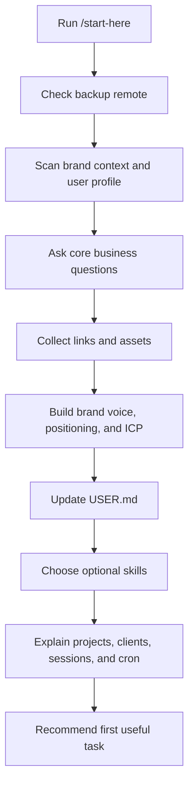

# Start Here And First Run

This is the first page for someone who has just copied AI-OS, opened it in
Claude Code, and wants to know what to do next.

The short answer:

```text
Open AI-OS -> run /start-here -> answer the setup questions -> choose skills
-> run one small real task -> end the session so memory saves
```

`/start-here` is the friendly name for the onboarding command. It points to
`.claude/commands/onboarding.md`. The older slash name is `/onboarding`; both
lead to the same first-run flow.

## The First Command

From the AI-OS root folder:

```bash
claude
```

Then run:

```text
/start-here
```

If `/start-here` is unavailable in the agent interface, use:

```text
/onboarding
```

Do this before asking AI-OS for a large project. The onboarding command builds
the basic context that makes the rest of the system useful.

## What `/start-here` Does



It does not just say hello. It prepares the workspace so future work has
context.

## Step 0: Backup Check

AI-OS keeps your brand context, client files, and project outputs on your
machine. The onboarding command checks whether your Git remote points at your
own private repo or still points at the upstream template.

If it is not backed up yet, it explains the risk and helps you create a private
GitHub repo or add one manually.

Why this matters: the template is safe to copy, but your work is yours. Once
you start adding brand context and clients, you need a backup that belongs to
you.

## Step 1: Workspace Scan

The command checks:

- whether `brand_context/` already has real files,
- whether `context/USER.md` is populated,
- which skills are installed,
- whether you are in the root workspace or inside `clients/{client}/`.

If brand context already exists, it does not rebuild it without reason. It
should tell you that you are already set up and ask what you are working on.

## Step 2: Four Core Questions

For a fresh root workspace, `/start-here` asks up to four questions, one at a
time:

1. What does your business do?
2. Who is your ideal customer?
3. What makes you different?
4. How do you want to come across?

It should not ask all four at once. If your answer already covers one of the
later questions, it should skip that question and keep moving.

For a client workspace, the same questions are asked about that client.

## Step 3: Links, Assets, And Optional Keys

The command asks for useful links:

- website,
- LinkedIn,
- YouTube,
- other business or personal profiles,
- existing copy or docs.

If links are available, AI-OS tries to extract useful brand signals and strong
example sentences. If a page needs stronger scraping, `FIRECRAWL_API_KEY` can
help, but it is optional.

The setup also checks `.env.example` against `.env` and explains missing
optional keys without blocking the first run.

## Step 4: Brand Foundation

Onboarding uses the foundation skills to write the first brand files:

| Skill | What it builds |
|---|---|
| `mkt-brand-voice` | `brand_context/voice-profile.md` and `brand_context/samples.md` |
| `mkt-positioning` | `brand_context/positioning.md` |
| `mkt-icp` | `brand_context/icp.md` |

These files are why later output sounds like the user or client instead of
generic AI text.

## Step 5: User Profile

The command updates:

```text
context/USER.md
```

That file records who the assistant is helping, how they like to work, and
communication preferences learned during onboarding.

## Step 6: Skill Selection

Fresh installs include a selectable skill catalog. After brand context is
built, `/start-here` shows optional skills grouped by category and asks what
to remove.

The user can say:

```text
keep all
```

or:

```text
remove 5, 6, 9
```

The command then runs:

```bash
python3 scripts/select-skills.py --remove "skill-a,skill-b"
```

or:

```bash
python3 scripts/select-skills.py --remove none
```

The script updates the installed skill list and writes:

```text
.claude/skills/_catalog/selection-result.json
```

Important distinction:

- the first-run selector covers optional template skills,
- `.claude/skills/` shows the full live skill catalog,
- `docs/skills-catalog.md` is the generated full reference.

## Step 7: How Work Is Structured

Onboarding explains the three practical work modes:

| Mode | Use it for | What happens |
|---|---|---|
| Single task | One clear output | Ask directly and AI-OS does the work. |
| Planned project | A few linked deliverables | AI-OS scopes it and writes a brief. |
| GSD project | Complex phased work | AI-OS uses a structured planning and execution flow. |

You do not need to choose the mode upfront. Describe the work and AI-OS should
recommend the right level.

## Step 8: Client Workspaces

If you serve multiple clients, brands, or accounts, AI-OS can create a separate
workspace for each one.

Create a client from the root workspace:

```bash
bash scripts/add-client.sh "Client Name"
```

Then work from the new client folder:

```bash
cd clients/client-name
claude
/start-here
```

Each client gets its own:

- `AGENTS.md`,
- `CLAUDE.md`,
- `brand_context/`,
- `context/`,
- `projects/`,
- `cron/jobs/`,
- discovery links to the shared root skills and scripts.

Root AI-OS holds shared methodology. Client folders hold client facts.

## Step 9: Sessions And Memory

When you are done, say something like:

```text
done for today
```

or:

```text
that's it
```

The session should be saved into:

```text
context/memory/YYYY-MM-DD.md
```

Durable lessons go into:

```text
context/learnings.md
```

The hot memory scratchpad is:

```text
context/MEMORY.md
```

## Step 10: Nightly Jobs Are Optional

AI-OS has scheduled jobs for memory upkeep and other recurring work. They are
off until configured.

The durable setup path is:

```bash
claude setup-token
bash scripts/enable-cron.sh <token>
```

Skip this at first if you do not care about automatic memory upkeep yet. AI-OS
still works without nightly jobs.

Read:

- [Memory And Cron](memory-and-cron.md)
- [Turn On Nightly Jobs](turn-on-nightly-jobs.md)
- [Background Jobs](background-jobs.md)

## Step 11: Operational Tour

After the first setup, AI-OS can explain:

- Command Centre dashboard,
- connectors and API keys,
- backups and updates,
- client workspaces,
- team sharing,
- health checks.

You do not need to configure all of this on day one. The correct order is:

```text
First context -> first real task -> first saved session -> optional services
```

## If Something Feels Broken

Run the systems check:

```bash
bash .claude/skills/meta-systems-check/scripts/check.sh
```

For deeper checks:

```bash
bash .claude/skills/meta-systems-check/scripts/check.sh --deep
```

Then read:

- [Troubleshooting](troubleshooting.md)
- [Commands And Folder Map](commands-and-folder-map.md)

## The Practical First Day

Do this:

1. Clone AI-OS.
2. Run `bash scripts/centre.sh`.
3. Open `claude` from the AI-OS root.
4. Run `/start-here`.
5. Answer the setup questions.
6. Keep or remove optional skills.
7. Ask for one small real deliverable.
8. Say `done for today` so memory saves.
9. Add a client only when you have real client work.
10. Turn on cron only after the manual workflow makes sense.
