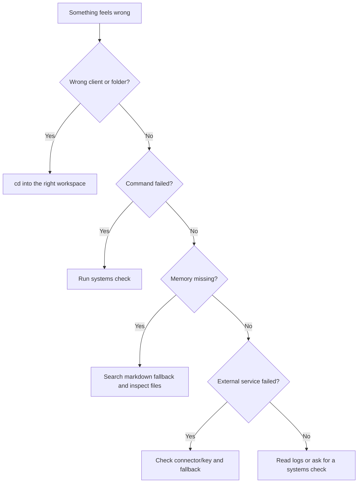

# Troubleshooting AI-OS

Start with the symptom. Most AI-OS problems are one of four things:

- you are in the wrong folder,
- memory/search is unavailable but the files still exist,
- dependencies are missing,
- a connector or API key is not configured.

## Quick Triage



Run the basic check:

```bash
bash .claude/skills/meta-systems-check/scripts/check.sh
```

Run the deeper check when debugging the local dashboard/runtime:

```bash
bash .claude/skills/meta-systems-check/scripts/check.sh --deep
```

## "The Agent Used The Wrong Client"

Check where you are:

```bash
pwd
```

Root work should happen in:

```text
AI-OS/
```

Client work should happen in:

```text
AI-OS/clients/{client}/
```

If you started at the root and asked for one-client work, AI-OS should ask for
scope confirmation before writing. If it did not, move the output manually and
record the correction in memory or the relevant client notes.

## "Memory Search Failed"

First, do not assume memory is gone. Semantic search can be blocked while the
markdown files are fine.

Try the AI-OS wrapper:

```bash
bash scripts/memsearch-search.sh "your query" 10 --scope root
```

If semantic search is blocked or locked, use markdown fallback:

```bash
bash scripts/memory-search.sh "your query" 10 --scope root
```

For a client:

```bash
bash scripts/memory-search.sh "your query" 10 --scope client --client client-name
```

Common causes:

| Symptom | Meaning | Fix |
|---|---|---|
| Search-index lock error | Indexing is active or another process has the local search index. | Use markdown fallback, then retry later. |
| Search-index access error | Semantic search needs local file or loopback access. | Use the wrapper command or use markdown fallback. |
| No semantic results | Index may be stale or not installed. | Run `bash scripts/setup-memory.sh --check`. |
| Results from wrong scope | Search ran from root or wrong client. | Pass `--scope client --client slug`. |

Refresh the semantic index:

```bash
bash scripts/memsearch-reindex.sh
```

## "Command Centre Will Not Start"

Use the repair launch first:

```bash
bash scripts/centre.sh
```

If dependencies are missing:

```bash
cd command-centre
nvm use
npm install
```

AI-OS pins Node in `.nvmrc`; npm rejects installs from another major version so
native modules cannot be silently rebuilt for the wrong ABI.

Then go back to the root and launch again:

```bash
cd ..
centre
```

The Command Centre is optional. If it is broken, AI-OS can still run from the
terminal.

## "Cron Jobs Did Not Run"

Check status:

```bash
bash scripts/status-crons.sh
```

Check logs:

```bash
bash scripts/logs-crons.sh
```

Start the daemon:

```bash
bash scripts/start-crons.sh
```

Common causes:

| Symptom | Likely cause | Fix |
|---|---|---|
| Jobs never run | Daemon is not running. | Start it with `scripts/start-crons.sh`. |
| Jobs fail with auth | Headless Claude auth is missing. | Follow the cron auth setup in `memory-and-cron.md`. |
| Laptop missed schedule | Mac was asleep or unplugged. | Use the nightly wake setup in `turn-on-nightly-jobs.md`. |
| Duplicate scheduling | UI and daemon both active without leader lock. | Check runtime status and logs. |

## "A Skill Did Not Run"

List skills:

```bash
bash scripts/list-skills.sh
```

Check the skill exists under:

```text
.claude/skills/{skill-name}/SKILL.md
```

If it is a client session, remember that client skills are copied/synced into:

```text
clients/{client}/.claude/skills/
```

If a task needs a skill and none exists, AI-OS should say there is a gap and
either handle the work with base knowledge or offer to build a skill.

## "A Connector Is Missing"

Check the connector map:

```text
docs/connectors.md
```

Rules of thumb:

- API keys belong in `.env`, not memory.
- Desktop connectors are usually managed in the desktop app, not in this repo.
- Some skills have fallbacks and can still run without the connector.
- External writes, such as Notion updates, need explicit approval first.

## "I Need To Undo Something"

For generated documents, check whether `ops-versioning` saved snapshots.

For code/docs changes, inspect git status:

```bash
git status --short
```

Do not run destructive reset commands unless you know exactly what you are
throwing away. In AI-OS, many files are user-owned memory or client context.

## When To Ask For A Systems Check

Ask:

```text
run a systems check
```

Use it when:

- setup feels broken,
- memory is not behaving,
- docs or registries may be stale,
- client sync seems wrong,
- Command Centre or cron is failing.

The systems check should produce a report rather than guessing.
