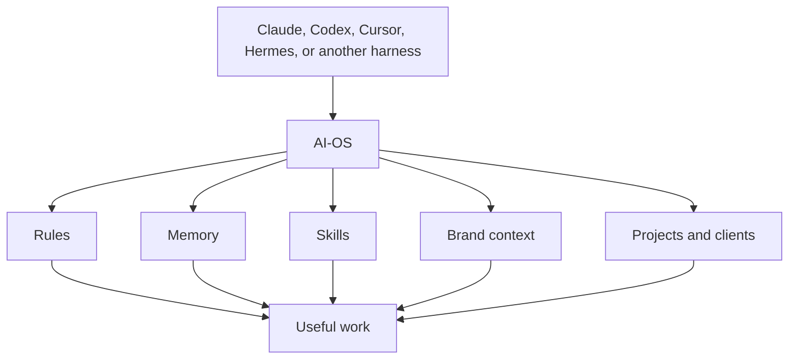
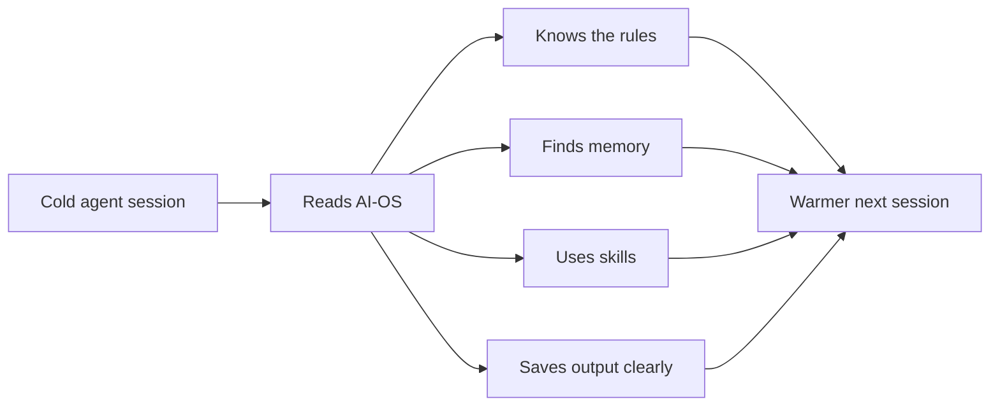
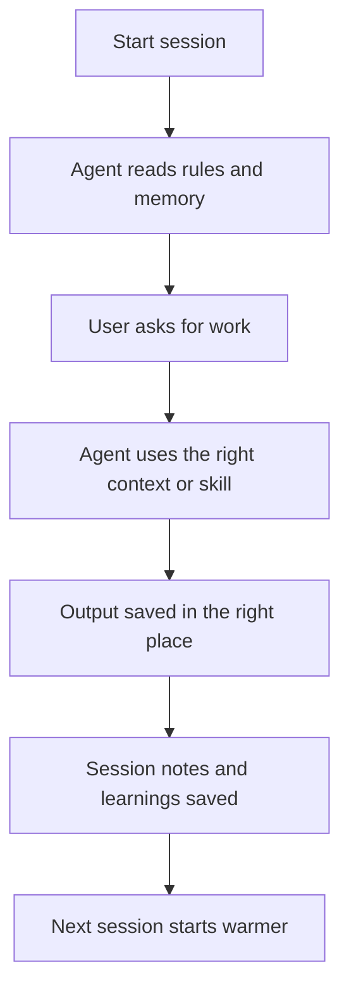

# What AI-OS Is

AI-OS is a local workspace that gives AI agent tools the same operating layer:
rules, memory, skills, projects, and client context.

You can use it with Claude Code, Codex, Cursor, Hermes, or another compatible
agent harness. The harness is the worker. AI-OS is the workspace and memory
around the worker.

It is not one app. It is not a chatbot. It is not a cloud platform. It is a
folder designed so agent sessions do not start from zero every time.

## The Short Version

AI-OS gives an agent four things:

| Part | What it does |
|---|---|
| Rules | Tells the agent how to behave, what to protect, and when to ask for approval. |
| Memory | Carries useful context from past sessions into future work. |
| Skills | Gives the agent repeatable methods for common work. |
| Workspace structure | Shows where projects, clients, docs, outputs, and jobs belong. |



## The Plain-English Mental Model

Think of AI-OS like a well-organized office for your AI assistant.

| Office part | AI-OS version |
|---|---|
| Desk rules | `AGENTS.md` |
| Notes about you | `context/USER.md` and `context/MEMORY.md` |
| Brand files | `brand_context/` |
| Playbooks | `.claude/skills/` |
| Client folders | `clients/` |
| Project folders | `projects/` |
| Scheduled work | `cron/jobs/` |
| Local dashboard | Command Centre |

The value is the arrangement. The same structure is always there, so the agent
knows where to look, how to work, and where to save the result.

## What AI-OS Is For

AI-OS is built for real business work that benefits from context over time.

It fits work like:

- strategy,
- marketing,
- content,
- client delivery,
- research,
- operations,
- automations,
- internal tools,
- creative systems,
- repeatable workflows.

It is strongest when the agent needs memory, taste, process, or client context.

## What AI-OS Is Not

AI-OS is not:

- a replacement for Claude, Codex, Cursor, Hermes, or other agent tools,
- a hosted SaaS product,
- a database-first knowledge base,
- a CRM,
- a project management app,
- a Notion template only,
- a guarantee that every answer will be correct.

Those tools can connect to AI-OS or sit beside it. AI-OS keeps the work
coherent.

## Why It Exists

Most agent tools have the same problem: every session starts too cold.

The agent may be smart, but it does not automatically know:

- how you like to work,
- what you are building,
- what decisions were already made,
- what tone you prefer,
- which skills already exist,
- what client context matters,
- where output should go.

AI-OS makes that context explicit and local.



Every useful session should make the next session easier.

## The Main Parts

### Rules

The main rules live in:

```text
AGENTS.md
```

That file tells compatible agents how AI-OS works: task routing, memory,
client boundaries, approval gates, writing standards, and safe defaults.

Tool-specific files point back to it:

- `CLAUDE.md` for Claude Code,
- `.cursor/` for Cursor,
- Codex reads `AGENTS.md` directly.

Other harnesses should follow the same contract when they can read project
instructions.

### Memory

Memory lives in markdown files:

```text
context/MEMORY.md
context/memory/
context/learnings.md
```

Client memory lives inside each client folder:

```text
clients/{client}/context/
```

The markdown files are the source of truth. Search helpers can find older notes,
but they do not replace the files.

### Skills

Skills live in:

```text
.claude/skills/
```

A skill is a practical method. It tells the agent what context to load, what
steps to follow, what to avoid, and what the output should look like.

### Brand Context

Brand context lives in:

```text
brand_context/
```

This is where voice, positioning, ideal customer context, offers, samples, and
messaging live. It helps the agent sound like the business instead of generic AI.

### Projects

Project output belongs in:

```text
projects/
```

Small tasks, planned projects, and ongoing systems get different homes so work
does not get lost in the root folder.

### Clients

Client workspaces live in:

```text
clients/{client}/
```

Each client can have its own memory, brand context, projects, and instructions
while still using the shared AI-OS rules and skills.

### Command Centre

Command Centre is the optional local dashboard.

It can show projects, tasks, jobs, clients, docs, and local system state. It is
useful, but it is not the source of truth. AI-OS still works when Command Centre
is closed.

### Notion Docs

Notion is the public docs surface for the template.

The local `docs/` folder remains the source. Notion should mirror the practical
docs, not replace them.

## The Core Loop



That loop is the product.

If a change makes this loop clearer, safer, or more reliable, it probably
belongs in AI-OS. If it makes the loop hidden, fragile, tool-specific, or
dependent on a service you do not control, it needs a stronger reason.

## Where To Go Next

| If you want to... | Read next |
|---|---|
| Start using it today | [Getting Started](getting-started.md) |
| Understand the mechanics | [How AI-OS Works](how-it-works.md) |
| Install from scratch | [Install And Setup](install-and-setup.md) |
| Understand memory | [Memory And Cron](memory-and-cron.md) |
| Work with clients | [Multi-Client Guide](multi-client-guide.md) |
| Change AI-OS itself | [Design And Contributing](design-and-contributing.md) |
