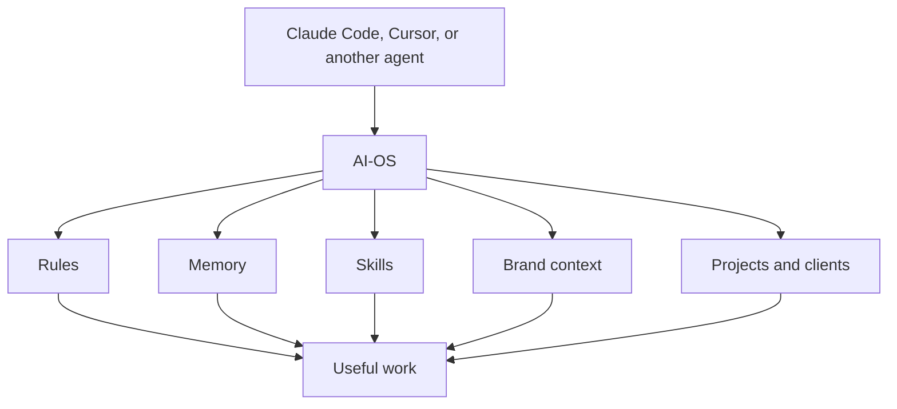
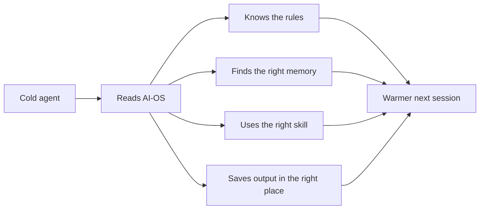

# What AI-OS Is

AI-OS is a local workspace that makes different coding agents behave like the
same business assistant.

It is not one app. It is not a chatbot. It is not a cloud platform.

It is a folder of rules, memory, skills, docs, scripts, projects, and client
workspaces arranged so agents can work with context instead of starting from
zero every time.

## The Short Version

AI-OS gives an agent four things:

1. **Rules** - how to behave, what to protect, and how to decide.
2. **Memory** - what matters from past work.
3. **Skills** - repeatable ways to do real tasks.
4. **Workspace structure** - where projects, clients, docs, and outputs live.



The agent is the worker. AI-OS is the operating layer around the worker.

## The Plain-English Mental Model

Think of AI-OS like a well-organized office for an AI agent.

| Office part | AI-OS version |
|---|---|
| Desk rules | `AGENTS.md` |
| Personal notes | `context/` |
| Brand files | `brand_context/` |
| Playbooks | `.claude/skills/` |
| Client folders | `clients/` |
| Project folders | `projects/` |
| Scheduled reminders | `cron/jobs/` |
| Local dashboard | Command Centre |

The value is not that any one file is special. The value is that the same
structure is always there, so the agent knows where to look and where to save
work.

## What AI-OS Is For

AI-OS is built for people who want an AI assistant that can help with real
business work over time.

It fits work like:

- strategy,
- marketing,
- content,
- client delivery,
- research,
- operations,
- automations,
- internal tools,
- creative systems,
- and repeatable workflows.

It is strongest when the work benefits from memory, taste, process, or context.

## What AI-OS Is Not

AI-OS is not:

- a replacement for Claude, Cursor, or other agents,
- a hosted SaaS product,
- a database-first knowledge base,
- a project management app,
- a CRM,
- a Notion template only,
- or a guarantee that every agent will be perfect.

Those tools can connect to it or sit beside it. AI-OS is the local operating
system that keeps the work coherent.

## Why It Exists

Most AI tools have the same problem: every session starts too cold.

The agent may be smart, but it does not automatically know:

- how you like to work,
- what you are building,
- what decisions were already made,
- what tone you prefer,
- what skills already exist,
- what client context matters,
- or where output should go.

AI-OS fixes that by making the context explicit and local.



Every useful session should make the next session easier.

## The Main Parts

### Rules

The main rules live in:

```text
AGENTS.md
```

That file tells agents how AI-OS works, how to route tasks, how memory behaves,
how client boundaries work, when approval is needed, and what must never happen
silently.

Tool-specific files point back to it:

- `CLAUDE.md` for Claude Code,
- `.cursor/` for Cursor.

### Memory

Memory lives in markdown files:

```text
context/MEMORY.md
context/memory/
context/learnings.md
```

Client memory lives inside each client folder:

```text
clients/{client}/context/
```

The markdown files are the source of truth. Search tools like MemSearch and
Milvus Lite help find older memory, but they do not replace the files.

### Skills

Skills live in:

```text
.claude/skills/
```

A skill is a small operating procedure. It tells the agent how to do a specific
kind of work, what context to load, what to avoid, and what output to produce.

### Brand Context

Brand context lives in:

```text
brand_context/
```

This is where voice, positioning, ideal customer context, offers, samples, and
messaging live. It helps the agent sound like the business instead of generic
AI.

### Projects

Project output belongs in:

```text
projects/
```

AI-OS separates small tasks, planned projects, and live ongoing systems so work
does not get lost in the root folder.

### Clients

Client workspaces live in:

```text
clients/{client}/
```

Each client can have its own memory, brand context, projects, and instructions
while still sharing the root AI-OS methodology.

### Command Centre

Command Centre is the optional local dashboard.

It can show projects, tasks, jobs, clients, docs, and local system state. It is
useful, but it is not the source of truth. AI-OS must still work when Command
Centre is closed.

### Notion Docs

Notion is a template docs surface.

The local `docs/` folder should remain the source used to update Notion. That
keeps the template docs practical while preserving the local repo as authority.

## Why AI-OS Is Local-First

Local-first means the important state lives in the folder you control.

That matters because:

- memory can be inspected,
- docs can be edited,
- clients can stay separate,
- search indexes can be rebuilt,
- backups are possible,
- and future agents can understand the system from files.

External tools can still help. Langfuse can observe model calls. Pinecone can
power production retrieval. Notion can present docs. GitHub can publish a
template. But none of those should be the only copy of critical AI-OS state.

## The Core Loop


That loop is the product.

If a change makes this loop clearer, safer, or more reliable, it probably
belongs in AI-OS.

If a change makes this loop hidden, fragile, tool-specific, or dependent on a
cloud service, it needs a stronger reason.

## When AI-OS Is Enough

AI-OS is enough when you need:

- a personal or small-team AI workspace,
- local memory,
- client separation,
- repeatable skills,
- docs,
- scripts,
- scheduled jobs,
- and practical continuity between sessions.

This covers most operator, consultant, and internal business workflows.

## When You Need More Than AI-OS

You may need extra infrastructure when you are building production AI software
for other users.

Examples:

- hosted vector search for many users,
- app-level permissions,
- customer-facing retrieval,
- high availability,
- trace analytics for model calls,
- prompt and eval workflows,
- data pipelines,
- or enterprise audit requirements.

In that case, AI-OS can still be the builder's workspace, but the production app
may need tools like Pinecone, Zilliz Cloud, Langfuse, LangChain, LlamaIndex, or
custom infrastructure.

For that decision, read
[Memory Search And Observability](memory-search-and-observability.md).

## Where To Go Next

| If you want to... | Read next |
|---|---|
| Start using it today | [Getting Started](getting-started.md) |
| Understand the mechanics | [How AI-OS Works](how-it-works.md) |
| Install from scratch | [Install And Setup](install-and-setup.md) |
| Understand memory | [Memory And Cron](memory-and-cron.md) |
| Work with clients | [Multi-Client Guide](multi-client-guide.md) |
| Change AI-OS itself | [Design And Contributing](design-and-contributing.md) |
